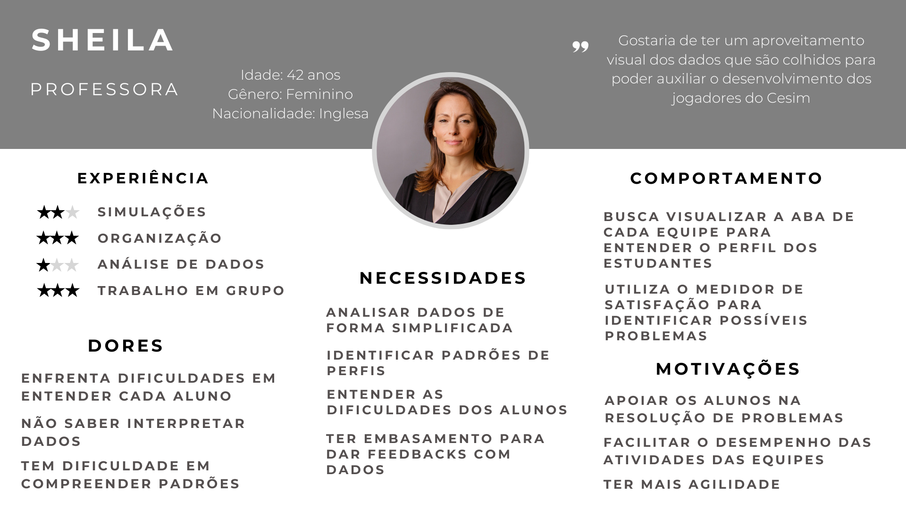
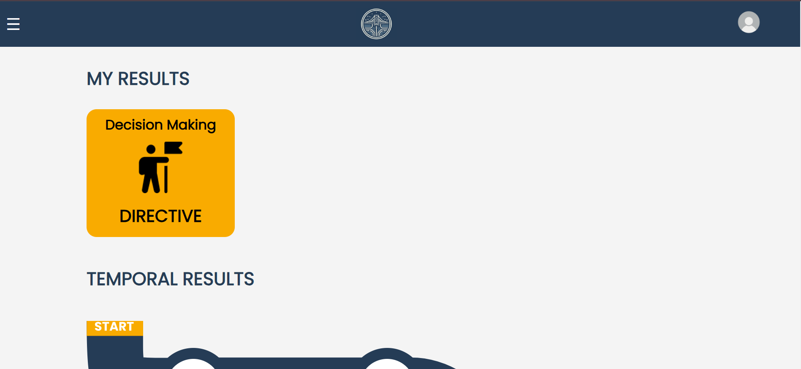
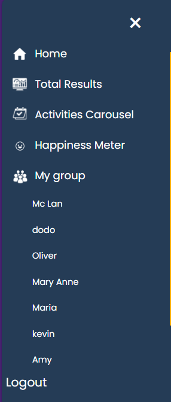

# WAD - Web Application Document - Módulo 2 - Inteli

## Techbridge
<div align="center">
<sub><a name="f1"></a>Figura 1 - Logo do grupo</sub>

<sup>Fonte: Material produzido pelos autores (2024)</sup>
</div>
<br>
Carolina Pascarelli Alves Santos
<br>
Eduardo Faria Rizk
<br>
Fernanda Correia Nascimento
<br>
Kauan Massuia
<br>
Larissa Martins Pereira de Souza
<br>
Luiza Faria Petenazzi
<br>
Milena Aparecida Vieira Castro

<br></br>

## Lista de tabelas:

[1. Tabela 1 - User Story 01 (US01)](#t1)

[2. Tabela 2 - User Story 02 (US02)](#t2)

[3. Tabela 3 - User Story 03 (US03)](#t3) 

[4. Tabela 4 - User Story 04 (US04)](#t4)

[5. Tabela 5 - User Story 05 (US05)](#t5)

[6. Tabela 6 - Consultas SQL e lógica proposicional #1](#t6)

[7. Tabela 7 - Consultas SQL e lógica proposicional #2](#t7)

[8. Tabela 8 - Consultas SQL e lógica proposicional #3](#t8) 

[9. Tabela 9 - Relatório da cobertura de testes](#t9)


[Figura 1 - Logo do grupo](#f1)

[Figura 2 - As 5 Forças de Porter](#f2)

[Figura 3 - Análise Swot](#f3)

[Figura 4 - Canvas da Proposta de Valor](#f4)

[Figura 5 - Matriz de risco](#f5)

[Figura 6 - Persona: Jenny (estudante)](#f6)

[Figura 7 - Persona: Emily (estudante)](#f7)

[Figura 8 - Persona: Edward (estudante)](#f8)

[Figura 9 - Persona: Anthony (estudante)](#f9)

[Figura 10 - Persona: Sheila (tutora)](#f10)

[Figura 11 - Persona: Johnny (tutora)](#f11)

[Figura 12 - Arquitetura MVC](#f12)

[Figura 13 - Wireframe Emily](#f13)

[Figura 14 - Wireframe Sheila](#f14)

[Figura 15 - Cores e Tons](#f15)

[Figura 16 - Tipografia](#f16)

[Figura 17 - Iconografia](#f17)

[Figura 18 - Protótipo Login e Register](#f18)

[Figura 19 - Protótipo Formulário Individual DM](#f19)

[Figura 20 - Protótipo Formulário _FeedBacks_ Colaboração](#f20)

[Figura 21 - Protótipo Tela de Resultados](#f21)

[Figura 22 - Protótipo Formulário _FeedBacks_ Decision Making](#f22)

[Figura 23 - Protótipo Meu Perfil](#f23)

[Figura 24 - Protótipo Formulário Final](#f24)

[Figura 25 - Modelo Relacional](#f25)

[Figura 26 - Versão rudimentar da *Homepage* - Primeira parte](#f26)

[Figura 27 - Versão rudimentar da "Homepage" - Segunda parte](#f27)

[Figura 28 - Versão rudimentar da tela "Register](#f28)

[Figura 29 - Versão rudimentar da tela "Login](#f29)

[Figura 30 - Versão rudimentar da tela "Questionnaire Dm" - Primeira parte](#f30)

[Figura 31 - Versão rudimentar da tela "Questionnaire Dm" - Segunda parte](#f31)

[Figura 32 - Versão rudimentar da tela "My Profile" - Primeira parte](#f32)

[Figura 33 - Versão rudimentar da tela "My Profile" - Segunda parte](#f33)

[Figura 34 - Versão rudimentar da tela "Painel Tutor](#f34)

[Figura 35 - Versão rudimentar da tela "Total Results" - Primeira parte](#f35)

[Figura 36 - Versão rudimentar da tela "Total Results" - Segunda parte](#f36)

[Figura 37 - Sidebar](#f37)

[Figura 38 - Homepage](#f38)

[Figura 39 - Happpines Meter](#f39)

[Figura 40 - Carousel](#f40)

[Figura 41 - Tela "My profile](#f41)

[Figura 42 - Tela "Total results - primeira parte](#f42)

[Figura 43 - Roadmap](#f43)

[Figura 44 - Tela "Total results - interatividade do roadmap](#f44)

[Figura 45 - Acesso a tela "Group profile](#f45)

[Figura 46 - Tela "Group profile](#f46)

[Figura 47 - Tela "Questionnaire DM" - primeira parte](#f47)

[Figura 48 - Tela "Questionnaire DM" - segunda parte](#f48)

[Figura 49 - Tela "Questionnaire DM" - terceira parte](#f49)

[Figura 50 - Tela "Questionnaire DM" - quarta parte](#f50)

[Figura 51 - Tela "Resultado Questionnaire DM](#f51)

[Figura 52 - Tela "Register user](#f52)

[Figura 53 - Tela "User Type"](#f53)

[Figura 54 - Helper](#f54)

[Figura 55 - Tela "Esqueci a senha"](#f55)

[Figura 56 - Sidebar components](#f56)

[Figura 57 - Tela "Foto de perfil"](#f57)

[Figura 58 - Tela "Resultado Questionnaire DM](#f51)

[Figura 59 - Tela "Saiba mais"](#f59)

[Figura 60 - Tela "Resultado Questionnaire DM"](#f60)

[Figura 61 - Testes](#f61)

[Figura 62 - Teste de usabilidade da tarefa 1](#f62)

[Figura 63 - Gráfico de resultado geral da tarefa 1](#f63)

[Figura 64 - Teste de usabilidade da tarefa 2](#f64)

[Figura 65 - Gráfico de resultado geral da tarefa 2](#f65)

[Figura 66 - Teste de usabilidade da Tarefa 3](#f66)

[Figura 67 - Gráfico de resultado geral tarefa 3](#f67)

[Figura 68 - Teste de usabilidade da Tarefa 4](#f68)

[Figura 69 - Gráfico de resultado geral tarefa 4](#f69)

[Figura 70 - Teste de usabilidade da Tarefa 5](#f70)

[Figura 71 - Gráfico de resultado geral tarefa 5](#f71)

[Figura 72 - Ocorrências](#f72)


## Sumário

## [1. Introdução](#c1)

##  [2. Visão Geral da Aplicação Web](#c2)
### &nbsp; [2.1. Escopo do Projeto](#c2.1)
#### &nbsp;&nbsp;&nbsp;&nbsp; [2.1.1. Contexto da indústria](#c2.1.1)
#### &nbsp;&nbsp;&nbsp;&nbsp; [2.1.2. Modelo de 5 Forças de Porter](#c2.1.2)
#### &nbsp;&nbsp;&nbsp;&nbsp; [2.1.3. Análise SWOT](#c2.1.3)
#### &nbsp;&nbsp;&nbsp;&nbsp; [2.1.4. Solução](#c2.1.4)
#### &nbsp;&nbsp;&nbsp;&nbsp; [2.1.5. Proposta de Valor](#c2.1.5)
#### &nbsp;&nbsp;&nbsp;&nbsp; [2.1.6. Matriz de Riscos](#c2.1.6)
### &nbsp; [2.2. Personas](#c2.2)
### &nbsp; [2.3. User Stories](#c2.3)


## [3. Projeto Técnico da Aplicação Web](#c3)
### &nbsp; [3.1. Arquitetura](##c3.1)
### &nbsp; [3.2. Wireframes](#c3.2)
### &nbsp; [3.3. Guia de estilos](#c3.3)
#### &nbsp;&nbsp;&nbsp;&nbsp; [3.3.1 Cores](#c3.3.1)
#### &nbsp;&nbsp;&nbsp;&nbsp; [3.3.2 Tipografia](#c3.3.2)
#### &nbsp;&nbsp;&nbsp;&nbsp; [3.3.3 Iconografia e imagens](#c3.3.3)
### &nbsp; [3.4 Protótipo de alta fidelidade](#c3.4)
### &nbsp; [3.5. Modelagem do banco de dados](#c3.5)
#### &nbsp;&nbsp;&nbsp;&nbsp; [3.5.1. Modelo relacional](#c3.5.1)
#### &nbsp;&nbsp;&nbsp;&nbsp; [3.5.2. Consultas SQL e lógica proposicional](#c3.5.2)
### &nbsp; [3.6. WebAPI e endpoints](#c3.6)

## [4. Desenvolvimento da Aplicação Web](#c4)
### &nbsp; [4.1. Primeira versão da aplicação web](#c4.1)
### &nbsp; [4.2. Segunda versão da aplicação web](#c4.2)
### &nbsp; [4.3. Versão final da aplicação web](#c4.3)


## [5. Testes da Aplicação Web](#c5)
### &nbsp; [5.1. Relatório de testes automatizados](#c5.1)
### &nbsp; [5.2. Testes de usabilidade](#c5.2)
#### &nbsp;&nbsp;&nbsp;&nbsp; [5.2.1 Registros de testes e melhorias](#c5.2.1)

## [6. Conclusões e trabalhos futuros](#c6)

## [7. Referências](#c7)

## [Anexos](#c8)

<br>

[Link para a visualização completa do site](https://two024-1b-t12-in02-g05-3.onrender.com)


# <a name="c1"></a>1. Introdução 

&nbsp;&nbsp;&nbsp;&nbsp; A _Zuyd University of Applied Sciences_ é uma universidade localizada na Holanda que forma profissionais de negócios com orientação internacional. Dessa maneira, seus alunos têm uma grande necessidade de troca de culturas e costumes com diversas nacionalidades. Assim, para promover um maior entendimento sobre esse mundo de negócios, seus alunos participam do Cesim game, uma simulação empresarial anual e inter-cultural. No entanto, em diversas ocasiões a falta de entendimento integral das diferentes culturas prejudica o aproveitamento do jogo, de forma a gerar também um estresse por falta de comunicação. 
<br>
&nbsp;&nbsp;&nbsp;&nbsp;Dessa forma, a universidade Zuyd nos trouxe a proposta de criar uma aplicação _web_ que ajudasse os alunos de diferentes países a entenderem melhor os costumes e hábitos uns dos outros, promovendo uma interação melhor dos grupos e fornecendo conhecimento para que os estudantes reconheçam e valorizem as diferenças culturais, trabalhando juntos para uma melhor performance na simulação e no ambiente real de negócios. 

# <a name="c2"></a>2. Visão Geral da Aplicação Web 

## <a name="c2.1"></a>2.1. Escopo do Projeto 

&nbsp;&nbsp;&nbsp;&nbsp;O escopo de um projeto é a definição do que será incluído e excluído no trabalho a ser realizado para alcançar os objetivos. Ele explicita os limites, responsabilidades e entregáveis do projeto, determinando o que será feito, como será feito, e o que estará fora do alcance de desenvolvimento. Diante da necessidade apresentada pela Universidade Zuyd acerca da integração de culturas e compreensão dos jogadores entre si, identificamos uma solução e definimos características e funcionalidades. A proposta é definida pela criação de uma aplicação _web_ cuja intenção é tornar o processo de conhecimento do grupo e de adaptação com o game mais fácil e interativo entre os próprios participantes. Definido o escopo, é garantido que todas as partes interessadas tenham uma compreensão clara do que será entregue.

### <a name="c2.1.1"></a>2.1.1. Contexto da indústria 

&nbsp;&nbsp;&nbsp;&nbsp; A instituição parceira Zuyd, situada na Holanda, atua no setor educacional e aplica uma metodologia de projetos que é direcionada para o mercado e que busca parcerias com empresas reais garantindo importância para seus trabalhos. As mudanças no sistema educacional, como a internacionalização, moldam a forma como a metodologia é aplicada e desenvolvida. Seu modelo de negócios diversificado inclui projetos de pesquisa e serviços de consultoria, refletindo sua missão de proporcionar uma educação aplicada. Essa abordagem permite à Zuyd manter-se relevante e competitiva, adaptando-se às mudanças do mercado e atendendo às necessidades tanto dos estudantes quanto das empresas parceiras.
<br>
&nbsp;&nbsp;&nbsp;&nbsp; A Zuyd compete com uma variedade de outras universidades tanto na Holanda quanto internacionalmente como, por exemplo, a Universidade de Ciências Aplicadas de Amsterdã (HvA). As principais tendências do setor educacional que impactam a Zuyd incluem a crescente importância de atrair e estabelecer parcerias globais, a incorporação de tecnologias de aprendizado online e híbrido para ampliar o alcance e a flexibilidade dos programas educacionais, o fortalecimento das relações com o setor empresarial para garantir que os currículos acadêmicos estejam alinhados com as necessidades do mercado, e o foco crescente em práticas educacionais sustentáveis e na responsabilidade social. Ao se adaptar às tendências, a Zuyd se compromete com a formação de profissionais qualificados e com experiências de mercado.
<br>

### <a name="c2.1.2"></a> 2.1.2. Modelo de 5 Forças de Porter
&nbsp;&nbsp;&nbsp;&nbsp;As 5 forças de Porter é um _framework_ destinado a analisar a arena competitiva onde a empresa está inserida. Dessa forma, é possível colocar a competitividade como o centro para planejar as melhores estratégias de como se proteger e se destacar no mercado de negócios. Assim, as forças analisadas são divididas em: 
<br>
* Rivalidade entre concorrentes existentes
* Ameaça de novos entrantes
* Ameaça de produtos ou serviços substitutos
* Poder de negociação dos fornecedores
* Poder de negociação dos compradores
<br>
<div align="center">
<sub><a name="f2"></a>Figura 2 - As 5 Forças de Porter</sub>

<sup>Fonte: Material produzido pelos autores (2024)</sup>
</div>
<br>
&nbsp;&nbsp;&nbsp;&nbsp;Com a análise destes 5 pontos as empresas conseguem entender o funcionamento e a competitividade do ambiente corporativo e, assim, desenvolver estratégias de como se manter no mercado. 
<br>
&nbsp;&nbsp;&nbsp;&nbsp; Ao analisar as 5 forças de Porter, é evidente que compreender a dinâmica competitiva de um mercado é essencial para o desenvolvimento de estratégias eficazes. Ao considerar a rivalidade entre concorrentes, a ameaça de novos entrantes, a ameaça de produtos ou serviços substitutos, e os poderes de negociação dos fornecedores e dos compradores, uma empresa pode planejar ações precisas e se destacar. Esta abordagem estratégica oferece uma visão ampla, permitindo uma posição mais forte e vantajosa no mercado.
<br>
&nbsp;&nbsp;&nbsp;&nbsp; A seguir está o link para o _board_ completo da análise das <a href="https://miro.com/app/board/uXjVKQpoAQA=">5 forças de porter.</a>

###  <a name="c2.1.3"></a>2.1.3. Análise SWOT

&nbsp;&nbsp;&nbsp;&nbsp;A análise SWOT (_Strengths_, _Weaknesses_, _Opportunities_, _Threats_) é uma ferramenta de planejamento estratégico e é importante porque direciona o  melhor  caminho  a  ser  seguido,  considerando  os  fatores  externos  e  internos. Essa ferramenta avalia as Forças, Fraquezas, Oportunidades e Ameaças envolvidas em um projeto ou em uma empresa. A análise é crucial para a tomada de decisões conscientes e eficazes em ambientes competitivos.
<div align="center">
<sub><a name="f3"></a>Figura 3 - Análise Swot</sub>

<sup>Fonte: Material produzido pelos autores (2024)</sup>
</div>

&nbsp;&nbsp;&nbsp;&nbsp;A análise garante que recursos sejam alocados de forma eficiente para superar obstáculos e explorar potenciais vantagens, assim como também mantém organizações alinhadas com suas metas em um mercado dinâmico.

###  <a name="c2.1.4"></a>2.1.4. Solução 

&nbsp;&nbsp;&nbsp;&nbsp;A universidade Zuyd nos apresentou a problemática de que muitos alunos não possuem consciência das diferenças culturais e, dentro das simulações do cesim game, a frustração dos alunos ao perceberem que cada pessoa pensa e é diferente uma da outra se tornou frequente, de forma a muitas vezes prejudicar o desempenho da equipe. É importante que os jogadores compreendam os diferentes potenciais, recebam _feedbacks_ dos colegas e que tenham a experiência de integração com os outros membros. Assim, apresentamos neste documento uma solução para atender aos requisitos e resolver os desafios específicos do projeto.
<br>
&nbsp;&nbsp;&nbsp;&nbsp;Para a resolução do problema, é necessário utilizar uma variedade de dados que foram fornecidos pelo parceiro, incluindo um modelo inicial estruturado de banco de dados com diferentes tabelas sobre as informações que devem ser armazenadas, documentação sobre os questionários que são utilizados para medir satisfação e desempenho, um esboço anterior de tentativa de solução do problema e um painel com elementos visuais que agradam a universidade para estimular a criação de novas ideias.
<br>
&nbsp;&nbsp;&nbsp;&nbsp;A proposta que o grupo TechBrigde apresenta é a de um site que reúne os alunos participantes do Cesim Game, visando tornar mais fácil a visualização e análise dos perfis, facilitar a integração entre culturas diversas e simplificar a supervisão e avaliação do desempenho feita pelo tutor. Os jogadores criarão uma conta na plataforma e automaticamente já estarão logados ao seu grupo, assim podendo ver suas métricas de desempenho e fazendo avaliações ao seu grupo para melhorias e _feedbacks_. O professor responsável terá um acesso personalizado para medir o desempenho dos grupos que estarão sob seu comando. Tal alternativa utiliza o engajamento dos participantes com o site, a satisfação do usuário com a equipe e com o progresso do jogo, e a colaboração entre eles como métricas de avaliação. 
<br>
&nbsp;&nbsp;&nbsp;&nbsp;Essa abordagem possui o intuito de resolver o problema de integração e promover uma aprendizagem intercultural, trazendo benefícios significativos para os tutores, permitindo uma visão mais clara do desempenho dos participantes, e para os jogadores,  possibilitando um maior envolvimento à medida que recebem _feedback_ e se integram com suas equipes. Diante disso, apresentamos uma solução alinhada com as expectativas do cliente e que atende os requisitos e solicitações do projeto.

###  <a name="c2.1.5"></a>2.1.5. Proposta de Valor 

&nbsp;&nbsp;&nbsp;&nbsp;O Canvas de Proposta de Valor é uma ferramenta crucial para entender o perfil do cliente e alinhar a proposta de valor do projeto às suas necessidades e expectativas. Para desenvolvê-lo inicialmente, identificam-se as necessidades do cliente por meio da análise da problemática apresentada, que inclui as dores a serem solucionadas, as tarefas desejadas com o projeto e os benefícios esperados ao implementá-lo.
<br>
&nbsp;&nbsp;&nbsp;&nbsp;Com base nessa análise do cliente, é possível formular uma proposta de valor alinhada ao negócio e as propostas apresentadas pelo cliente. Isso envolve identificar o produto ou serviço a ser desenvolvido para mitigar as dores identificadas, projetar soluções eficazes para superá-las – chamadas de "analgésicos" – e definir os fatores que asseguram a realização dos ganhos do cliente, conhecidos como "criadores de ganhos". Neste contexto, foi desenvolvido o seguinte Canvas de Proposta de Valor para o projeto, destacando a proposta de valor alinhada às necessidades, desafios e expectativas do cliente.

<br>
<div align="center">
<sub><a name="f4"></a>Figura 4 - Canvas da Proposta de Valor</sub>

<sup>Fonte: Material produzido pelos autores (2024)</sup>
</div>
<br>

&nbsp;&nbsp;&nbsp;&nbsp;O Canvas de Proposta de Valor apresentado acima delineia uma solução para aprimorar a experiência de jogo dos participantes do _Cesim Global Challenge_, fortalecer a comunicação entre eles e enriquecer o intercâmbio cultural durante a experiência de jogo tendo em vista os trabalhos a serem realizados pelo cliente. Diante da identificação desses trabalhos, percebeu-se o desafio enfrentado pelo parceiro: a dificuldade em apresentar aos jogadores as diferenças culturais entre eles, comprometendo a comunicação efetiva no grupo. Além disso, ao considerar a exposição de dados sobre os membros da equipe como uma possível solução, identificou-se a necessidade de tornar essa apresentação mais acessível e acolhedora.
<br>
&nbsp;&nbsp;&nbsp;&nbsp;Assim, com base na compreensão da problemática apresentada pelo cliente, desenvolveu-se uma proposta de valor centrada em um produto que consiste em um site para apoiar os jogadores do Cesim Game. Esta aplicação _web_ oferecerá recursos e ferramentas destinados a aprimorar a colaboração e o aprendizado entre os participantes, incluindo questionários personalizados sobre o jogador e os membros do seu grupo, um painel intuitivo com análise dos dados coletados nos questionários e um medidor de felicidade.
<br>
&nbsp;&nbsp;&nbsp;&nbsp;Com isso, estabelecem-se os "analgésicos" para a problemática explorada, que foram identificados como a facilitação da compreensão e interação cultural, a melhoria da comunicação e colaboração entre os participantes e o apoio e orientação contínuos dos tutores. Após compreender a problemática e formular um solução, compreende-se que ao receber o produto desenvolvido pelo grupo o cliente se beneficiará com uma experiência de jogo mais enriquecedora, um funcionamento aprimorado das equipes, um acompanhamento mais eficaz dos participantes pelos tutores e uma execução mais satisfatória da simulação, resultando em um desempenho melhorado das equipes.
<br>
&nbsp;&nbsp;&nbsp;&nbsp;Em síntese, o Canvas de Proposta de Valor oferece uma abordagem estratégica e integrada para atender às necessidades específicas dos participantes do _Cesim Global Challenge_. Ao identificar e solucionar os desafios de comunicação e compreensão cultural, a proposta criada visa não apenas aprimorar a experiência de jogo, mas também fortalecer a colaboração e o aprendizado entre os participantes. Com a implementação dos recursos e ferramentas propostos no site dedicado ao Cesim Game, os "criadores de ganhos" identificados serão alcançados, proporcionando uma simulação mais enriquecedora, eficaz e satisfatória para todos os envolvidos.

###  <a name="c2.1.6"></a>2.1.6. Matriz de Riscos 

&nbsp;&nbsp;&nbsp;&nbsp;A criação da matriz de risco tem como objetivo prever e gerenciar eventos que possam interferir no andamento do projeto. Ao compreender e analisar os diferentes elementos que podem influenciar o sucesso ou fracasso do projeto, torna-se possível adotar medidas preventivas e estratégias de mitigação. Inicialmente, é necessário identificar e categorizar os diversos riscos que podem surgir durante o desenvolvimento do projeto. Isso engloba reconhecer possíveis fontes de incerteza, avaliar sua probabilidade de ocorrência e estimar o impacto que podem causar nos objetivos e entregas.
<br>
<div align="center">
<sub><a name="f5"></a>Figura 5 - Matriz de risco</sub>

<sup>Fonte: Material produzido pelos autores (2024)</sup>
</div>
<br>
&nbsp;&nbsp;&nbsp;&nbsp;Essa abordagem permite uma compreensão mais completa e detalhada do panorama de riscos do projeto, possibilitando uma tomada de decisão mais informada e eficaz ao longo de todo crescimento do projeto. Considerando os riscos analisados, planos de ação foram desenvolvidos para gerenciar os possíveis eventos.
<br>
<br>

- **Dados desatualizados:** Probabilidade alta e impacto muito baixo. Os dados desatualizados podem levar a decisões e funcionalidades não eficientes, e para solucionar esse problema é necessário a identificação dessas inconsistências para realizar um procedimento de atualização dos dados.

- **Falha no servidor:** Probabilidade média e impacto baixo. As possíveis falhas podem gerar inatividades que prejudicam o desempenho do jogador e do grupo. Investir em serviços de suporte técnico de qualidade e monitorar continuamente o servidor são ações funcionais para sanar o problema.

- **Falta de acessibilidade na plataforma web:** Probabilidade baixa e impacto baixo. A falta de acessibilidade na plataforma pode excluir usuários e resultar em discriminação. Testes de usabilidade devem ser realizados com pessoas fora do público-alvo específico, levando em consideração diferentes línguas, culturas e deficiências para evitar esse problema.

- **Dificuldade de integração entre o grupo desenvolvedor:** Probabilidade muito baixa e impacto baixo. Tal dificuldade pode resultar em atrasos e inconsistências nas entregas do projeto. Utilizar a metodologia _Scrum_ de forma eficiente, realizar reuniões e compartilhar o progresso regularmente são medidas para incentivar a união do grupo.

- **Incompatibilidade com diferentes dispositivos e navegadores:** Probabilidade média e impacto moderado. Tal risco limita o uso da aplicação _web_ de forma funcional para apenas um dispositivo, o que pode resultar em uma experiência do usuário insatisfatória e afetar a credibilidade da plataforma. Realizar testes de compatibilidade e priorizar um desenvolvimento responsivo são ações necessárias para resolver esse problema.

- **Conflitos entre os usuários e conteúdos indevidos compartilhados:** Probabilidade baixa e impacto alto. Esses conflitos e compartilhamentos inadequados podem criar um ambiente problemático e afetar o desenvolvimento do grupo. Isso é solucionado com um sistema de denúncia e moderação de conteúdo pra casos de desrespeito. 

- **Má compreensão da proposta do cliente:** Probabilidade alta e impacto impacto alto. Esse risco leva a entregas inadequadas e insatisfatórias. Realizar reuniões e manter contato regular com o cliente, além de validar as ideias, são ações que podem alinhar as expectativas e garantir um entendimento mútuo.

- **Acesso incompleto aos dados a serem utilizados:** Probabilidade média e impacto alto. Tal falta de dados prejudica a eficácia da plataforma. Para solucionar, deve-se identificar e priorizar os conjuntos de dados essenciais, garantindo que eles sejam acessíveis.

- **Página não intuitiva perante as diferentes culturas:** Probabilidade alta e impacto muito alto. Uma página não intuitiva em diferentes culturas dificulta a adesão da plataforma em diversas regiões. Pesquisas culturais dentro das plataformas para entender as diferenças e preferências em comum, aliadas aos testes de usabilidade, podem resolver esse problema.

&nbsp;&nbsp;&nbsp;&nbsp; A criação da matriz de risco permite uma compreensão mais completa do panorama de riscos do projeto, possibilitando uma tomada de decisão mais informada e eficaz. Considerando os riscos analisados, planos de ação foram desenvolvidos para gerenciar os possíveis eventos, tais como dados desatualizados, falha no servidor, falta de acessibilidade na plataforma _web_, dificuldade de integração entre o grupo desenvolvedor, incompatibilidade com diferentes dispositivos e navegadores, conflitos entre os usuários e conteúdos indevidos compartilhados, má compreensão da proposta do cliente, acesso incompleto aos dados a serem utilizados e uma página não intuitiva perante as diferentes culturas. A adoção dessas medidas preventivas e estratégias de mitigação é essencial para o sucesso do projeto, garantindo a eficácia e a satisfação do usuário final.


## <a name="c2.2"></a>2.2. Personas

&nbsp;&nbsp;&nbsp;&nbsp; As personas são importantes recursos para entender e adaptar as necessidades dos públicos-alvo dentro de uma aplicação _web_, elas são caracterizadas como descrições de usuários fictícios com dores, requerimentos e histórias realistas. Para a criação de um site que objetiva integrações culturais, é imprescindível pesquisar quem serão os usuários e como acontecerão suas interações com outras pessoas e com o próprio _website_. Dessa forma, o grupo TechBridge organizou possíveis públicos que utilizarão os sites e suas características principais:

<br>
<div align="center">
<sub><a name="f6"></a>Figura 6 - Persona: Jenny (estudante) </sub>

<sup>Fonte: Material produzido pelos autores (2024)</sup>
</div>
<br>

&nbsp;&nbsp;&nbsp;&nbsp; Jenny é uma estudante de economia cujas principais dores se concentram na comunicação, sobretudo na dificuldade de expressar com palavras seus sentimentos pelo medo de parecer rude, e no esquecimento de prazos. Suas necessidades, portanto, são de interfaces não-verbais que a ajudem na expressão de sentimentos (com o uso de _sliders_ ou emojis, por exemplo) e notificações de prazos ou espaços chamativos para a própria organização.

<br>
<div align="center">
<sub><a name="f7"></a>Figura 7 - Persona: Emily (estudante) </sub>

<sup>Fonte: Material produzido pelos autores (2024)</sup>
</div>
<br>

&nbsp;&nbsp;&nbsp;&nbsp; Emily é uma estudante de administração cujas principais dores se concentram no entendimento de outras culturas, pela falta de experiência com diversidade, e na dificuldade de lidar com sobrecarga de informações. Suas necessidades, portanto, são de interfaces com motivadores de interação e dicas para o bom convívio com pessoas de diferentes realidades, e plataformas com informações dispostas de maneira mais _clean_, que exijam pouco esforço para serem entendidas.

<br>
<div align="center">
<sub><a name="f8"></a>Figura 8 - Persona: Edward (estudante) </sub>

<sup>Fonte: Material produzido pelos autores (2024)</sup>
</div>
<br>

&nbsp;&nbsp;&nbsp;&nbsp; Edward é um estudante de economia cujas principais dores se concentram na organização das próprias tarefas, perda de prazos por esquecimento e dificuldade de equilibrar o uso de diversas plataformas diferentes para realizar uma mesma atividade. Suas necessidades, portanto, são de notificações chamativas de cumprimento de prazos (como o uso de _pop-up’s_), área para organização de tarefas e uma plataforma única que consiga abranger grande parte das requisições para o cumprimento das atividades.

<br>
<div align="center">
<sub><a name="f9"></a>Figura 9 - Persona: Anthony (estudante) </sub>

<sup>Fonte: Material produzido pelos autores (2024)</sup>
</div>
<br>

&nbsp;&nbsp;&nbsp;&nbsp; Anthony é um estudante de ciência de dados cujas principais dores se concentram na comunicação, uma vez que ele não está acostumado a gerir e lidar com grupos, preferindo realizar suas tarefas sozinho. Suas necessidades, portanto, são de interfaces com motivadores fortes de interação para gerar interesse e dar ideias de formas de contato com outras pessoas e dicas de como lidar com _feedbacks_, opiniões e personalidades diversas. Além disso, por ser um desenvolvedor _full-stack_, ele tem o costume de analisar criticamente as plataformas que precisa utilizar, sentindo-se satisfeito com plataformas ágeis e rápidas que contam com _UX/UI_ bem desenvolvidas.

<br>
<div align="center">
<sub><a name="f10"></a>Figura 10 - Persona: Sheila (tutora) </sub>

<sup>Fonte: Material produzido pelos autores (2024)</sup>
</div>
<br>

&nbsp;&nbsp;&nbsp;&nbsp; Sheila é uma professora que tutora o Cesim Game cujas principais dores se concentram na dificuldade de compreensão dos alunos em formas não-verbais pela pouca experiência em análise de padrões, e, da mesma forma, na necessidade de parâmetros visuais para entender agrupamentos de dados. Suas necessidades, portanto, são de representações visuais intuitivas para o estudo do perfil dos estudantes e a reunião de dados importantes para o embasamento de seus _feedbacks_ em uma mesma plataforma.

<br>
<div align="center">
<sub><a name="f11"></a>Figura 11 - Persona: Johnny (tutora) </sub>

<sup>Fonte: Material produzido pelos autores (2024)</sup>
</div>
<br>

&nbsp;&nbsp;&nbsp;&nbsp; Johnny é um professor que tutora o Cesim Game cujas principais dores se concentram na dificuldade de comunicação com os alunos pela timidez e poucas habilidades com liderança de grupos, uma vez que seu trabalho se concentra mais na área de pesquisa técnica ao invés da prática da licenciatura. Suas necessidades, portanto, são de plataformas que permitam a análise de grupos de forma não-verbalizada, o que facilita seu entendimento dos alunos sem a necessidade de um contato direto e de _feedbacks_ padronizados para compreender as dores dos estudantes e a avaliação de sua tutoria, que traria consequências positivas por tornar palpável seus pontos de melhoria.


## # <a name="c2.3"></a>2.3. User Stories 
&nbsp;&nbsp;&nbsp;&nbsp; User stories são formas de analisar as necessidades e os passos a serem seguidos pelos usuários de um website, elas consideram as perspectivas dessas pessoas e revelam métricas para avaliar se as hipóteses de usabilidade estão sendo cumpridas. Para algumas personas apresentadas no tópico 2.2 deste documento, são apontadas as seguintes user stories:
<br>

# <a name="t1"></a>
Identificação | US01
--- | ---
Persona | Jenny (Estudante - 20 anos)
User Story | "Como estudante, posso fazer login na página do site para acessar os conteúdos e formulários designados"
Critério de aceite 1 | CR1: O estudante deve ser capaz de entender a funcionalidade de cada espaço de preenchimento de dados (usuário e senha)
‎ | TESTE 1: Arrastar o _pointer_ do mouse até a caixa de usuário e clicar
‎ | TESTE 3: Arrastar o _pointer_ até a caixa de senha e clicar
Critério de aceite 2 | CR2: O estudante deve ser capaz de preencher os seus dados dentro de cada caixa correspondente e clicar no botão de login
‎ | TESTE 2: Digitar o email do estudante dentro da caixa
‎ | TESTE 4: Digitar o email cadastrado
‎ | TESTE 5: Arrastar o _pointer_ do mouse até o botão de login
Critério de aceite 3 | CR3: O _back-end_ do site deve ser capaz de ler os dados preenchidos e procurá-los no banco de dados com informações dos usuários
‎ | TESTE 6: _Back-end_ realiza a leitura e cópia dos dados preenchidos
‎ | TESTE 7: _Back-end_ busca no banco de dados a correspondência
‎ | TESTE 8: _Back-end_ retorna uma resposta: 
‎ | • Se os dados possuírem correspondência no banco, a resposta retorna positiva e ocorre o encaminhamento para outra tela do site; 
‎ | • Se os dados não possuírem correspondência no banco, a resposta retorna negativa e imprime um texto de “login/senha incorreto” na tela do usuário, que continua na mesma página
Critério de aceite 4 | CR4: Caso os dados estejam corretos, o _back-end_ do site deve fechar a tela de login e redirecionar o usuário à tela inicial do site
‎ | TESTE 9: _Back-end_ lê a resposta positiva e fecha a tela de login
‎ | TESTE 10: _Back-end_ redireciona o usuário à tela inicial do site


<br> </br>

# <a name="t2"></a>
Identificação | US02 
--- | ---
Persona | Emily (Estudante - 21 anos)
User Story | "Como estudante, posso me auto avaliar por meio da resposta dos formulários para ajudar meus colegas e tutores a entenderem mais sobre mim"
Critério de aceite 1 | CR1: O estudante deve ser capaz de visualizar a tela inicial do site e identificar as tarefas a serem feitas na plataforma
‎ | TESTE 1: Dar um _scroll_ na página até o carrossel de tarefas
‎ | TESTE 2: Clicar com o _pointer_ do mouse na tarefa
Critério de aceite 2 | CR2: O _back-end_ deve ser capaz de redirecionar o estudante ao formulário de preenchimento de autoavaliação
‎ | TESTE 3: Identificar o clique no botão da tarefa
‎ | TESTE 4: Fechar a página inicial
‎ | TESTE 5: Iniciar uma nova tela com os formulários de autoavaliação
Critério de aceite 3 | CR3: O estudante deve ser capaz de entender o formato do formulário e preencher as respostas de acordo com seu perfil
‎ | TESTE 6: Identificar o enunciado da questão no topo da página
‎ | TESTE 7: Arrastar o _pointer_ do mouse até a resposta escolhida
‎ | TESTE 8: Clicar na resposta que melhor o define
‎ | TESTE 9: Dar _scroll_ para visualizar as próximas perguntas abaixo
Critério de aceite 4 | CR4: O estudante deve ser capaz de enviar as respostas
‎ | TESTE 10: Identificar o botão de enviar respostas
‎ | TESTE 11: Arrastar o _pointer_ do mouse até o botão
‎ | TESTE 12: Clicar para enviar as respostas
Critério de aceite 5 | CR5: O _back-end_ deve ser capaz de enviar os dados coletados para um banco de dados
‎ | TESTE 13: Identificar o envio de um novo formulário
‎ | TESTE 14: Realizar a leitura e cópia dos dados coletados
‎ | TESTE 15: Enviar os dados copiados para um banco de dados
‎ | TESTE 16: Organizar os dados de acordo com as linhas e colunas estabelecidas na organização do banco relacional


<br> </br>


# <a name="t3"></a>
Identificação | US03 
--- | ---
Persona | Edward (Estudante - 23 anos)
User Story | “Como estudante, posso visualizar meu próprio perfil para alterar minhas informações”
Critério de aceite 1 | O estudante deve ser capaz de visualizar a tela inicial do site e identificar o ícone de perfil no canto superior direito
‎ | TESTE 1: Arrastar o pointer do mouse até o ícone do perfil
‎ | TESTE 2: Clicar com o pointer do mouse no ícone do perfil
Critério de aceite 2 | O _back-end_ deve ser capaz de redirecionar o estudante até a página de perfil
‎ | TESTE 3: Identificar o clique no botão do ícone de perfil
‎ | TESTE 4: Fechar a página inicial do _website_
‎ | TESTE 5: Abrir a tela de página de perfil do próprio estudante
Critério de aceite 3 | O estudante deve ser capaz de visualizar a página de perfil e identificar cada um de seus elementos de gerenciamento das próprias informações em texto
‎ | TESTE 6: Arrastar o _pointer_ do mouse até um dos campos de preenchimento de texto
‎ | TESTE 7: Clicar no campo desejado
‎ | TESTE 8: Digitar as informações coerentes com os comandos solicitados no próprio campo
‎ | TESTE 9: Clicar no botão de salvar alterações quando todas as alterações desejadas forem preenchidas
Critério de aceite 4 | O estudante deve ser capaz de visualizar a página de perfil, identificar cada um de seus elementos de gerenciamento das próprias informações e trocar sua foto
‎ | TESTE 10: Arrastar o _pointer_ do mouse até o ícone da foto no canto superior esquerdo da tela
‎ | TESTE 11: Clicar no botão de alterar foto no canto inferior direito do ícone da foto
‎ | TESTE 12: Escolher o arquivo a ser inserido como foto de perfil nos próprios documentos
‎ | TESTE 13: Clicar no botão de salvar alterações quando a foto for confirmada
Critério de aceite 5 | O _back-end_ deve ser capaz de armazenar e alterar nas páginas todas as mudanças feitas pelo estudante no seu próprio perfil
‎ | TESTE 14: Identificar mudanças realizadas nos parâmetros de campo de dados
‎ | TESTE 15: Realizar a leitura e cópia dos dados alterados
‎ | TESTE 16: Enviar os dados copiados para um banco de dados
‎ | TESTE 17:  Organizar os dados de acordo com as linhas e colunas estabelecidas na organização do banco relacional
‎ | TESTE 18: Alterar nas páginas as informações mudadas pelo estudante, disponibilizando-as também para seus colegas e/ou tutores


<br> </br>

# <a name="t4"></a> 
Identificação | US04
--- | ---
Persona | Anthony (Estudante - 22 anos)
User Story | “Como estudante, posso prencher meu nível de felicidade e visualizar a média do meu grupo”
Critério de aceite 1 | O estudante deve ser capaz de visualizar a tela inicial do site e identificar o  ícone da _sidebar_
‎ | TESTE 1: Arrastar o _pointer_ do mouse até o ícone das "hamburguer"
‎ | TESTE 2: Clicar no ícone do das "hamburguer" e abrir a _sidebar_
‎ | TESTE 3: Identificar o ícone com a escrita "Happiness meter"
‎ | TESTE 4: Clicar no ícone do "Happiness meter"
Critério de aceite 2 | O _back-end_ deve ser capaz de redirecionar o estudante ao espaço da tela inicial que corresponde ao medidor de felicidade
‎ | TESTE 5: Identificar o clique no ícone da _sidebar_
‎ | TESTE 6: Abrir uma aba lateral com ícones de redirecionamento
‎ | TESTE 7: Identificar o clique no ícone do medidor de felicidade
‎ | TESTE 8: Redirecionar o estudante ao espaço da tela inicial que corresponde ao medidor de felicidade
Critérios de aceite 3 | O estudante deve ser capaz de entender a estrutura do _slider_ e indicar o nível de felicidade correspondente ao _round_
‎ | TESTE 9: Identificar o campo do medidor de felicidade
‎ | TESTE 10: Pressionar o _pointer_ do mouse no círculo a ser deslizado pela estrutura do _slider_
‎ | TESTE 11: Arrastar esse círculo até o nível correspondente da felicidade
‎ | TESTE 12: Soltar o _pointer_ do mouse
‎ | TESTE 13: Salvar o valor no botão "salvar valor"
‎ | TESTE 14: Identificar a média do grupo no mesmo campo de preenchimento
Critério de aceite 4 | O back-end deve ser capaz de computar o valor selecionado pelo estudante e calcular uma média dos estudantes do mesmo grupo
‎ | TESTE 15: Identificar uma nova resposta do medidor de felicidade
‎ | TESTE 16: Realizar a leitura e cópia do valor indicado para o nível de felicidade
‎ | TESTE 17: Enviar os dados copiados para um banco de dados
‎ | TESTE 18: Organizar os dados de acordo com as linhas e colunas estabelecidas na organização do banco relacional
‎ | TESTE 19: Calcular a média dos estudantes do mesmo grupo
‎ | TESTE 20: Tornar visível o valor obtido na média para cada um dos estudantes


<br> </br>

# <a name="t5"></a>
Identificação | US05
--- | ---
Persona | Anthony (Estudante - 22 anos)
User Story | “Como estudante, posso entrar no perfil dos outros membros do meu grupo para observar as informações sobre seus perfis”
Critério de aceite 1 | O estudante deve ser capaz de visualizar a tela inicial do site e identificar o  ícone da _sidebar_
‎ | TESTE 1: Arrastar o _pointer_ do mouse até o ícone das "hamburguer"
‎ | TESTE 2: Clicar no ícone do "hamburguer" e abrir a _sidebar_
‎ | TESTE 3: Identificar o ícone identificado do membro escolhido do grupo
‎ | TESTE 4: Clicar no ícone do membro do grupo
Critério de aceite 2 | O _back-end_ deve ser capaz de redirecionar o estudante à página do membro do grupo escolhido
‎ | TESTE 5: Identificar o clique no ícone da _sidebar_
‎ | TESTE 6: Abrir uma aba lateral com ícones de redirecionamento
‎ | TESTE 7: Identificar o clique no ícone do membro do grupo
‎ | TESTE 8: Fechar a tela inicial
‎ | TESTE 9: Abrir a página do estudante escolhido
Critério de aceite 3 | O estudante deve ser capaz de reconhecer e entender a estrutura de exposição dos dados do seu par
‎ | TESTE 10: Identificar o título do bloco de informações
‎ | TESTE 11: Realizar a leitura das informações desse bloco


<br> </br>


# <a name="c3"></a>3. Projeto da Aplicação Web 

## <a name="c3.1"></a>3.1. Arquitetura


&nbsp;&nbsp;&nbsp;&nbsp;Para que um projeto possa ser devidamente estruturado tendo suas camadas muito bem definidas é necessário delinear uma arquitetura de _software_, que pode ser definido como o responsável por definir a forma como os espaços e toda a estrutura é organizada. Além disso, a arquitetura de _software_ define a maneira como um _software_ opera, organizando o sistema e questões como o comportamento da estrutura, quais componentes serão responsáveis por executar um conjunto específico de funções e como suas partes serão distribuídas.
<br>
&nbsp;&nbsp;&nbsp;&nbsp;A arquitetura definida para utilizarmos no projeto foi a arquitetura MVC, que como definiu GAMMA (1998), consiste em estruturar o desenvolvimento da aplicação web por meio de 3 camadas, sendo elas: _Model_, _View_ e _Controller_. Nesse sentido, na solução que está sendo desenvolvida, observou-se a necessidade de desenvolver esse modelo de arquitetura de _software_ e, para isso, as tecnologias utilizadas foram sails.js e node.js, juntamente com a ferramenta de diagramação Draw.io, que possibilitou a representação organizada e funcional do diagrama de arquitetura, sendo ele:

<br>
<div align="center">
<sub><a name="f12"></a>Figura 12 - Arquitetura MVC</sub>

<sup>Fonte: Material produzido pelos autores (2024)</sup>
</div>
<br>

[Link para a arquitetura completa](https://drive.google.com/file/d/1U3qntiEguxUFxognOyPHZgiwh4ghU6Ya/view?usp=sharing)


**Modelos (_Models_)**

&nbsp;&nbsp;&nbsp;&nbsp;O Modelo é a camada responsável pela lógica de armazenamento e recuperação de informações. Logo, pode ser definido como a representação dos dados da aplicação, sendo formado por entidades e atributos. Sendo assim, na arquitetura MVC formulada com base na solução proposta, foram estabelecidas 6 entidades com seus respectivos atributos. Essas entidades representam espécies de tabelas de dados agrupados e relacionados. Dessa forma, dentro do projeto tem-se, por exemplo, a entidade _User Player_ e como atributo, os dados respectivos ao _Player_ como nome, país e email.
&nbsp;&nbsp;&nbsp;&nbsp; Nesta arquitetura, há 10 _models_ diferentes:

1. Entidade “Cesim_game” - representa a edição que está sendo realizada do jogo, por meio da associação de uma numeração e sua duração, sendo os atributos abaixo: 
* “year” (chave primária da tabela): Identificador único do jogo, sendo seu ano de aplicação;

2. Entidade “Country” - armazena as informações de países e suas respectivas cidades, sendo que seus atributos são:
* “id” (Chave primária da tabela): Identificador único do país;
* “country”: Nome do país;
* “city”: Nome da cidade.

3. Entidade "_Feedback_" - armazena os _feedbacks_ enviados pelos usuários. Aqui estão os atributos e uma breve explicação de cada um:
* "id" (chave primária da tabela): Identificador único da resposta do usuário.
* "results": armazena o resultado dos questionários
* "id_questions" (chave estrangeira da tabela "Questions"): Referência à pergunta à qual a resposta está associada.
* “id_answers” (chave estrangeira da tabela “User”): Referência ao usuário correspondente na tabela “User”;
* "id_Student_sender" (chave estrangeira da tabela "Student_sender"): Referência à quem enviou o _feedback_
* "id_Student_receiver" (chave estrangeira da tabela "Student_receiver"): Referência à quem recebeu o _feedback_
* "id_questionnaire" (chave estrangeira da tabela "Questionnaire"): Referência ao questionário atribuído ao estudante.

4. Entidade “Round” - registra informações sobre as rodadas presentes no Jogo Cesim, sendo que seus atributos são:
* “id” (chave primária da tabela): Identificador único da rodada.
* “startdate”: Data de início da rodada;
* “enddate”: Data de término da rodada;
* “round_number”: Número da rodada;
* “year_cesim_game” (chave estrangeira da tabela “Cesim_game”): Referência ao jogo Cesim associado à rodada.

5. Entidade “Student” - armazena detalhes mais específicos dos estudantes que estão participando do Cesim Game,  sendo que seus atributos são:
* “id”(Chave primária da tabela): Identificador único do estudante;
* “social_media”: Mídia social associada ao estudante;
* “one_word”: Uma palavra para descrever o estudante;
* “about_me”: Informações sobre o estudante;
* “id_university”(chave estrangeira da tabela “University”): Referência à universidade associada ao estudante;
* “id_country” (chave estrangeira da tabela “country”): Referência ao país de origem do estudante;
* “id_user” (chave estrangeira da tabela “User”): Referência ao usuário correspondente na tabela “User”;
* “id_answers” (chave estrangeira da tabela “User”): Referência ao usuário correspondente na tabela “User”;
* "id_feedback" (chave estrangeira da tabela "_Feedback_"): Referência ao _feedback_ que o estudante recebe

6. Entidade “Student_team” - relaciona o estudante com um grupo por meio do armazenamento dos identificadores únicos de ambos, sendo assim os atributos presentes são:
* “id” (Chave primária da tabela): Identificador único da tabela;
* “id_student” (chave estrangeira da tabela “Student”): Referência ao estudante associado ao grupo que está sendo referenciado;
* “id_team” (chave estrangeira da tabela “Team”): Referência à equipe à qual o  estudante está associado.

7. Entidade “Team” - armazena as informações dos grupos inscritos, sendo que seus atributos são:
* “id” (Chave primária da tabela): Identificador único do grupo;
* “color”: Cor do grupo;
* “universe”: Universo que o time está localizado;
* “year_cesim_game” (chave estrangeira da tabela “Cesim_game”): Referência ao ano do jogo Cesim associado ao grupo;
* “id_student_team” (chave estrangeira da tabela “Student_team”): Referência aos estudantes que compõem o grupo;
* “id_tutor_team” (chave estrangeira da tabela “Tutor_team”): Referência ao tutor responsável pelo grupo.

8. Entidade “Tutor” - armazena as informações necessárias do tutor, sendo que seus atributos são:
* “id” (Chave Primária da tabela): Identificador único do tutor;
* “id_country” (chave estrangeira da tabela “country”): Referência ao país de origem do estudante;
* “id_user” (chave estrangeira da tabela “User”): Referência ao usuário correspondente na tabela “User”.

9. Entidade “University” - armazena os registros das universidades, sendo que seus atributos são:
* “id” (Chave primária da tabela): Identificador único da universidade;
* “name”: Nome da universidade;
* “id_country”(chave estrangeira da tabela “Country”): Referência ao país onde a universidade está localizada.

10. Entidade “User” - armazena as informações básicas de um usuário no sistema, sendo que seus atributos são:
* “id”(Chave primária da tabela): Identificador único do usuário;
* “age”: Idade do usuário;
* “phone_number”: Número de telefone do usuário;
* “gender”: Gênero do usuário;
* “nationality”: Nacionalidade do usuário;
* “email”: Endereço de email do usuário;
* "name": Nome completo do usuário
* “password”: Senha de acesso definida pelo usuário.
* “user_type”: Tipo de conta do usuário- Tutor ou estudante.


**Visão (_Views_)**

&nbsp;&nbsp;&nbsp;&nbsp;A visão está relacionada ao que é exibido para o usuário, logo devem ser definidos nela: como aparecerão as informações e como elas serão inseridas. Dessa forma, para que a apresentação dos dados ocorra de forma compreensível estabeleceu-se as telas e suas funções. A proposta é que o site seja composto por 6 telas, designadas por Cadastro, Login, _Feedback_ do Grupo, Questionário de Perfil, Medidor de Felicidade e Perfil de Integrante.
&nbsp;&nbsp;&nbsp;&nbsp; Nossa arquitetura conta com 8 páginas de _views_ até o momento :
* Homepage- Página inicial.
* Register user- Página na qual estudantes e tutores se registram no website.
* Login- Página de login para acessar a plataforma.
* My profile- Página que contém todas as informações do usuário.
* Tutor dashboard- Página de tutores na qual ficam todas as suas equipes tutoradas.
* Questionnaires- Página onde todos os questionários serão realizados.
* Result- Página de resultados dos questionários feitos pelo usuário.
* Total results- Página de resultados dos questionários feitos por todo o grupo.

**Controlador (_Controller_)**

&nbsp;&nbsp;&nbsp;&nbsp;O controlador, por sua vez, faz a conexão entre o Modelo e a Visão. Por isso, ele é responsável por gerenciar a comunicação entre essas duas camadas, atualizando uma em relação a alterações na outra. No projeto, criou-se 6 controladores, sendo cada um o intermediário entre uma entidade do Modelo e uma tela da Visão. O controlador Perfil, por exemplo, interage com o Medidor de Felicidade, gravando as informações adicionadas no formulário, para que essas informações, por fim, sejam atualizadas no Modelo Nível de Felicidade.
&nbsp;&nbsp;&nbsp;&nbsp; Nossa arquitetura MVC conta com 9 controllers:
* Auth- Autentica o usuário que está logando na página.
* Questionnaire- Grava os questionários que serão realizados ao longo dos _rounds_.
* Round- Visualiza o _round_ em andamento
* Student- Visualiza o perfil do usuário, neste caso, do estudante.
* Tutor- Visualiza e relaciona os tutores.
* User- Grava as informações do usuário. 


&nbsp;&nbsp;&nbsp;&nbsp;Em suma, compreende-se que a utilização da Arquitetura MVC proporciona uma clareza maior na divisão das responsabilidade entre Modelo, Visão e Controle, facilitando a manutenção, extensibilidade e testabilidade do código. Bem como, resulta em uma base sólida para o desenvolvimento ágil de aplicações _web_, promovendo uma melhor colaboração entre equipes de desenvolvimento e garantindo uma experiência eficiente.

## <a name="c3.2"></a>3.2. Wireframes

&nbsp;&nbsp;&nbsp;&nbsp;Pode-se definir como _Wireframe_ um diagrama visual que esboça a estrutura de telas de um site, isto é, uma forma de mapear o design e o _layout_ do que será desenvolvido. Diante disso, a estruturação de _wireframes_ "estão na intersecção entre a arquitetura de informação e design visual e de informação do site". Nesse sentido, é um desenho que viabiliza uma a visualização de uma interface, que era até então inexistente, para planejar e corrigir eventuais problemas. 
<br>
&nbsp;&nbsp;&nbsp;&nbsp;Com isso, baseado em _User Stories_, isto é, uma forma de alinhar um tipo de usuário, uma necessidade e um objetivo dentro do site, previamente definidas, estabelecemos sequências de interações correlacionadas ao _wireframe_ de cada tela do site. Para isso, usamos como referência possíveis atividades de duas personas: um Estudante Jogador do Cesim e um Tutor.
<br>
&nbsp;&nbsp;&nbsp;&nbsp; Acesse o <a href="https://www.figma.com/file/VOymVsYY9Ye5LX4WhCHQKO/Wireframe?type=design&node-id=0-1&mode=design&t=hbtMRgtU9HRGQfBA-0">Wireframe Completo.</a>

<div align="center">
<sub><a name="f13"></a>Figura 13 - Wireframe Emily</sub>

<sup>Fonte: Material produzido pelos autores (2024)</sup>
</div>

&nbsp;&nbsp;&nbsp;&nbsp;Sabendo-se que, enquanto persona usuária do site a Emily, cuja _User Storie_ é "Como estudante, posso me auto avaliar por meio da resposta dos formulários para ajudar meus colegas e tutores a entenderem mais sobre mim" e que o objetivo dela é preencher um questionário que demonstre a ela posteriormente o seu perfil pessoal, delineamos o fluxo de uma_ Wireframe_ composto por 3 telas: Login, Tela Inicial e Formulário. Essas três partes regem o caminho necessário para cumprir um objetivo dentro da aplicação. No caso dessa jogadora, será necessário fazer o Login no site, acessar o card designado para preenchimento do questionário de perfil e por fim preencher o formulário correspondente.


<div align="center">
<sub><a name="f14"></a>Figura 14 - Wireframe Sheila</sub>

<sup>Fonte: Material produzido pelos autores (2024)</sup>
</div>

&nbsp;&nbsp;&nbsp;&nbsp;Deve-se ressaltar também que não somente jogadores poderão acessar o site, mas também os tutores dos grupos. Por isso, criamos uma persona, a Sheila, com a seguinte _User Storie_: "Como tutora, posso acessar o perfil dos meus alunos para analisar seus relatórios e ajudá-los com suas possíveis dificuldades". Essa, por sua vez, representa os tutores e os seus objetivos dentro do site. Com base nesses objetivos, estabelecemos uma trilha de telas que deve ser seguida pelos tutores para acessar o perfil de um aluno. Para isso, compreendemos a necessidade de desenvolver o _Wireframe_ de três telas que compõem o caminho a ser seguido: Login, Painel de Jogadores e Perfil do Jogador. 
<br>
&nbsp;&nbsp;&nbsp;&nbsp;Em suma, os _wireframes_ servem como uma peça-chave no desenvolvimento de interfaces digitais, uma vez que oferecem uma visão clara do _layout_ e do design, permitindo a identificação e correção de problemas precocemente, bem como, a construção de fluxos coerentes. Sendo assim, a combinação de histórias dos usuários e personas com os _wireframes_, se tornam guias essenciais para criar interfaces que atendam às necessidades dos usuários garantindo um bom planejamento da aplicação.


## <a name="c3.3"></a>3.3. Guia de estilos 

&nbsp;&nbsp;&nbsp;&nbsp; O guia de estilos serve como um documento de referência que estabelece padrões e diretrizes para o _design_, escrita, e outros elementos visuais e textuais do projeto. Ele é o responsável por garantir a organização estética do _website_, evitando sobrecargas visuais nos usuários.

&nbsp;&nbsp;&nbsp;&nbsp; As recomendações para utilizar o guia de estilo são:

- Referência Regular: Consultar o guia sempre que necessário para o uso de elementos visuais, indicados com seus respectivos tamanhos, cores e fontes.

- Flexibilidade Controlada: Adaptar conforme necessário, mas seguir as orientações pré-estabelecidas de padronização para garantir a consistência do projeto.

- _Feedback_ Valorizado: Compartilhar _feedbacks_ para melhorias contínuas do guia de estilo, sugerindo eventuais ajustes ou novas propostas estéticas.

&nbsp;&nbsp;&nbsp;&nbsp;Seguir estas recomendações garantirá uma aplicação eficaz e consistente das diretrizes do guia de estilo em seu projeto.

### <a name="c3.3.1"></a>3.3.1 Cores

&nbsp;&nbsp;&nbsp;&nbsp; A combinação escolhida de cores, com branco, azul escuro, amarelo brilhante e preto, é ideal para um site universitário pois evoca confiança, clareza e energia intelectual. O azul e o preto trazem seriedade e autoridade, o amarelo destaca a criatividade e o otimismo associados ao ambiente acadêmico, enquanto o branco adiciona contraste e traz um equilíbrio visual. Juntos, esses tons criam uma paleta equilibrada e atraente para os visitantes do site e são utilizados nas seguintes interfaces:

<div align="center">
<sub><a name="f15"></a>Figura 15 - Cores e Tons</sub>

<sup>Fonte: Material produzido pelos autores (2024)</sup>
</div>
<br></br>

- HEX #FEFAF9: Um tom _off-white_ amarelado, é utilizado como cor de fundo das páginas do _website_, oferece um descanso visual das cores mais vibrantes (como o amarelo e o azul) e garante uma estética mais _clean_ ao projeto. 
<br></br>
- HEX #253C56: Um azul escuro que é utilizado no cabeçalho e rodapé das páginas do _website_, na barra lateral expandida e em alguns elementos interativos (como o medidor de felicidade, a tela de login, botões de alterar informações de perfil e “aprender mais” na tela de resultado de questionários). Na questão dos textos, a cor também aparece nos explicativos da página inicial e nas chamadas de ação no perfil dos integrantes.
<br></br>
- HEX #F9AB00: Um amarelo vibrante utilizado em botões como o de login ou cadastro de conta, no expansível “meu grupo” da página inicial, fundo dos blocos de carrossel, redes sociais e das perguntas dos questionários, elemento de _start_ na página de resultados e nos espaços de definição de perfil (Decision-Making e Collaboration).
<br></br>
- HEX #000000: Preto, serve como cor de textos que aparecem dentro de quase todos os blocos amarelos (exceto apenas os da expansão do menu “meu grupo” da tela inicial), cor das alternativas dos questionários e do nome desses mesmos questionários em suas respectivas telas. A cor foi escolhida para trazer contraste de leitura com os tons amarelados, tornando o site acessível para pessoas com dificuldade de diferenciação de cores.
<br></br>
- HEX #FFFFFF: Branco, utilizado como cor de textos que aparecem dentro de blocos azuis, também é a cor de quase todos os ícones do site (exceto somente da câmera no bloco de redes sociais) e fundo das páginas de questionários e respostas.
<br></br>
- HEX #F3C666: Uma alternativa mais clara para o amarelo #F9AB00, serve como fundo de textos como as perguntas e respostas dos questionários, das escritas dentro dos carrosséis de atividades, da expansão do menu “meu grupo” da tela inicial e dos espaços de redes sociais no perfil do usuário ou do integrante de seu grupo.
<br></br>
- HEX #305073: Uma alternativa mais clara para o azul #253C56, serve como fundo de textos como informações de perfil do usuário ou os integrantes de seu grupo e as tags do medidor de felicidade. Da mesma forma, também é aplicado como fundo do ícone de perfil e cor oficial da barra lateral comprimida.
<br></br>
- HEX #BB9D5D: Um tom de ocre, funciona como affordance para indicar quando uma alternativa foi selecionada no preenchimento dos formulários.


### <a name="c3.3.2"></a>3.3.2 Tipografia

&nbsp;&nbsp;&nbsp;&nbsp; Foram selecionadas a Poppins e a Libre Franklin como as principais fontes para o projeto. A Poppins foi escolhida para textos maiores, como títulos e cabeçalhos, devido à sua modernidade e clareza. Enquanto isso, a Libre Franklin foi adotada para textos menores, como textos de suporte, devido à sua legibilidade e versatilidade em tamanhos reduzidos. Essas escolhas visam garantir uma experiência de leitura agradável, acessível e coerente em todo o site.

<div align="center">
<sub><a name="f16"></a>Figura 16 - Tipografia</sub>

<sup>Fonte: Material produzido pelos autores (2024)</sup>
</div>
<br></br>
Poppins - A família de fontes Poppins possui uma grande variedade de pesos, que foram estrategicamente utilizadas para garantir o destaque maior de informações específicas, como títulos. A seguir, obtém-se uma explicação do uso de cada uma delas:
<br></br>

- **800 (Poppins Extrabold)** - Domínio e versão do site no rodapé, alternativas dos questionários e informações mais chamativas na página de grupos dos tutores.
<br></br>

- **700 (Poppins Bold)** - Títulos de seções no corpo do site, resultados dos questionários, informações principais da tela de perfil do usuário ou dos integrantes do seu grupo (nome, apelido e formação acadêmica) e nome de usuário nas redes sociais.
<br></br>

- **600( Poppins Semibold)** - Itens da barra lateral expandida (exceto o nome dos integrantes do grupo, que aparecem em Poppins Regular) e informações nos carrosséis de atividades (exceto explicações, que aparecem em Poppins Regular).
<br></br>

- **500 (Poppins Medium)** - Subtítulos de seções no corpo do site e nome de tags ou campos de dados dos estudantes.
<br></br>

- **400 (Poppins Regular)** - Nome dos integrantes do grupo na barra lateral, explicações das atividades nos carrosséis, nomes dos questionários e suas respectivas respostas, botões de resultados e explicações nas páginas de respostas de formulários.
<br></br>

- **200 (Poppins Extralight)** - Textos de explicação das seções do site, nome dos participantes do grupo na barra lateral e designação de resultados dos integrantes no espaço de “Resultados do Time”.
<br></br>

Libre Franklin - Utilizada apenas em sua forma regular (peso 400), aparece como um guia de instruções para a realização do login ou cadastro de usuários, indicando o que deve ser inserido em cada um dos campos de digitação.

### <a name="c3.3.3"></a>3.3.3 Iconografia e imagens 

&nbsp;&nbsp;&nbsp;&nbsp;A iconografia e as imagens possuem a função de trazer uma linguagem visual de fácil entendimento e que é eficiente na experiência do usuário, uma vez que utiliza de símbolos e figuras para representar conceitos ou ideias. Assim, no escopo do projeto desenvolvido, para um _feedback_ visual claro e de fácil compreensão a imagem de logotipo do projeto foi definida e os seguintes símbolos foram escolhidos:

<div align="center">
<sub><a name="f17"></a>Figura 17 - Iconografia</sub>

<sup>Fonte: Material produzido pelos autores (2024)</sup>
</div>
<br>

- **Logo:** A imagem refere-se à logo do grupo desenvolvedor e está presente em todas as telas.
- **Perfil:** O ícone de perfil direciona o usuário para a seção "Meu perfil" do website. Encontra-se na parte superior direita da tela.
- **Lua:** Representa o status do participante, se ele está disponível ou não no determinado horário.
- **Coração:** Faz referência às preferências do usuário e fica disponível para visualização quando o ícone de perfil é clicado.
- **Porta de saída:** O símbolo de saída refere-se ao "_logout_", à opção de sair da conta.
- **Casa:** Direciona para a tela de home page e fica disponível para a seleção na aba lateral esquerda.
- **Calendário:** Direciona para a tela do website que possui um calendário e está localizado na aba lateral esquerda.
- **Gráfico:** Representa a tela de _dashboard_ que possui os resultados dos formulários e respostas dos integrantes do grupo. Localizado também na aba lateral esquerda.
- **Comunidade:** O círculo de pessoas faz referência ao grupo e quando selecionado disponibiliza a visualização dos nomes dos integrantes do grupo que, quando selecionado, direciona para a tela referente ao integrante. O ícone de grupo está disponível na aba lateral esquerda.
- **Lápis:** O lápis é para demonstrar a possibilidade da edição de informação. Disponível para visualização e seleção na tela de "Meu perfil".
- **Capelo:** O chapéu de graduação faz referência à página do tutor. Disponível na aba lateral esquerda.
- **Câmera:** A câmera permite que o usuário altere sua foto. O ícone se encontra na tela de "Meu perfil".
- **Chat:** O ícone de _chat_ representa as informações pessoais e está disponível na tela de "Meu Perfil" e na tela de visualização do perfil de outros participantes.
- **Godê:** O ícone da paleta de pintura refere-se às informações adicionais do usuário e está disponível na tela de "Meu Perfil" e na tela de visualização do perfil de outros participantes.
- **Câmera preta:** O ícone da câmera preta indica a adição de redes sociais na página, que é seguido pelos ícones do Youtube, LinkedIn, Instagram, X e Facebook.
- **Emojis:** Os ícones de choro, felicidade e neutralidade representam as emoções que podem ser selecionadas no medidor de felicidade. O medidor está localizado na tela inicial.
- **Calendário amarelo:** O calendário amarelo representa o carrossel de atividades a serem realizadas. Disponível na tela inicial.

&nbsp;&nbsp;&nbsp;&nbsp;Os ícones foram selecionados considerando a identidade visual do projeto, de modo que os símbolos permanecessem consistentes com a estética planejada, e também levando em conta a sua intuitividade, garantindo que os usuários possam compreender suas funções e desfrutar de uma experiência agradável.


## <a name="c3.4"></a>3.4 Protótipo de alta fidelidade 

&nbsp;&nbsp;&nbsp;&nbsp;Sabe-se que o protótipo de alta fidelidade é responsável por apresentar maior semelhança com o _design_ final em termos de detalhes e funcionalidade, ajudando a materializar para o cliente quais serão as funcionalidades do produto. Com base nessa definição criou-se o protótipo de alta fidelidade da solução que está sendo desenvolvida. Para isso, foi utilizada a ferramenta Figma, e o Guia de Estilos estabelecidos para a criação do _design_ do _website_. 
O protótipo buscou apresentar principalmente a funcionalidade de coleta de informações através dos formulários, a representação dessas informações de forma lúdica e a criação de telas de perfis de usuários para demonstrar as informações desses. 

&nbsp;&nbsp;&nbsp;&nbsp;Acesse o <a href="https://www.figma.com/file/NewhCxGlg1kthxpk4UqA29/TechBridge?type=design&node-id=0%3A1&mode=design&t=07Xviap4yUE8GVQo-1">Protótipo de Alta Fidelidade Completo.</a>


<div align="center">
<sub><a name="f18"></a>Figura 18 - Protótipo Login e Register</sub>

<sup>Fonte: Material produzido pelos autores (2024)</sup>
</div>

&nbsp;&nbsp;&nbsp;&nbsp;O protótipo de alta fidelidade do site se inicia na tela de login. Nessa tela, o usuário poderá colocar, caso ele já esteja cadastrado, as informações solicitadas, como login e senha, para acessar o site. Se ele ainda não tiver cadastro, ele deve acessar o botão de "Create Account" que o direcionará para a tela de _Register_. Nessa tela, ele terá que preencher os campos com seu nome, sobrenome, email e, por fim, criar uma senha. Ao encerrar esse formulário, ele terá criado seu acesso à plataforma e será direcionado para a tela inicial.

&nbsp;&nbsp;&nbsp;&nbsp;Na tela inicial ele irá se deparar com um _banner_, com a imagem de jovens diversos para representar os jogadores do Cesim. Logo abaixo, ele poderá acessar as primeiras funcionalidades do site, sendo elas: o medidor de felicidade e as atividades pendentes. Vale ressaltar que cada atividade pendente será um formulário que o usuário deverá preencher para saber o seu perfil comportamental ou opinar sobre o perfil dos outros integrantes.
&nbsp;&nbsp;&nbsp;&nbsp;Já o medidor de felicidade será uma forma de interpretar a satisfação do usuário em relação ao grupo. Logo, caso o medidor aponte algum grau de infelicidade, deve-se saber que o grupo tem algum problema para resolver. Sendo assim, isso se torna uma forma de _feedback_ claro e muito útil para a equipe resolver seus conflitos e para os tutores auxiliá-los.

<div align="center">
<sub><a name="f19"></a>Figura 19 - Protótipo Formulário Individual DM</sub>

<sup>Fonte: Material produzido pelos autores (2024)</sup>
</div>

&nbsp;&nbsp;&nbsp;&nbsp;Ao acessar um _card_ da seção "Activities Carousel" da página inicial, o usuário será direcionado para o formulário "Decision-Making" que definirá, por meio das respostas que forem dadas, o estilo de tomada de decisão do mesmo. Após o preenchimento de todas as perguntas selecionando alternativas, ao clicar no botão "see results", haverá um direcionamento para página que trará a resposta do estilo de tomada de decisão que o usuário mais se adequa. Seguindo esse mesmo fluxo e _design_, haverá também no _website_ um formulário para descobrir o tipo de colaboração do jogador do Cesim Game. Nesse também haverão perguntas norteadoras que definirão o resultado que será devolvido para o usuário posteriormente.

<div align="center">
<sub><a name="f20"></a>Figura 20 - Protótipo Formulário _FeedBacks_ Colaboração</sub>

<sup>Fonte: Material produzido pelos autores (2024)</sup>
</div>

&nbsp;&nbsp;&nbsp;&nbsp;Após o preenchimento dos formulários individuais, o usuário será entusiasmado, de acordo com os _cards_, a preencher formulários sobre os integrantes do seu grupo. Esses formulários serviram como uma forma de dar _feedbacks_ sobre o desempenho dos demais participantes, possibilitando que eles reconheçam como estão sendo enxergados pelo grupo, nesse caso sobre seu Estilo de Colaboração. Para isso, deve-se acessar o _card_ designado para esse formulário, responder as devidas perguntas sobre cada um dos participantes, e ao enviar as respostas haverá uma página de parabenizações por cumprir a tarefa. Ainda nessa página, ao clicar no botão "see results" o usuário será direcionado para a tela de resultados. A tela de resultados será o local onde o usuário terá acesso tanto aos seus próprios resultados como também aos resultados do grupo.

<div align="center">
<sub><a name="f21"></a>Figura 21 - Protótipo Tela de Resultados</sub>

<sup>Fonte: Material produzido pelos autores (2024)</sup>
</div>

&nbsp;&nbsp;&nbsp;&nbsp;Para ver os resultados do grupo de forma lúdica, foi implementada uma espécie de infográfico que simula um caminho a ser seguido de acordo com os _rounds_. Essa estrutura facilita a apresentação das informações de forma separada de acordo com a rodada, assim, ao posicionar o mouse sobre o ícone de uma rodada, se expande uma tela com os resultados de todos os participantes naquele momento do jogo.

<div align="center">
<sub><a name="f22"></a>Figura 22 - Protótipo Formulário _FeedBacks_ Decision Making</sub>

<sup>Fonte: Material produzido pelos autores (2024)</sup>
</div>

&nbsp;&nbsp;&nbsp;&nbsp;Seguindo o mesmo caminho de acesso pelos cards da tela inicial, o usuário terá também como dar _feedbacks_ para os integrantes do seu grupo sobre o Estilo de Tomada de Decisão deles. Para isso, ele será direcionado para o tela do formulário, em que ele terá que responder duas perguntas rápidas para cada integrante do grupo, ao finalizar o formulário, passando por todos os integrantes, haverá para o usuário o caminho a seguir: uma página de parabenização e por fim a tela de resultados.

<div align="center">
<sub><a name="f23"></a>Figura 23 - Protótipo Meu Perfil</sub>

<sup>Fonte: Material produzido pelos autores (2024)</sup>
</div>

&nbsp;&nbsp;&nbsp;&nbsp;Além das telas relacionadas aos formulários, tem-se também a tela de Meu Perfil e tela de Perfil de Integrantes. Para acessar o Meu Perfil, que será onde o usuário encontrará as próprias informações e poderá editá-las, deve-se, no cabeçalho do site, clicar no ícone de perfil. Enquanto para acessar o perfil de outro integrante do grupo, ele deve acessar o _sidebar_, clicar em "group" e depois no nome do participante que desejar. Assim, em ambas as telas, ele verá informações como linguagem, interesses, _hobbies_ e uma biografia. Quando suas, essas informações poderão ser editadas, quando de outras pessoas, visualizadas somente.

<div align="center">
<sub><a name="f24"></a>Figura 24 - Protótipo Formulário Final</sub>

<sup>Fonte: Material produzido pelos autores (2024)</sup>
</div>

&nbsp;&nbsp;&nbsp;&nbsp;Conforme as rodadas forem avançando, as tarefas concluídas e os formulários preenchidos, aparecerá um _card_ no carrossel de tarefas para que o jogador avalie o processo que passou, ponderando sobre o grupo e sobre os formulários que respondeu. Assim, poderá ser extraído um panorama geral de quão satisfatória e proveitosa foi a experiência de participar do Cesim Game para cada um dos usuários.

&nbsp;&nbsp;&nbsp;&nbsp;Em suma entende-se que o desenvolvimento de um protótipo de alta fidelidade é importante para assegurar que erros na percepção do consumidor sejam identificados e corrigidos antes da entrega final. Bem como, auxilia na visualização lógica da solução e na integração de todas as partes da aplicação de forma coerente. Sendo assim, essa se mostra uma etapa crucial no processo de _design_ para garantir que a solução final atenda às necessidades e expectativas dos usuários de maneira precisa.


## <a name="c3.5"></a>3.5. Modelagem do banco de dados 

### <a name="c3.5.1"></a>3.5.1. Modelo relacional 

&nbsp;&nbsp;&nbsp;&nbsp;Um banco de dados é uma coleção de dados relacionados entre si, destinados a armazenar informações que representam aspectos da realidade. No projeto em questão, tornou-se necessário desenvolver um banco de dados, optando-se por um modelo relacional. Esse modelo baseia-se na estruturação através de tabelas, também chamadas de entidades, que possuem ligação entre si, por meio das chamadas chaves estrangeiras. O primeiro passo na construção desse banco de dados é a criação do modelo relacional, uma forma intuitiva de representar os dados em tabelas.

&nbsp;&nbsp;&nbsp;&nbsp;No contexto de um banco de dados relacional, cada linha em uma tabela corresponde a um registro único, identificado por uma chave primária. As colunas da tabela representam os diferentes atributos dos dados. Com base nesse entendimento sobre bancos de dados, foi elaborado o seguinte modelo relacional através da ferramenta de modelagem "SQL Designer" para o banco de dados do site em desenvolvimento:

<div align="center">
<sub><a name="f25"></a>Figura 25 - Modelo Relacional</sub>

<sup>Fonte: Material produzido pelos autores (2024)</sup>
</div>

&nbsp;&nbsp;&nbsp;&nbsp;A representação acima é gerada por um arquivo XML, construído em uma linguagem de marcação utilizada para estruturar e armazenar dados em um formato legível por máquina, que pode ser visualizado abaixo.

```xml
<?xml version="1.0" encoding="utf-8" ?>
<!-- SQL XML created by WWW SQL Designer, https://github.com/ondras/wwwsqldesigner/ -->
<!-- Active URL: https://sql.toad.cz/ -->
<sql>
<datatypes db="mysql">
	<group label="Numeric" color="rgb(238,238,170)">
		<type label="Integer" length="0" sql="INTEGER" quote=""/>
	 	<type label="TINYINT" length="0" sql="TINYINT" quote=""/>
	 	<type label="SMALLINT" length="0" sql="SMALLINT" quote=""/>
	 	<type label="MEDIUMINT" length="0" sql="MEDIUMINT" quote=""/>
	 	<type label="INT" length="0" sql="INT" quote=""/>
		<type label="BIGINT" length="0" sql="BIGINT" quote=""/>
		<type label="Decimal" length="1" sql="DECIMAL" re="DEC" quote=""/>
		<type label="Single precision" length="0" sql="FLOAT" quote=""/>
		<type label="Double precision" length="0" sql="DOUBLE" re="DOUBLE" quote=""/>
	</group>

	<group label="Character" color="rgb(255,200,200)">
		<type label="Char" length="1" sql="CHAR" quote="'"/>
		<type label="Varchar" length="1" sql="VARCHAR" quote="'"/>
		<type label="Text" length="0" sql="MEDIUMTEXT" re="TEXT" quote="'"/>
		<type label="Binary" length="1" sql="BINARY" quote="'"/>
		<type label="Varbinary" length="1" sql="VARBINARY" quote="'"/>
		<type label="BLOB" length="0" sql="BLOB" re="BLOB" quote="'"/>
	</group>

	<group label="Date &amp; Time" color="rgb(200,255,200)">
		<type label="Date" length="0" sql="DATE" quote="'"/>
		<type label="Time" length="0" sql="TIME" quote="'"/>
		<type label="Datetime" length="0" sql="DATETIME" quote="'"/>
		<type label="Year" length="0" sql="YEAR" quote=""/>
		<type label="Timestamp" length="0" sql="TIMESTAMP" quote="'"/>
	</group>
	
	<group label="Miscellaneous" color="rgb(200,200,255)">
		<type label="ENUM" length="1" sql="ENUM" quote=""/>
		<type label="SET" length="1" sql="SET" quote=""/>
		<type label="Bit" length="0" sql="bit" quote=""/>
	</group>
</datatypes><table x="1551" y="1766" name="User">
<row name="id" null="1" autoincrement="1">
<datatype>INTEGER</datatype>
<default>NULL</default></row>
<row name="age " null="1" autoincrement="0">
<datatype>INTEGER</datatype>
<default>NULL</default></row>
<row name="phone_number" null="1" autoincrement="0">
<datatype>INTEGER</datatype>
<default>NULL</default></row>
<row name="gender" null="1" autoincrement="0">
<datatype>VARCHAR</datatype>
<default>NULL</default></row>
<row name="nationality" null="1" autoincrement="0">
<datatype>VARCHAR</datatype>
<default>NULL</default></row>
<row name="email" null="1" autoincrement="0">
<datatype>VARCHAR</datatype>
<default>NULL</default></row>
<row name="name" null="1" autoincrement="0">
<datatype>VARCHAR</datatype>
<default>NULL</default></row>
<row name="password" null="1" autoincrement="0">
<datatype>VARCHAR</datatype>
<default>NULL</default></row>
<row name="user_type" null="1" autoincrement="0">
<datatype>MEDIUMTEXT</datatype>
<default>NULL</default></row>
<key type="PRIMARY" name="">
<part>id</part>
</key>
</table>
<table x="1840" y="1894" name="Student">
<row name="id" null="1" autoincrement="1">
<datatype>INTEGER</datatype>
<default>NULL</default></row>
<row name="social_media" null="1" autoincrement="0">
<datatype>MEDIUMTEXT</datatype>
<default>NULL</default></row>
<row name="bio" null="1" autoincrement="0">
<datatype>MEDIUMTEXT</datatype>
<default>NULL</default></row>
<row name="id_university" null="1" autoincrement="0">
<datatype>INTEGER</datatype>
<default>NULL</default><relation table="University" row="id" />
</row>
<row name="id_country" null="1" autoincrement="0">
<datatype>INTEGER</datatype>
<default>NULL</default><relation table="Country" row="id" />
</row>
<row name="id_user" null="1" autoincrement="0">
<datatype>INTEGER</datatype>
<default>NULL</default><relation table="User" row="id" />
</row>
<row name="result" null="1" autoincrement="0">
<datatype>VARCHAR</datatype>
<default>NULL</default></row>
<row name="hobbies" null="1" autoincrement="0">
<datatype>MEDIUMTEXT</datatype>
<default>NULL</default></row>
<row name="interests" null="1" autoincrement="0">
<datatype>MEDIUMTEXT</datatype>
<default>NULL</default></row>
<row name="languages" null="1" autoincrement="0">
<datatype>MEDIUMTEXT</datatype>
<default>NULL</default></row>
<row name="happinessMeter" null="1" autoincrement="0">
<datatype>INTEGER</datatype>
<default>NULL</default></row>
<row name="feedback" null="1" autoincrement="0">
<datatype>INTEGER</datatype>
<default>NULL</default></row>
<row name="instagram" null="1" autoincrement="0">
<datatype>MEDIUMTEXT</datatype>
<default>NULL</default></row>
<row name="tiktok" null="1" autoincrement="0">
<datatype>MEDIUMTEXT</datatype>
<default>NULL</default></row>
<row name="linkedin" null="1" autoincrement="0">
<datatype>MEDIUMTEXT</datatype>
<default>NULL</default></row>
<row name="facebook" null="1" autoincrement="0">
<datatype>INTEGER</datatype>
<default>NULL</default></row>
<key type="PRIMARY" name="">
<part>id</part>
</key>
</table>
<table x="1330" y="1814" name="Tutor">
<row name="id" null="1" autoincrement="1">
<datatype>INTEGER</datatype>
<default>NULL</default></row>
<row name="id_user" null="1" autoincrement="0">
<datatype>INTEGER</datatype>
<default>NULL</default><relation table="User" row="id" />
</row>
<row name="id_Country" null="1" autoincrement="0">
<datatype>INTEGER</datatype>
<default>NULL</default><relation table="Country" row="id" />
</row>
<key type="PRIMARY" name="">
<part>id</part>
</key>
</table>
<table x="1568" y="2100" name="University">
<row name="id" null="1" autoincrement="1">
<datatype>INTEGER</datatype>
<default>NULL</default></row>
<row name="name" null="1" autoincrement="0">
<datatype>VARCHAR</datatype>
<default>NULL</default></row>
<row name="id_country" null="1" autoincrement="0">
<datatype>INTEGER</datatype>
<default>NULL</default><relation table="Country" row="id" />
</row>
<key type="PRIMARY" name="">
<part>id</part>
</key>
</table>
<table x="1244" y="2035" name="Country">
<row name="id" null="1" autoincrement="1">
<datatype>INTEGER</datatype>
<default>NULL</default></row>
<row name="country" null="1" autoincrement="0">
<datatype>VARCHAR</datatype>
<default>NULL</default></row>
<row name="city" null="1" autoincrement="0">
<datatype>VARCHAR</datatype>
<default>NULL</default></row>
<key type="PRIMARY" name="">
<part>id</part>
</key>
</table>
<table x="1647" y="1529" name="team">
<row name="id" null="1" autoincrement="1">
<datatype>INTEGER</datatype>
<default>NULL</default></row>
<row name="color" null="1" autoincrement="0">
<datatype>VARCHAR</datatype>
<default>NULL</default></row>
<row name="universe" null="1" autoincrement="0">
<datatype>INTEGER</datatype>
<default>NULL</default></row>
<row name="year_cesim_game" null="1" autoincrement="0">
<datatype>INTEGER</datatype>
<default>NULL</default><relation table="Cesim_game" row="year" />
</row>
<row name="id_student_team" null="1" autoincrement="0">
<datatype>INTEGER</datatype>
<default>NULL</default></row>
<row name="id_tutor_team" null="1" autoincrement="0">
<datatype>INTEGER</datatype>
<default>NULL</default><relation table="Tutor_team" row="id" />
</row>
<key type="PRIMARY" name="">
<part>id</part>
</key>
</table>
<table x="1900" y="1522" name="Cesim_game">
<row name="year" null="1" autoincrement="1">
<datatype>INTEGER</datatype>
<default>NULL</default></row>
<key type="PRIMARY" name="">
<part>year</part>
</key>
</table>
<table x="2073" y="1655" name="Round">
<row name="id" null="1" autoincrement="1">
<datatype>INTEGER</datatype>
<default>NULL</default></row>
<row name="startdate" null="1" autoincrement="0">
<datatype>INTEGER</datatype>
<default>NULL</default></row>
<row name="enddate" null="1" autoincrement="0">
<datatype>INTEGER</datatype>
<default>NULL</default></row>
<row name="round_number" null="1" autoincrement="0">
<datatype>INTEGER</datatype>
<default>NULL</default></row>
<row name="year_cesim_game" null="1" autoincrement="0">
<datatype>INTEGER</datatype>
<default>NULL</default><relation table="Cesim_game" row="year" />
</row>
<key type="PRIMARY" name="">
<part>id</part>
</key>
</table>
<table x="1819" y="1720" name="Student_team">
<row name="id" null="1" autoincrement="1">
<datatype>INTEGER</datatype>
<default>NULL</default></row>
<row name="id_team" null="1" autoincrement="0">
<datatype>INTEGER</datatype>
<default>NULL</default><relation table="team" row="id" />
</row>
<row name="id_student" null="1" autoincrement="0">
<datatype>INTEGER</datatype>
<default>NULL</default><relation table="Student" row="id" />
</row>
<key type="PRIMARY" name="">
<part>id</part>
</key>
</table>
<table x="1322" y="1581" name="Tutor_team">
<row name="id" null="1" autoincrement="1">
<datatype>INTEGER</datatype>
<default>NULL</default></row>
<row name="id_tutor" null="1" autoincrement="0">
<datatype>INTEGER</datatype>
<default>NULL</default><relation table="Tutor" row="id" />
</row>
<row name="id_team" null="1" autoincrement="0">
<datatype>INTEGER</datatype>
<default>NULL</default><relation table="team" row="id" />
</row>
<key type="PRIMARY" name="">
<part>id</part>
</key>
</table>
<table x="2021" y="1924" name="Feedback">
<row name="id" null="1" autoincrement="1">
<datatype>INTEGER</datatype>
<default>NULL</default></row>
<row name="results" null="1" autoincrement="0">
<datatype>VARCHAR</datatype>
<default>NULL</default></row>
<row name="id_StudentReceiver" null="1" autoincrement="0">
<datatype>INTEGER</datatype>
<default>NULL</default><relation table="Student" row="id" />
</row>
<row name="id_StudentSender" null="1" autoincrement="0">
<datatype>INTEGER</datatype>
<default>NULL</default><relation table="Student" row="id" />
</row>
<row name="questType" null="1" autoincrement="0">
<datatype>INTEGER</datatype>
<default>NULL</default></row>
<key type="PRIMARY" name="">
<part>id</part>
</key>
</table>
</sql>
```
&nbsp;&nbsp;&nbsp;&nbsp;Tendo em vista a estrutura das tabelas apresentadas acima por meio da exibição da imagem do modelo relacional e seu arquivo, estabelecem-se as seguintes descrições das entidades e atributos criados para o banco de dados:

1. Entidade “User” - armazena as informações básicas de um usuário no sistema, sendo que seus atributos são:
* “id”(Chave primária da tabela): Identificador único do usuário;
* “age”: Idade do usuário;
* “phone_number”: Número de telefone do usuário;
* “gender”: Gênero do usuário;
* “nationality”: Nacionalidade do usuário;
* “email”: Endereço de email do usuário;
* "name": Nome completo do usuário
* “password”: Senha de acesso definida pelo usuário.
* “user_type”: Tipo de conta do usuário- Tutor ou estudante.

2. Entidade “Student” - armazena detalhes mais específicos dos estudantes que estão participando do Cesim Game,  sendo que seus atributos são:
* “id”(Chave primária da tabela): Identificador único do estudante;
* “social_media”: Mídia social associada ao estudante;
* “one_word”: Uma palavra para descrever o estudante;
* “about_me”: Informações sobre o estudante;
* “id_university”(chave estrangeira da tabela “University”): Referência à universidade associada ao estudante;
* “id_country” (chave estrangeira da tabela “country”): Referência ao país de origem do estudante;
* “id_user” (chave estrangeira da tabela “User”): Referência ao usuário correspondente na tabela “User”;
* “id_answers” (chave estrangeira da tabela “User”): Referência ao usuário correspondente na tabela “User”;
* "id_feedback" (chave estrangeira da tabela "_Feedback_"): Referência ao _feedback_ que o estudante recebe;
* "result": armazena as respostas do formulário;
* "hobbies": o _hobbie_ que aparecerá em _myprofile_
* "interests": o interesse que aparecerá em _myprofile_
* "languages": a linguagem que aparecerá em _myprofile_
* "happinessMeter": a metríca individual de felicidade
* "instagram": acesso para a rede social
* "tiktok": acesso para a rede social
* "facebook": acesso para a rede social
* "linkedin": acesso para a rede social

3. Entidade “Tutor” - armazena as informações necessárias do tutor, sendo que seus atributos são:
* “id” (Chave Primária da tabela): Identificador único do tutor;
* “id_country” (chave estrangeira da tabela “country”): Referência ao país de origem do estudante;
* “id_user” (chave estrangeira da tabela “User”): Referência ao usuário correspondente na tabela “User”.

4. Entidade “Country” - armazena as informações de países e suas respectivas cidades, sendo que seus atributos são:
* “id” (Chave primária da tabela): Identificador único do país;
* “country”: Nome do país;
* “city”: Nome da cidade.

5. Entidade “University” - armazena os registros das universidades, sendo que seus atributos são:
* “id” (Chave primária da tabela): Identificador único da universidade;
* “name”: Nome da universidade;
* “id_country”(chave estrangeira da tabela “Country”): Referência ao país onde a universidade está localizada.

6. Entidade “Team” - armazena as informações dos grupos inscritos, sendo que seus atributos são:
* “id” (Chave primária da tabela): Identificador único do grupo;
* “color”: Cor do grupo;
* “universe”: Universo que o time está localizado;
* “year_cesim_game” (chave estrangeira da tabela “Cesim_game”): Referência ao ano do jogo Cesim associado ao grupo;
* “id_student_team” (chave estrangeira da tabela “Student_team”): Referência aos estudantes que compõem o grupo;
* “id_tutor_team” (chave estrangeira da tabela “Tutor_team”): Referência ao tutor responsável pelo grupo.

7. Entidade “Tutor_team” - relaciona o tutor com um grupo por meio do armazenamento dos identificadores únicos de ambos, sendo assim os atributos presentes são:
* “id” (Chave primária da tabela): Identificador único da tabela;
* “id_tutor” (chave estrangeira da tabela “Tutor”): Referência ao tutor associado ao grupo que está sendo referenciado;
* “id_team” (chave estrangeira da tabela “Team”): Referência à equipe à qual o tutor está associado.

8. Entidade “Student_team” - relaciona o estudante com um grupo por meio do armazenamento dos identificadores únicos de ambos, sendo assim os atributos presentes são:
* “id” (Chave primária da tabela): Identificador único da tabela;
* “id_student” (chave estrangeira da tabela “Student”): Referência ao estudante associado ao grupo que está sendo referenciado;
* “id_team” (chave estrangeira da tabela “Team”): Referência à equipe à qual o  estudante está associado.

9. Entidade “Cesim_game” - representa a edição que está sendo realizada do jogo, por meio da associação de uma numeração e sua duração, sendo os atributos abaixo: 
* “year” (chave primária da tabela): Identificador único do jogo, sendo seu ano de aplicação;

10. Entidade “Round” - registra informações sobre as rodadas presentes no Jogo Cesim, sendo que seus atributos são:

* “id” (chave primária da tabela): Identificador único da rodada.
* “startdate”: Data de início da rodada;
* “enddate”: Data de término da rodada;
* “round_number”: Número da rodada;
* “year_cesim_game” (chave estrangeira da tabela “Cesim_game”): Referência ao jogo Cesim associado à rodada.

11. Entidade "_Feedback_" - armazena os _feedbacks_ enviados pelos usuários. Aqui estão os atributos e uma breve explicação de cada um:

* "id" (chave primária da tabela): Identificador único da resposta do usuário.
* "results": armazena o resultado dos questionários
* "id_questions" (chave estrangeira da tabela "Questions"): Referência à pergunta à qual a resposta está associada.
* “id_answers” (chave estrangeira da tabela “User”): Referência ao usuário correspondente na tabela “User”;
* "id_Student_sender" (chave estrangeira da tabela "Student_sender"): Referência à quem enviou o _feedback_
* "id_Student_receiver" (chave estrangeira da tabela "Student_receiver"): Referência à quem recebeu o _feedback_
* "id_questionnaire" (chave estrangeira da tabela "Questionnaire"): Referência ao questionário atribuído ao estudante.


 &nbsp;&nbsp;&nbsp;&nbsp; A fim de diminuir a repetição desnecessária de colunas identicas dentro de um mesmo banco de dados, são estruturados relacionamentos entre tabelas com a ligação de colunas correspondentes entre elas. No banco de dados estruturado para o projeto, foram propostos os seguintes relacionamentos com suas respectivas cardinalidades:

* User - Student (1:N), dentro da tabela Student existe a coluna id_user, chave primária da tabela User, que indica o user cadastrado correspondente de cada aluno. Apesar de um estudante possuir apenas um user, um user pode guardar informações sobre diferentes anos de um mesmo estudante (que a cada ano, são resetadas, sendo considerado um novo estudante).
* University - Student (1:N), dentro da tabela Student existe a coluna id_university, chave primária da tabela University, que indica a universidade cadastrada de cada aluno. Apesar de um estudante possuir apenas uma universidade cadastrada, uma universidade pode possuir diversos estudantes.
* Country - Student (1:N), dentro da tabela Student existe a coluna id_country, chave primária da tabela Country, que indica o país cadastrado de cada aluno. Apesar de um estudante possuir apenas um país cadastrado, um país pode possuir diversos estudantes.
* Answers - Student (N:N), dentro da tabela Student existe a coluna id_answers, chave primária da tabela Answers, que indica as respostas dadas pelos alunos nos formulários. Um aluno pode possuir diversas respostas, da mesma forma que uma resposta pode ter sido escolhida por diversos alunos.
* Feedback - Student (1:N), dentro da tabela Students existe a coluna id_feedback, chave primária da tabela _Feedback_, que indica os _feedbacks_ colhidos dos colegas de equipe para um estudante. Um aluno pode possuir diversos _feedbacks_, mas um _feedback_ só pode ter correspondência em um aluno.
* User - Tutor (1:N), dentro da tabela Tutor existe a coluna id_user, chave primária da tabela User, que indica o user cadastrado correspondente de cada tutor. Apesar de um tutor possuir apenas um user, um user pode guardar informações sobre diferentes anos de um mesmo tutor (que a cada ano, são resetadas, sendo considerado um novo tutor).
* Country - Tutor (1:N), dentro da tabela Tutor existe a coluna id_country, chave primária da tabela Country, que indica o país cadastrado de cada tutor. Apesar de um tutor possuir apenas um país cadastrado, um país pode possuir diversos tutores.
* Tutor - Tutor_team (1:1), dentro da tabela Tutor_team existe a coluna id_tutor, chave primária da tabela Tutor, que indica o tutor responsável por cada time. Apesar de um tutor possuir diversos times, o id_tutor é único para cada time em Tutor_team, logo, um tutor possui apenas uma correspondência em tutor_team, da mesma forma que um tutor_team possui apenas um cadastro de tutor.
* Team - Tutor_team (1:1), dentro da tabela Tutor_team existe a coluna id_team, chave primária da tabela Team, que indica cada time tutorado por um respectivo tutor. Um tutor_team possui apenas uma corresponência para cada time, já que representa apenas a ligação entre tutor e um de seus times, da mesma forma que cada team possui apenas uma correspondência para tutor_team.
* Country - University (1:N), dentro da tabela University existe a coluna id_country, chave primária da tabela Country, que indica o país onde se localiza cada universidade. Uma universidade pode estar localizada em apenas um país, no entanto, um país pode ter diversas universidades cadastradas.
* Cesim_game - Team (1:N), dentro da tabela Team existe a coluna year_cesim_game, chave primária da tabela Cesim_game, que indica o ano em que ocorre o Cesim Business Game que abrange cada time. Um time pode fazer parte de apenas um Cesim Game, mas um ano do Cesim Game pode possuir múltiplos times.
* Cesim_game - Round (1:N), dentro da tabela Round, existe a coluna year_cesim_game, chave primária da tabela Cesim_game, que indica o ano em que ocorre o Cesim Business Game que abrange cada round. Um Cesim Game pode possuir diversos rounds, no entanto, um round pode se referir apenas a um Cesim Game.
* Student_team - Student (1:1), dentro da tabela intermediária Student_team existe a coluna id_student, chave primária da tabela Student, que indica quais estudantes fazem parte de um mesmo time. Por se tratar de uma tabela intermediária, um estudante se refere apenas a um student_team e vice-versa.
* Student_team - Team (1:1), dentro da tabela intermediária Student_team existe a coluna id_team, chave primária da tabela Team, que indica os times que cada estudante faz parte. Por se tratar de uma tabela intermediária, um time se refere apenas a um Student_team e vice-versa.


&nbsp;&nbsp;&nbsp;&nbsp;Diante da estrutura proposta para o banco de dados e a descrição dos dados a serem armazenados,faz-se necessária a criação do banco de dados do site em desenvolvimento, para isso foi escolhido o sistema gerenciador de banco de dados PostgreSQL, que é gerenciado por meio do DBeaver, uma ferramenta de administração de banco de dados. Sendo assim, para criar todas as entidades e estabelecer suas relações no banco de dados, é necessário empregar uma série de comandos SQL. Diante disso, expõe-se abaixo os comandos necessários para a criação do banco.

```sql
-- ---
-- Table 'User'
-- ---

DROP TABLE IF EXISTS "User";

CREATE TABLE "User" (
  id SERIAL PRIMARY KEY,
  age INTEGER NULL,
  phone_number INTEGER NULL,
  gender VARCHAR NULL,
  nationality VARCHAR NULL,
  email VARCHAR NULL,
  name VARCHAR NULL,
  password VARCHAR NULL,
  user_type TEXT NULL
);

-- ---
-- Table 'Student'
-- ---

DROP TABLE IF EXISTS "Student";

CREATE TABLE "Student" (
  id SERIAL PRIMARY KEY,
  social_media TEXT NULL,
  one_word TEXT NULL,
  about_me TEXT NULL,
  id_university INTEGER NULL,
  id_country INTEGER NULL,
  id_user INTEGER NULL,
  id_answers INTEGER NULL,
  id_feedback INTEGER NULL
  result  INTEGER NULL
  hobbies TEXT NULL
  interests TEXT NULL
  languages TEXT NULL
  happinessMeter
  feedback TEXT NULL
  instagram TEXT NULL
  tiktok TEXT NULL
  linkedin TEXT NULL
  facebook TEXT NULL
);

-- ---
-- Table 'Tutor'
-- ---

DROP TABLE IF EXISTS "Tutor";

CREATE TABLE "Tutor" (
  id SERIAL PRIMARY KEY,
  id_user INTEGER NULL,
  id_country INTEGER NULL
);

-- ---
-- Table 'University'
-- ---

DROP TABLE IF EXISTS "University";

CREATE TABLE "University" (
  id SERIAL PRIMARY KEY,
  name VARCHAR NULL,
  id_country INTEGER NULL
);

-- ---
-- Table 'Country'
-- ---

DROP TABLE IF EXISTS "Country";

CREATE TABLE "Country" (
  id SERIAL PRIMARY KEY,
  country VARCHAR NULL,
  city VARCHAR NULL
);

-- ---
-- Table 'team'
-- ---

DROP TABLE IF EXISTS "team";

CREATE TABLE "team" (
  id SERIAL PRIMARY KEY,
  color VARCHAR NULL,
  universe INTEGER NULL,
  year_cesim_game INTEGER NULL,
  id_student_team INTEGER NULL,
  id_tutor_team INTEGER NULL
);

-- ---
-- Table 'Cesim_game'
-- ---

DROP TABLE IF EXISTS "Cesim_game";

CREATE TABLE "Cesim_game" (
  year SERIAL PRIMARY KEY
);

-- ---
-- Table 'Round'
-- ---

DROP TABLE IF EXISTS "Round";

CREATE TABLE "Round" (
  id SERIAL PRIMARY KEY,
  startdate INTEGER NULL,
  enddate INTEGER NULL,
  round_number INTEGER NULL,
  year_cesim_game INTEGER NULL
);

-- ---
-- Table 'Student_team'
-- ---

DROP TABLE IF EXISTS "Student_team";

CREATE TABLE "Student_team" (
  id SERIAL PRIMARY KEY,
  id_team INTEGER NULL,
  id_student INTEGER NULL
);

-- ---
-- Table 'Tutor_team'
-- ---

DROP TABLE IF EXISTS "Tutor_team";

CREATE TABLE "Tutor_team" (
  id SERIAL PRIMARY KEY,
  id_tutor INTEGER NULL,
  id_team INTEGER NULL
);

-- ---
-- Table 'Feedback'
-- ---

DROP TABLE IF EXISTS "Feedback";

CREATE TABLE "Feedback" (
  id SERIAL PRIMARY KEY,
  results VARCHAR NULL,
  id_questions INTEGER NULL,
  id_answers INTEGER NULL,
  id_student_sender INTEGER NULL,
  id_student_receiver INTEGER NULL,
  id_questionnaire INTEGER NULL
);

-- ---
-- Foreign Keys
-- ---

ALTER TABLE "Student" ADD FOREIGN KEY (id_university) REFERENCES "University" (id);
ALTER TABLE "Student" ADD FOREIGN KEY (id_country) REFERENCES "Country" (id);
ALTER TABLE "Student" ADD FOREIGN KEY (id_user) REFERENCES "User" (id);
ALTER TABLE "Student" ADD FOREIGN KEY (id_feedback) REFERENCES "Feedback" (id);
ALTER TABLE "Tutor" ADD FOREIGN KEY (id_user) REFERENCES "User" (id);
ALTER TABLE "Tutor" ADD FOREIGN KEY (id_country) REFERENCES "Country" (id);
ALTER TABLE "University" ADD FOREIGN KEY (id_country) REFERENCES "Country" (id);
ALTER TABLE "team" ADD FOREIGN KEY (year_cesim_game) REFERENCES "Cesim_game" (year);
ALTER TABLE "team" ADD FOREIGN KEY (id_tutor_team) REFERENCES "Tutor_team" (id);
ALTER TABLE "Round" ADD FOREIGN KEY (year_cesim_game) REFERENCES "Cesim_game" (year);
ALTER TABLE "Student_team" ADD FOREIGN KEY (id_team) REFERENCES "team" (id);
ALTER TABLE "Student_team" ADD FOREIGN KEY (id_student) REFERENCES "Student" (id);
ALTER TABLE "Tutor_team" ADD FOREIGN KEY (id_tutor) REFERENCES "Tutor" (id);
ALTER TABLE "Tutor_team" ADD FOREIGN KEY (id_team) REFERENCES "team" (id);
ALTER TABLE "Feedback" ADD FOREIGN KEY (id_student_sender) REFERENCES "Student_sender" (id);
ALTER TABLE "Feedback" ADD FOREIGN KEY (id_student_receiver) REFERENCES "Student_receiver" (id);
```
&nbsp;&nbsp;&nbsp;&nbsp;Frente ao modelo apresentado, fica claro que o banco de dados foi estruturado com base em uma lógica de relacionamento entre as tabelas, utilizando chaves estrangeiras. Inicialmente, para o registro e armazenamento dos usuários, foram definidas na tabela "User" as informações essenciais para todos os que acessam o site. Em seguida, foram criadas tabelas separadas para armazenar detalhes específicos de estudantes e tutores. Além disso, foram criadas entidades para registrar o país de origem do jogador, juntamente com uma tabela adicional para armazenar as universidades, relacionando-as com os países previamente registrados.


### <a name="c3.5.2"></a>3.5.2. Consultas SQL e lógica proposicional
<br>

&nbsp;&nbsp;&nbsp;&nbsp; A tabelação de consultas SQL é uma ferramenta crucial para o entendimento da lógica de armazenamento das informações nos bancos de dados e o processo de busca dessas a partir do _back-end_ da aplicação _web_. Em conjunto com essas consultas, surgem as lógicas proposicionais, modelos matemáticos de alinhamento de possibilidades que retornam valores _booleanos_ para o preenchimento (ou não) dos requisitos de uma consulta SQL. Torna-se mais fácil a visualização dessas ferramentas com a observação dos seguintes exemplos:

# <a name="t6"></a>
#1 | O back-end realiza a consulta dos questionários de acordo com o país do tutor e do estudante. Dessa maneira, é possível filtrar os questionários de personalidade pelo país. 
--- | ---
**Expressão SQL** |SELECT<br>Student.id,<br>Student.id_country,<br>feedback.results<br>FROM<br>Tutor<br>INNER JOIN<br>User<br>ON<br>Tutor.id_User = User.id<br>INNER JOIN<br>Student<br>ON<br>Student.id_country = User.id_country<br>INNER JOIN<br>Country<br>ON<br>Student.id_country = Country.id<br>INNER JOIN<br>feedback AS Receiver<br>ON <br>Student.id = feedback.id_studentReceiver<br>INNER JOIN<br>feedback AS Sender<br>ON<br>Student.id = feedback.id_studentSender<br>WHERE<br>feedback.result IS NOT NULL AND Tutor.id_country = Student.id_country;
**Proposições lógicas** | $A$: O resultado do feedback não é nulo<br>$B$: O país do tutor é igual o país do aluno<br>
**Expressão lógica proposicional** | $(A \land B)$
**Tabela Verdade** | Tabela Verdade 1 <table> <thead> <tr> <th>$A$</th><th>$B$</th> <th>$(A \land B)$</th> </tr> </thead><tbody> <tr> <td>F</td><td>V</td><td>F</td></tr><tr><td>V</td><td>F</td><td>F</td></tr><tr><td>F</td><td>F</td><td>F</td></tr><tr><td>V</td><td>V</td><td>V</td> </tr></tbody> </table>

<br>

# <a name="t7"></a>
#2| O _back-end_ verifica as respostas dadas pelo grupo no primeiro _round_ sobre um estudante para utilizar essas informações na tela de resultados.
--- | ---
**Expressão SQL** | SELECT id_Questionnaire<br>FROM `Questionnaire_round` FULL JOIN `Round`<br>ON Questionnaire_round.id_round = Round.id_round <br>WHERE year = 2024 AND round_number = 1<br></br>SELECT results, id_Student_sender<br>FROM `Feedback` <br>WHERE id_Student_receiver = 1 AND id_Questionnaire = 1;
**Proposições lógicas** | $P$: O ano do Cesim Game é 2024 <br>$Q$: Os resultados se referem ao mesmo estudante(Feedback.id_Student_receiver = 1)<br>$R$: O Round do questionário é o 1 (Round.round_number = 1)
**Expressão lógica proposicional** | $(P \land Q) \land R$
**Tabela Verdade** |  Tabela Verdade 2 <table> <thead> <tr> <th>$P$</th><th>$Q$</th><th>$R$</th> <th>$(P \land Q)$</th><th>$(P \land Q)\land R$</th> </tr> </thead><tbody> <tr> <td>V</td><td>V</td><td>V</td><td>V</td><td>V</td></tr><tr><td>V</td><td>V</td><td>F</td><td>V</td><td>F</td></tr><tr><td>V</td><td>F</td><td>F</td><td>F</td><td>F</td></tr><tr><td>V</td><td>F</td><td>V</td><td>F</td><td>F</td></tr><tr><td>F</td><td>F</td><td>F</td><td>F</td><td>F</td></tr><tr><td>F</td><td>V</td><td>F</td><td>F</td><td>F</td></tr><tr><td>F</td><td>V</td><td>V</td><td>F</td><td>F</td></tr><tr><td>F</td><td>F</td><td>V</td><td>F</td><td>F</td> </tr></tbody> </table>

<br>

# <a name="t8"></a>
#3 | Consegue pegar todos os estudantes maiores de 18 anos que são de um mesmo time
--- | ---
**Expressão SQL** | SELECT u.*, t.color<br>FROM "User" u<br>JOIN student s ON u.id = s.id_User<br>JOIN student_team st ON s.id = st.id_student<br>JOIN team t ON st.id_team = t.id<br>WHERE u.age > 18<br>&nbsp;&nbsp;&nbsp;&nbsp;AND t.color = 'verde';
**Proposições lógicas** | $A$: A idade é maior que 18 (u.age > 18)<br>$B$: A cor da equipe é verde (t.color = 'verde')
**Expressão lógica proposicional** | $(A \land B)$
**Tabela Verdade** |  Tabela Verdade 3 <table> <thead> <tr> <th>A</th> <th>B</th> <th>$(A \land B)$</th> </tr> </thead> <tbody> <tr> <td>V</td> <td>V</td> <td>V</td> </tr> <tr> <td>V</td> <td>F</td> <td>F</td> </tr> <tr> <td>F</td> <td>V</td> <td>F</td> </tr> <tr> <td>F</td> <td>F</td> <td>F</td> </tr> </tbody> </table>

&nbsp;&nbsp;&nbsp;&nbsp; Dessa forma, é possível enxergar o desenvolvimento das pesquisas a partir da linguagem utilizada pelo PostgreSQL, gerenciador de banco de dados utilizado na construção da aplicação _web_, e suas possibilidades.


## <a name="c3.6"></a>3.6. WebAPI e endpoints 

&nbsp;&nbsp;&nbsp;&nbsp;Em uma API (Application Programming Interface), os endpoints representam pontos de acesso específicos para solicitar um recurso ou uma ação como recuperar, enviar, atualizar e recuperar recursos. Sabendo-se disso, dentro da aplicação que está sendo desenvolvida, foram criados alguns endpointers que tornaram possíveis as funcionalidades de cada página do site. Esses endpoints são utilizados para registrar um novo usuário no sistema, bem como verificar os dados no momento de login, e ainda para exibir as telas do site.

```js
  //routes.js
  '/': { view: 'pages/login' },
  '/login': { view: 'pages/login' },
  '/homepage-student': { view: 'pages/homepage' },
  '/register-user': { view: 'pages/register-user' },
  '/questionnaireDm': { view: 'pages/questionnaireDm' },
  '/painel-tutor': { view: 'pages/painel-tutor' },
  '/myprofile': { view: 'pages/myprofile' },
  '/totalresults': { view: 'pages/totalresults' },
  '/group-profile': { view: 'pages/group-profile' },
  '/painel-tutor': {view: 'pages/painel-tutor'},
  '/myprofile': {view: 'pages/myprofile'},
  '/totalresults': {view: 'pages/totalresults'},
  'GET /result': { view: 'pages/result' },

  //Register and login
  'POST /login': 'AuthController.login',
  'POST /register-user': 'UserController.register',
  'POST /create-student': 'StudentController.create',
  
  //Update my profile
  'PUT /update-profile': 'StudentController.update', 
  
  //Member in sidebar
  'GET /sideBarGroup': 'StudentController.sideBarGroup',

  //Happinessmeter
  'POST /happinessMeter': 'StudentController.happinessMeter',

  //Cards
  'GET /student/checkResult': 'StudentController.checkResult',
  
  //Forms Decision Making
  'POST /questionnaireDmResults': 'QuestionnarieDmResultsController.submit',
  
```

<br/>


### User Story Relacionada - Login e Register

&nbsp;&nbsp;&nbsp;&nbsp;Os _endpoints_ a seguir estão relacionados a _User Story_ identificada nesse documento como US01. Nela, tem-se o percurso necessário para que um estudante faça o login na plataforma e acesse o questionário. Evidencia-se, portanto nesse tópico o processo de registro para posteriormente fazer o login e acessar os conteúdos.

#### GET /register-user

**URL**: /register-user<br/>
**Método**: GET<br/>

Status 200 - OK<br>
**Headers:**<br/>
Content-Type: text/html

**Body**: Conteúdo HTML da página de registro de usuário

<br/>

#### POST /register-user

**Método**: POST <br/>
**URL**: /register-user <br/>
**Headers** <br/>
Content-Type: application/json

**Body**<br/>
O corpo da requisição deve ser um JSON contendo os dados do usuário a ser registrado. Campos obrigatórios são name, username, email e password. Campos adicionais opcionais incluem nationality, city, age, gender, phoneNumber e userType. Exemplo de corpo da requisição:

```json
{
 "name": "John Doe",
 "username": "johndoe",
 "email": "johndoe@example.com",
 "password": "securePassword123",
 "nationality": "American",
 "city": "New York",
 "age": 30,
 "gender": "male",
 "phoneNumber": "1234567890",
 "userType": "admin"
}
```

**Response**

Sucesso (201 Created)
```json
{
 "message": "User registered successfully",
 "user": {
 "id": 1,
 "name": "John Doe",
 "username": "johndoe",
 "email": "johndoe@example.com",
 "nationality": "American",
 "city": "New York",
 "age": 30,
 "gender": "male",
 "phoneNumber": "1234567890",
 "userType": "admin"
 }
}
```

Erro de Validação (400 Bad Request)
```json
{
 "message": "All required fields must be provided"
}
```

Erro Interno do Servidor (500 Internal Server Error)

```json
{
 "message": "Error registering user",
 "error": "Descrição detalhada do erro"
}
```

<br/>

#### GET /login

**Método**: GET<br/>
**URL:** /login<br/>
**Header**: <br/>
Content-Type: application/json

**Body**: Não requer corpo de requisição.

**Response**:
Sucesso (200):
Retorna a página de login renderizada.
Erro (500):
```json
{
 "message": "Error displaying login page",
 "error": "Detalhes do erro"
}
```

<br/>

#### POST /login

**Método**: POST <br/>
**URL**: /login <br/>
**Headers**: <br/>
Content-Type: application/json

**Body**: <br/>
email (string, obrigatório): O email do usuário.<br/>
password (string, obrigatório): A senha do usuário.

```json
{
 "email": "string",
 "password": "string"
}
```

**Response**

Sucesso (200)<br/>
message: Mensagem indicando sucesso no login.
user: Objeto contendo as informações do usuário logado.


```json
{
 "message": "Login successful",
 "user": {
 "id": "number",
 "age": "number",
 "phoneNumber": "string",
 "gender": "string",
 "nationality": "string",
 "email": "string",
 "name": "string",
 "userType": "string"
 }
}
```


Erro de Requisição (400)<br/>
message: Mensagem indicando que email e senha são obrigatórios.


```json
{
 "message": "Email and password are required"
}
```


Usuário não encontrado (404)<br/>
message: Mensagem indicando que o usuário não foi encontrado.


```json
{
 "message": "No user found with this email"
}
```


Senha incorreta (401)<br/>
message: Mensagem indicando que a senha está incorreta.


```json
{
 "message": "Incorrect password"
}

```

Erro no Servidor (500)<br/>
message: Mensagem indicando erro no processo de login.
error: Detalhes do erro ocorrido.


```json
{
 "message": "Error logging in",
 "error": "string"
}
```

<br/>

### User Story Relacionada - Home page e Questionnaire
&nbsp;&nbsp;&nbsp;&nbsp;Na _User Story_ US02, diz sobre o preenchimento dos formulários de auto avaliação e acesso dos resultados. Com base nisso, foram criadas as telas que compõem essa jornada dentro do _website_ e para isso, tem-se os seguintes endpoints:


#### GET /homepage
**Método**: GET <br/>
**Endereço**: /homepage <br/>
**Headers**: Content-Type: text/html <br/>
**Body**: Não aplicável <br/>
**Response**:<br/>
**Status**: 200 OK<br/>
**Body**: HTML da página inicial do site

<br/>

&nbsp;&nbsp;&nbsp;&nbsp;A partir dos _cards_ localizados na homepage, há o acesso ao questionário:

#### GET /questionnaireDm
**Método**: GET <br/>
**Endereço**: /questionnaireDm <br/>
**Headers**: Content-Type: text/html <br/>
**Body**: Não aplicável <br/>

**Response**:<br/>
Status: 200 OK<br/>
Body: HTML da página do questionário de DM do site

&nbsp;&nbsp;&nbsp;&nbsp;Para que o questionário realmente funcione, é necessário o armazenamento de respostas da seguinte forma:

#### POST /questionnaireDmResults
**Método**: POST <br/>
**Endereço**: /questionnaireDmResults <br/>
**Headers**: 'Content-Type': 'application/json' <br/>
**Body**:  JSON.stringify(data) <br/>

&nbsp;&nbsp;&nbsp;&nbsp;Isto é, os dados das respostas preenchidas no formulário são acessados, processados pelo _controller_ e transformados em um resultado que será retornado:

**Response**:<br/>
Status: 200 OK<br/>
Body: result

<br/>

&nbsp;&nbsp;&nbsp;&nbsp;Após devidamente armazenados os resultados irão aparecer na tela de Total Results:

#### GET /totalresults
**Método**: GET <br/>
**Endereço**: /totalresults <br/>
**Headers**: Content-Type: text/html <br/>
**Body**: Não aplicável <br/>

**Response**:<br/>
Status: 200 OK<br/>
Body: HTML da página de resultados

<br>

&nbsp;&nbsp;&nbsp;&nbsp;Também dentro da _homepage_, existem outras duas funcionalidades o _Happiness Meter_ e os _cards_. Os _cards_ possibilitam o acesso ao formulário, enquanto o _Happiness Meter_ armazena a métrica de felicidade do usuário e exibe a média do grupo:

#### POST /happinessMeter
**Método**: POST <br/>
**Endereço**: /happinessMeter <br/>
**Headers**: 'Content-Type': 'application/json' <br/>
**Body**: formData <br/>

**Response**:<br/>
Status: 200 OK<br/>
Body: happinessMeter, averageHappinessMeter


### User Story Relacionada - Meu perfil

&nbsp;&nbsp;&nbsp;&nbsp;Após acessar a _homepage_ do _website_, torna-se possível, por meio do menu, acessar o próprio perfil. Esse processo foi previsto na _User Storie_ da persona Edward (US03) e o _endpoint_ corresponde é:

#### GET /myprofile
**Método**: GET <br/>
**Endereço**: /myprofile <br/>
**Headers**: Content-Type: text/html <br/>
**Body**: Não aplicável <br/>

**Response**:<br/>
Status: 200 OK<br/>
Body: HTML da página do meu perfil

&nbsp;&nbsp;&nbsp;&nbsp;Bem como, para que a edição desses conteúdos seja possível, tem-se o _endpoint_:

#### POST /update-profile
**Método**: POST <br/>
**Endereço**: /update-profile <br/>
**Headers**: 'Content-Type': 'application/json' <br/>
**Body**: JSON.stringify(profileData) <br/>

**Response**:<br/>
Status: 200 OK<br/>
Body: json do student atualizado

<br>
&nbsp;&nbsp;&nbsp;&nbsp;Por fim, entende-se que os pontos de acesso configurados possibilitam operações como registro e login de usuários, navegação entre páginas e acesso a funcionalidades específicas para diferentes usuários. A definição clara dos métodos HTTP, URLs e formatos de resposta garante a integração entre o _front-end_ e o _back-end_, assegurando que o sistema atenda às necessidades dos usuários.

<br>


# <a name="c4"></a>4. Desenvolvimento da Aplicação Web

## <a name="c4.1"></a>4.1. Primeira versão da aplicação web 

&nbsp;&nbsp;&nbsp;&nbsp;Diante das funcionalidades identificadas como solucionadoras da problemática exposta, definiu-se como primeira versão da aplicação o web o desenvolvimento rudimentar de algumas páginas. As páginas desenvolvidas nessa versão foram a de login, register, homepage, questionnaire decision-making, my profile, painel tutor e total results. Vale ressaltar que, enquanto, elaboração inicial da aplicação web, focamos na estrutura dos elementos da página e nos estilos usados para definir cores, fontes, tamanhos e posicionamentos. Para tanto, utilizou-se a linguagem de marcação, HTML, e a de estilização, CSS.
<br>

**Homepage**

&nbsp;&nbsp;&nbsp;&nbsp;Para a tela inicial, estruturou-se duas seções que englobam duas funcionalidades muito importantes da aplicação: o medidor de felicidade e o questionário. A primeira, fica na seção "Express Your Emotions" e sua finalidade é coletar o estado de humor atual do usuário do site, bem como, exibir, de acordo com as emoções dos demais participantes do seu grupo, a média de felicidade geral. Com esse dado, torna-se possível a identificação de problemas, o que culmina na resolução dos mesmos. Já a segunda funcionalidade, está na seção "Activities Carousel", em que ocorre o redirecionamento para os questionários e a gestão dos pendentes, sabendo-se que esses questionários são posicionados no Carrossel de acordo com os rounds do CesimGame. 
<br>

```html
<!DOCTYPE html>
<html lang="en">
<head>
    <!-- Meta information about the document -->
    <meta charset="UTF-8">
    <meta name="viewport" content="width=device-width, initial-scale=1.0">
    <!-- Title of the web page -->
    <title>TechBridge</title>
    <!-- Link to the external stylesheet -->
    <link rel="stylesheet" type="text/css" href="..\..\assets\styles\style.css">
</head>
<body>
    <header>
        <nav>
            <!-- Button for navigation menu -->
            <button class="bt">☰</button>
            <!-- Logo image -->
            
            <!-- Profile icon with click event -->
            
        </nav>
    </header>
    <main>
        <!-- First section with a banner image and introductory text -->
        <section>
            <div>
                <!-- Banner image -->
                
            </div>
            <!-- Main heading and description -->
            <h1>A NEW FORM OF EXPLORING THE WORLD.</h1>
            <p>Connect with students from many countries</p>
        </section>
        <!-- Second section about expressing emotions -->
        <section>
            <h2>EXPRESS YOUR EMOTIONS</h2>
            <p>TRACK AND ANALYSE HOW YOUR TEAM FEELS</p>
            <p>Visualize your team's happiness meter and describe their feelings with tags to aid conflict resolution. Remember to act with patience and empathy!</p>
            <div>
                <!-- Display happiness meter and button -->
                <p>Happiness meter: 7.6</p>
                <button>Your group</button>
            </div>
        </section>
        <!-- Third section about activities carousel -->
        <section>
            <h2>ACTIVITIES CAROUSEL</h2>
            <p>EXPLORE YOUR UNDONE ACTIVITIES</p>
            <p>Remember your deadlines and pending activities. Don't forget to mark tasks as 'done' once completed to track your progress</p>
            <!-- Activity details -->
            <div>
                <div>
                    <p>Fill the Collaboration form</p>
                    <p>Discover your collaboration profile by answering a few questions!</p>
                    <p>Today - 12:00pm</p>
                </div>
                <!-- Outros card... -->
                </div>
            </div>
        </section>
    </main>
    <!-- JavaScript for profile button navigation -->
    <script>
        document.getElementById('btmyprofile').addEventListener('click', function () {
            window.location.href = '/myprofile';
        });
    </script>
</body>
</html>
```
<br>
<div align="center">
<sub><a name="f26"></a>Figura 26 - Versão rudimentar da *Homepage* - Primeira parte.</sub>

<sup>Fonte: Material produzido pelos autores (2024)</sup>
</div>
<br>
<div align="center">
<sub><a name="f27"></a>Figura 27 - Versão rudimentar da "Homepage" - Segunda parte.</sub>

<sup>Fonte: Material produzido pelos autores (2024)</sup>
</div>
<br>

**Register User**

&nbsp;&nbsp;&nbsp;&nbsp;Inicialmente, página de registro permite que o usuário crie uma conta no site, escolhendo entre se registrar como estudante ou como tutor. O formulário de registro solicita informações básicas, como nome, e-mail, senha e outras informações relevantes para cada perfil.
<br>
```html
<!DOCTYPE html>
<html lang="en">
<body>
    <!-- Registration form -->
    <form action="/register-user" method="POST" id="registerForm" class="box">
        <h3>Is this your first access?</h3>
        <h1>Register User</h1>
        
        <!-- Form group for entering full name -->
        <div class="form-group">
            <label for="name">Name:</label>
            <input type="text" id="name" name="name" placeholder="Enter your full name..." required>
        </div>
        
        <!-- Form group for entering username -->
        <div class="form-group">
            <label for="username">Username:</label>
            <input type="text" id="username" name="username" placeholder="Enter a username..." required>
        </div>
        
        <!-- Form group for entering email -->
        <div class="form-group">
            <label for="email">Email:</label>
            <input type="email" id="email" name="email" placeholder="Enter your email..." required>
        </div>
        
        <!-- Others inputs -->

        <!-- Submit button for the form -->
        <div class="form-group" class="submit">
            <button id="btsubmit">Register</button>
        </div>
    </form>

    

    <!-- JavaScript for redirecting to the login page after registration -->
    <script>
        document.getElementById('btsubmit').addEventListener('click', function () {
            window.location.href = '/';
        });
    </script>
</body>
</html>
```
<br>
<div align="center">
<sub><a name="f28"></a>Figura 28 - Versão rudimentar da tela "Register"  .</sub>

<sup>Fonte: Material produzido pelos autores (2024)</sup>
</div>
<br>

**Login**

&nbsp;&nbsp;&nbsp;&nbsp;A página de login permite que o usuário acesse sua conta no site utilizando os dados cadastrados previamente. Nesta página, o usuário deve inserir seu endereço de e-mail e a senha correspondente. O design da página possui botões para "Entrar" e "Cadastre-se". O botão "Entrar" valida as credenciais fornecidas e, se corretas, direciona o usuário para a homepage.


<br>
```html
<!DOCTYPE html>
<html lang="en">
<body>
    <!-- Login form container -->
    <div id="loginForm" class="box">
        <h1 class="b">Login</h1>
        <!-- Form for login -->
        <form action="/login" method="POST">
            <!-- Email input field -->
            <div class="form-group">
                <label for="email">Email:</label>
                <input type="email" id="email" name="email" placeholder="Enter your email..." required>
            </div>
            <!-- Password input field -->
            <div class="form-group">
                <label for="password">Password:</label>
                <input type="password" id="password" name="password" placeholder="Enter your password..." required>
            </div>
            <!-- Login button -->
            <div class="bottom-form" id="login-buttons">
                <button id="btlogin">Login</button>
            </div>
        </form>
        <!-- Additional links: Forgot password and Create account -->
        <div class="bottom-form" id="additional-links">
            <a href="/forgot-password">Forget Password?</a>
            <a href="/register-user">Create Account</a>
        </div>
    </div>
</body>
<script>
    // Add event listener to the login button
    document.getElementById('btlogin').addEventListener('click', function () {
        // Redirect to the homepage on button click
        window.location.href = '/homepage';
    })
</script>
</html>
```
<br>
<div align="center">
<sub><a name="f29"></a>Figura 29 - Versão rudimentar da tela "Login".</sub>

<sup>Fonte: Material produzido pelos autores (2024)</sup>
</div>
<br>

&nbsp;&nbsp;&nbsp;&nbsp;
**Questionnaire Dm**

&nbsp;&nbsp;&nbsp;&nbsp;Ao acessar a tela do formulário de tomada de decisão, os usuários terão algumas perguntas, cujas respostas são de múltipla escolha, para responder. Essas perguntas são projetadas para analisar o perfil de tomada de decisão da pessoa. Logo, conforme as respostas que forem dadas neste formulário, haverá um cálculo que gerará um resultado, definindo assim, o perfil do usuário.


<br>
```html
<!DOCTYPE html>
<html lang="en">
<body>
    <!-- Header with navigation -->
    <header>
        <nav>
            <!-- Button for navigation menu -->
            <button class="bt">☰</button>
            <!-- Logo image -->
            
            <!-- Profile icon -->
            
        </nav>
    </header>
    
    <!-- Main content -->
    <h1>Discover your decision-making style</h1>
    <h1>Decision-Making - Questionnaire</h1>
    
    <!-- Form for submitting answers -->
    <form action="/submit" method="post" id="questionnaireDm">
        <!-- Question 1 -->
        <div class="question">
            <label for="q1">When working on projects I :</label><br>
            <input type="radio" id="q1a1" name="q1" value="a" required>
            <label for="q1a1">like tasks that are clear and have defined outcomes.</label><br>
            <input type="radio" id="q1a2" name="q1" value="b">
            <label for="q1a2">am comfortable when task and outcomes are not well defined.</label>
        </div><br>

        <!-- Question 2 -->
        <div class="question">
            <label for="q2">If there are major changes during a project I:</label><br>
            <input type="radio" id="q2a1" name="q2" value="a" required>
            <label for="q2a1">tend to be annoyed because I like to stick to the original work.</label><br>
            <input type="radio" id="q2a2" name="q2" value="b">
            <label for="q2a2">easily adapt the work plan to the changes.</label>
        </div><br>

        <!-- Others questions -->
        
        <!-- Submit button -->
        <button type="submit">Submit</button>
    </form>

    <!-- JavaScript for handling form submission -->
    <script>
        document.getElementById("questionnaireDm").addEventListener('submit', async (event) => {
            event.preventDefault();
            const question1 = document.querySelector('input[name="q1"]:checked').value;
            const question2 = document.querySelector('input[name="q2"]:checked').value;
            

            try {
                const response = await fetch('/questionnaireDm', {
                    method: 'POST',
                    headers: {
                        'Content-Type': 'application/json',
                    },
                    body: JSON.stringify({
                        q1: question1,
                        q2: question2,
                    }),
                });

                if (response.ok) {
                    const data = await response.json();
                    alert('Progress saved!');
                } else {
                    console.error('Response error:', response.statusText);
                }
            } catch (error) {
                console.error('Error:', error);
            }
        });
    </script>
</body>
</html>
```
<br>
<div align="center">
<sub><a name="f30"></a>Figura 30 - Versão rudimentar da tela "Questionnaire Dm" - Primeira parte.</sub>

<sup>Fonte: Material produzido pelos autores (2024)</sup>
</div>
<br>
<div align="center">
<sub><a name="f31"></a>Figura 31 - Versão rudimentar da tela "Questionnaire Dm" - Segunda parte.</sub>

<sup>Fonte: Material produzido pelos autores (2024)</sup>
</div>
<br>

&nbsp;&nbsp;&nbsp;&nbsp;
**My Profile**

&nbsp;&nbsp;&nbsp;&nbsp;Ao acessar o ícone de perfil, o usuário é direcionado para sua própria tela de perfil. Essa tela consiste em uma interface onde os usuários podem visualizar e editar suas informações pessoais. No topo da página, o nome do usuário é exibido junto com um apelido opcional. Todas as informações podem ser editadas conforme a necessidade do usuário.
<br>
```html
<body>
  <header>
    <nav>
        <button class="bt">☰</button>
        
        
    </nav>
</header>
  <div class="content">
    <h1>MY PROFILE</h1>
    <div>
      
      <button class="edit-img-button icon" onclick="toggleProfileImgEdit()">
        
      </button>
      <div id="profile-img-edit">
        <input type="file" id="profile-img-input" accept="image/*">
        <div class="buttons">
          <button class="save-button" onclick="saveProfileImg()">Salve</button>
          <button class="cancel-button" onclick="cancelProfileImgEdit()">Cancel</button>
        </div>
      </div>
    </div>
    
    <!-- Exibição de perfil -->
    <div id="profile-view">
      <h1 id="profile-name">Mary Anne</h1>
      <p id="profile-alias">You can also call me:</p>
      <p>My course</p>
      <button class="edit-profile-button icon" onclick="toggleProfileEdit()">
        
      </button>
    </div>

    <!-- Modo de edição de perfil -->
    <div id="profile-edit" class="edit-mode">
      <input type="text" id="edit-name" value="Mary Anne">
      <input type="text" id="edit-alias" value="You can also call me:">
      <div class="buttons">
        <button class="save-button" onclick="saveProfile()">Salve</button>
        <button class="cancel-button" onclick="cancelProfileEdit()">Cancel</button>
      </div>
    </div>

    
    
    
  </div>

  <div class="container">
    <!-- Languages Section -->
    <div class="section" id="languages-section">
      <h2>Languages</h2>
      <div class="items" id="languages-view">
        <span id="language-list">My languages</span>
        <button class="edit-button" onclick="toggleEditMode('languages')">Edit</button>
      </div>
      <div class="edit-mode" id="languages-edit">
        <input type="text" id="edit-languages" value="My languages">
        <div class="buttons">
          <button class="save-button" onclick="saveChanges('languages')">Salve</button>
          <button class="cancel-button" onclick="cancelEdit('languages')">Cancel</button>
        </div>
      </div>
    </div>

    <!-- Interests Section -->
    <div class="section" id="interests-section">
      <h2>Interests</h2>
      <div class="items" id="interests-view">
        <span id="interest-list">My interests</span>
        <button class="edit-button" onclick="toggleEditMode('interests')">Edit</button>
      </div>
      <div class="edit-mode" id="interests-edit">
        <input type="text" id="edit-interests" value="My interests">
        <div class="buttons">
          <button class="save-button" onclick="saveChanges('interests')">Salve</button>
          <button class="cancel-button" onclick="cancelEdit('interests')">Cancel</button>
        </div>
      </div>
    </div>

    <!-- Social Media Section -->
    <div class="section" id="social-medias-section">
      <h2>My social medias</h2>
      <div class="items" id="social-medias-view">
        <span id="social-media-1">Instagram</span>
        <span id="social-media-2">linkedin</span>
        <span id="social-media-3">Facebook</span>
        <span id="social-media-4">TikTok</span>
        <button class="edit-button" onclick="toggleEditMode('social-medias')">Edit</button>
      </div>

    <!-- Others Sections -->
      
  </div>

  <script>
    // Toggle edit mode for profile image
    function toggleProfileImgEdit() {
      const profileImgEdit = document.getElementById('profile-img-edit');
      profileImgEdit.style.display = profileImgEdit.style.display === 'none' ? 'block' : 'none';
    }

    // Save profile image
    function saveProfileImg() {
      const fileInput = document.getElementById('profile-img-input');
      const profileImg = document.getElementById('profile-img');
      const file = fileInput.files[0];
      
      if (file) {
        const reader = new FileReader();
        reader.onload = function (e) {
          profileImg.src = e.target.result;
          toggleProfileImgEdit();
        }
        reader.readAsDataURL(file);
      }
    }

    // Cancel profile image edit
    function cancelProfileImgEdit() {
      toggleProfileImgEdit();
    }

    // Toggle edit mode for sections
    function toggleEditMode(section) {
      const view = document.getElementById(`${section}-view`);
      const edit = document.getElementById(`${section}-edit`);
      view.style.display = 'none';
      edit.style.display = 'block';
    }

    // Save changes for sections
    function saveChanges(section) {
      const edit = document.getElementById(`${section}-edit`);
      const view = document.getElementById(`${section}-view`);
      
      if (section === 'languages') {
        document.getElementById('language-list').textContent = document.getElementById('edit-languages').value;
      } else if (section === 'interests') {
        document.getElementById('interest-list').textContent = document.getElementById('edit-interests').value;
      } else if (section === 'social-medias') {
        document.getElementById('social-media-1').textContent = document.getElementById('edit-social-media-1').value;
        document.getElementById('social-media-2').textContent = document.getElementById('edit-social-media-2').value;
        document.getElementById('social-media-3').textContent = document.getElementById('edit-social-media-3').value;
        document.getElementById('social-media-4').textContent = document.getElementById('edit-social-media-4').value;
      } else if (section === 'more-about-me') {
        document.getElementById('hobbies').textContent = document.getElementById('edit-hobbies').value;
        document.getElementById('bio').textContent = document.getElementById('edit-bio').value;
      }
      
      view.style.display = 'block';
      edit.style.display = 'none';
    }

    // Cancel edit mode for sections
    function cancelEdit(section) {
      const view = document.getElementById(`${section}-view`);
      const edit = document.getElementById(`${section}-edit`);
      
      view.style.display = 'block';
      edit.style.display = 'none';
    }

    // Toggle profile edit mode
    function toggleProfileEdit() {
      const profileView = document.getElementById('profile-view');
      const profileEdit = document.getElementById('profile-edit');
      profileView.style.display = 'none';
      profileEdit.style.display = 'block';
    }

    // Save profile changes
    function saveProfile() {
      document.getElementById('profile-name').textContent = document.getElementById('edit-name').value;
      document.getElementById('profile-alias').textContent = document.getElementById('edit-alias').value;
      cancelProfileEdit();
    }

    // Cancel profile edit mode
    function cancelProfileEdit() {
      const profileView = document.getElementById('profile-view');
      const profileEdit = document.getElementById('profile-edit');
      
      profileView.style.display = 'block';
      profileEdit.style.display = 'none';
    }
  </script>

</body>
</html>
```
<br>
<div align="center">
<sub><a name="f32"></a>Figura 32 - Versão rudimentar da tela "My Profile" - Primeira parte.</sub>

<sup>Fonte: Material produzido pelos autores (2024)</sup>
</div>
<br>
<div align="center">
<sub><a name="33"></a>Figura 33 - Versão rudimentar da tela "My Profile" - Segunda parte.</sub>

<sup>Fonte: Material produzido pelos autores (2024)</sup>
</div>
<br>

&nbsp;&nbsp;&nbsp;&nbsp;
**Painel Tutor**

&nbsp;&nbsp;&nbsp;&nbsp;Nesta tela, pensando na visão do Tutor dentro deste website, tem-se um painel onde ele pode acessar informações acerca dos usuários que são estudantes e, assim, avaliar o desempenho dos grupos durante o Cesim Game. Com base nessa análise, o tutor pode desempenhar o seu papel, colaborando com o desenvolvimento dos grupos.

<br>
```html
<!DOCTYPE html>
<html lang="pt-BR">
<body>
    <div class="content">
        <!-- Group selection section -->
        <div class="group-select">
            <label for="groups">Groups</label>
            <select id="groups">
                <option value="group1">Group 1</option>
                <option value="group2">Group 2</option>
                <option value="group3">Group 3</option>
                <!-- Add more groups as needed -->
            </select>
            <div class="group-info">
                <div class="group-average">
                </div>
                <div>
                    <!-- Display group information -->
                    <p>Group 1</p>
                    <p>Average: 🙂</p>
                </div>
            </div>
        </div>
        <!-- Group details section -->
        <div class="group-details">
            <ul class="group-list">
                <li>
                    <!-- Avatar and name of group member with country flag -->
                    
                    <span>Akion Yamahita</span>
                    
                </li>
                <li>
                    <!-- Avatar and name of group member with country flag -->
                    
                    <span>Raquel Santos</span>
                    
                </li>
                <li>
                    <!-- Avatar and name of group member with country flag -->
                    
                    <span>Haruto Yuki</span>
                    
                </li>
                <li>
                    <!-- Avatar and name of group member with country flag -->
                    
                    <span>Clara Martínez</span>
                    
                </li>
            </ul>
        </div>
    </div>
</body>
</html>
```
<br>
<div align="center">
<sub><a name="f34"></a>Figura 34 - Versão rudimentar da tela "Painel Tutor".</sub>

<sup>Fonte: Material produzido pelos autores (2024)</sup>
</div>
<br>

&nbsp;&nbsp;&nbsp;&nbsp;
**Total Results**

&nbsp;&nbsp;&nbsp;&nbsp;A página de visualização de resultados permite que o usuário consulte os resultados dos formulários preenchidos e os rounds do jogo. Tem-se uma primeira seção, onde o usuário pode observar seus resultados individuais, e também, uma segunda seção, onde podem ser analisados os resultados do grupo como um todo. Esses resultados são devidamente organizados conforme os rounds, distribuídos de maneira criativa como em uma "linha do tempo".
<br>
```html
<html>
<body>
    <div class="container">
        <main>
            <!-- Section for displaying results -->
            <section class="results">
                <h1>My Results</h1>
                <div class="decision-making">
                    <!-- Box for decision-making result -->
                    <div class="result-box">
                        <h2>Decision-Making</h2>
                        
                        <p>DIRECTIVE</p>
                    </div>
                    <!-- Box for collaboration result -->
                    <div class="result-box">
                        <h2>Collaboration</h2>
                        
                        <p>INITIATOR</p>
                    </div>
                </div>
            </section>
            
            <!-- Section for displaying time results -->
            <section class="time-results">
                <h2>Time Results</h2>
                <div class="track">
                    <!-- Image with clickable map areas -->
                    
                    <map name="image-map">
                        <!-- Clickable areas on the image map -->
                        <area shape="rect" coords="10,10,50,50" href="#R1" alt="R1">
                        <area shape="rect" coords="60,60,100,100" href="#R2" alt="R2">
                        <area shape="rect" coords="110,110,150,150" href="#R3" alt="R3">
                        <area shape="rect" coords="160,160,200,200" href="#R4" alt="R4">
                        <area shape="rect" coords="210,210,250,250" href="#R5" alt="R5">
                        <area shape="rect" coords="260,260,300,300" href="#R6" alt="R6">
                        <area shape="rect" coords="310,310,350,350" href="#R7" alt="R7">
                        <area shape="rect" coords="360,360,400,400" href="#R8" alt="R8">
                    </map>
                </div>
            </section>
        </main>
    </div>
</html>
```
<br>
<div align="center">
<sub><a name="f35"></a>Figura 35 - Versão rudimentar da tela "Total Results" - Primeira parte.</sub>

<sup>Fonte: Material produzido pelos autores (2024)</sup>
</div>
<br>
<div align="center">
<sub><a name="f36"></a>Figura 36 - Versão rudimentar da tela "Total Results" - Segunda parte.</sub>

<sup>Fonte: Material produzido pelos autores (2024)</sup>
</div>
<br>

&nbsp;&nbsp;&nbsp;&nbsp;Para estruturar e possibilitar as operações do sistema, foi desenvolvido um back-end composto por models e controllers, os quais estão diretamente relacionados às tabelas do banco de dados mencionadas na seção 3.5.1 deste documento. Este back-end adota o padrão de arquitetura MVC (Model-View-Controller), garantindo que as funcionalidades sejam integradas de forma eficaz com as telas do front-end. A integração entre o back-end e o front-end não apenas viabiliza a funcionalidade do sistema, mas também enriquece a experiência do usuário. Através dessa integração harmoniosa, as interações no site são aprimoradas, proporcionando uma navegação fluida e uma experiência satisfatória para o usuário.


## <a name="c4.2"></a>4.2. Segunda versão da aplicação web 

&nbsp;&nbsp;&nbsp;&nbsp;No desenvolvimento da aplicação _web_ durante esta _sprint_, foram realizados ajustes no HTML e estruturado o CSS das seguintes páginas do site: "Homepage", "Register User", "Login", "Questionnaire DM", "My Profile" e "Total Results". As telas de login e registro não apresentaram grandes mudanças, tendo apenas a fonte dos textos alterada. No restante das telas, as seguintes melhorias foram desenvolvidas:

**Layout**
<br>
&nbsp;&nbsp;&nbsp;&nbsp; O _layout_ foi aplicado em todas as páginas exceto login e registro do usuário e contém a logo do projeto, botão de perfil do integrante e a sidebar. A sidebar é onde o usuário pode acessar os outros integrantes de seu grupo e seus perfis, além dos resultados totais dos questionários realizados. 
<br>

```html
 .sidebar {
            height: 100%;
            width: 0;
            position: fixed;
            z-index: 1;
            top: 0;
            left: 0;
            background-color: #253C56;
            overflow-x: hidden;
            transition: 0.5s;
            padding-top: 60px;
        }
        .sidebar a, .dropdown-btn {
            padding: 10px 15px;
            text-decoration: none;
            font-size: 18px;
            color: white;
            display: block;
            transition: 0.3s;
        }
        .sidebar a:hover, .dropdown-btn:hover {
            background-color: #575757;
        }
        .sidebar .closebtn {
            position: absolute;
            top: 0;
            right: 25px;
            font-size: 36px;
            margin-left: 50px;
        }
```
<div align="center">
<sub><a name="f37"></a>Figura 37 - Sidebar</sub>

<sup>Fonte: Material produzido pelos autores (2024)</sup>
</div>
<br>

**Homepage**
<br>

&nbsp;&nbsp;&nbsp;&nbsp; Após realizar o login o usuário é direcionado direto para a _homepage_. Nesta _sprint_ implementamosa funcionalidade dos recursos propostos no nosso protótipo de alta fidelidade, como _sidebar_, carrossel de atividades e medidor de felicidade. 
<br>

```html

    /* Banner section styles */
    .banner {
        position: relative; /* Positioned relative to its normal position */
        width: 100%; /* Full width */
        margin: 0; /* No margin */
    }
    .imageBanner {
        position: relative; /* Positioned relative to its normal position */
    }
    .textBanner {
        position: absolute; /* Positioned absolutely within its container */
        bottom: 130px; /* Positioned 130px from the bottom */
        left: -10px; /* Positioned -10px from the left */
        background-color: #253C56; /* Background color */
        color: white; /* Text color */
        padding: 20px; /* Padding inside the text banner */
        border-radius: 20px; /* Rounded corners */
        width: 850px; /* Fixed width */
        height: 200px; /* Fixed height */
    }
    .textBanner h1 {
        font-size: 50px; /* Font size */
        font-weight: 700; /* Font weight */
        text-align: left; /* Left-aligned text */
        margin-top: 0; /* No top margin */
        margin-bottom: 0; /* No bottom margin */
    }
    .textBanner h2 {
        margin-top: 0; /* No top margin */
        margin-bottom: 0; /* No bottom margin */
        margin-left: 1px; /* Left margin */
        font-size: 50px; /* Font size */
        font-style: normal; /* Normal font style */
        font-weight: 500; /* Font weight */
        text-align: left; /* Left-aligned text */
    }
    .textBanner p {
        margin-top: 0; /* No top margin */
        margin-bottom: 0; /* No bottom margin */
        margin-left: 0; /* No left margin */
        font-size: 34px; /* Font size */
        font-weight: 100; /* Font weight */
        line-height: normal; /* Normal line height */
    }
```
<div align="center">
<sub><a name="f38"></a>Figura 38 - Homepage</sub>

<sup>Fonte: Material produzido pelos autores (2024)</sup>
</div>
<br>

&nbsp;&nbsp;&nbsp;&nbsp; Desenvolveu-se o medidor de felicidade é onde o usuário pode colocar de 0 até 10 o seu nível de satisfação com o grupo, que é armazenada no banco de dados. Neste campo também aparece a média de felicidade do grupo, que é calculada por meio do _controller_ . 

<br>

```html
 /* Happiness meter section styles */
    .happiness-container {
        display: flex; /* Flexbox layout */
        flex-direction: column; /* Column layout */
        align-items: flex-start; /* Align items to the start */
        margin-bottom: 20px; /* Bottom margin */
        margin-left: 70px; /* Left margin */
    }
    .happiness-meter {
        display: flex; /* Flexbox layout */
        flex-direction: column; /* Column layout */
        align-items: center; /* Center-align items */
        background-color: #253C56; /* Background color */
        color: white; /* Text color */
        border-radius: 15px; /* Rounded corners */
        padding: 20px; /* Padding inside the meter */
        box-shadow: 0 0 10px rgba(0, 0, 0, 0.1); /* Shadow effect */
        margin-bottom: 20px; /* Bottom margin */
        margin-left: 130px; /* Left margin */
    }
    .happiness-meter .emoji {
        font-size: 2em; /* Font size for emojis */
    }
    .happiness-meter .meter {
        display: flex; /* Flexbox layout */
        align-items: center; /* Center-align items */
        margin: 10px 0; /* Vertical margin */
    }
    .happiness-meter .meter .emoji {
        margin: 0 10px; /* Horizontal margin for emojis */
    }
    .happiness-meter .slider {
        width: 300px; /* Fixed width for the slider */
        margin: 0 10px; /* Horizontal margin */
    }
    .happiness-meter .score {
        font-size: 1.2em; /* Font size */
        margin-top: 10px; /* Top margin */
    }
    .group-average {
        font-size: 1.2em; /* Font size */
        margin-bottom: 20px; /* Bottom margin */
    }

```
<div align="center">
<sub><a name="f39"></a>Figura 39 - Happpines Meter.</sub>

<sup>Fonte: Material produzido pelos autores (2024)</sup>
</div>
<br>


&nbsp;&nbsp;&nbsp;&nbsp; Além disso, foi implementado um carrossel de atividades que exibe as atividades pendentes, incluindo uma breve descrição e a data limite de cada uma. Ainda é necessário desenvolver uma funcionalidade que permita indicar quando uma tarefa foi concluída.
<br>

```html
 /* Style for the main carousel container */
    .carousel {
        position: relative; /* Positioned relative to its normal position */
        max-width: 80%; /* Maximum width of 80% of its container */
        margin: auto; /* Center the carousel */
        overflow-x: auto; /* Enable horizontal scrolling */
        overflow-y: hidden; /* Disable vertical scrolling */
        white-space: nowrap; /* Prevent text from wrapping */
        padding: 20px; /* Padding inside the carousel */
    }

    /* Style for the inner container of the carousel that holds the items */
    .carousel-inner {
        display: inline-flex; /* Inline-flex to keep items in a row */
        white-space: nowrap; /* Prevent text from wrapping */
    }

    /* Style for individual items in the carousel */
    .carousel-item {
        display: inline-block; /* Inline-block to allow multiple items in a row */
        width: 450px; /* Fixed width for each item */
        box-sizing: border-box; /* Include padding and border in the element's total width and height */
        padding: 20px; /* Padding inside each item */
        background-color: #F9AB00; /* Background color for the item */
        border-radius: 15px; /* Rounded corners */
        margin-right: 20px; /* Space between items */
        box-shadow: 0 0 10px rgba(0, 0, 0, 0.1); /* Shadow effect */
        position: relative; /* Positioned relative to its normal position */
    }

    /* Style for the header within each carousel item */
    .carousel-item h5 {
        background-color: #F3C666; /* Background color */
        padding: 10px; /* Padding inside the header */
        border-radius: 15px; /* Rounded corners */
        font-family: 'Poppins'; /* Font family */
        font-size: 1.2em; /* Font size */
        text-align: center; /* Center-aligned text */
    }

    /* Style for the paragraph within each carousel item */
    .carousel-item p {
        background-color: #F3C666; /* Background color */
        max-width: 80%; /* Maximum width */
        padding: 10px; /* Padding inside the paragraph */
        border-radius: 15px; /* Rounded corners */
        font-size: 1em; /* Font size */
        font-family: 'Poppins'; /* Font family */
        white-space: normal; /* Allow text wrapping */
        word-wrap: break-word; /* Break long words to wrap to the next line */
        align-items: center; /* Center-aligned items */
        margin-left: 30px; /* Left margin */
    }

    /* Style for the footer section within each carousel item */
    .carousel-item .item-footer img {
        width: 20px; /* Fixed width for the image */
        height: 20px; /* Fixed height for the image */
        margin-right: 10px; /* Right margin */
    }

    /* Style for the text within the footer section */
    .carousel-item .item-footer span {
        max-width: 50%; /* Maximum width */
        text-align: center; /* Center-aligned text */
        margin-top: 10px; /* Top margin */
        background-color: #F3C666; /* Background color */
        padding: 10px; /* Padding inside the text */
        border-radius: 20px; /* Rounded corners */
        font-size: 0.9em; /* Font size */
        font-family: 'Poppins'; /* Font family */
        font-weight: 600; /* Font weight */
    }

    /* Style for the button within the footer section */
    .carousel-item .item-footer button {
        background-color: #14ab09; /* Background color */
        align-items: flex-end; /* Align items to the end */
    }
```
<div align="center">
<sub><a name="f40"></a>Figura 40 - Carousel</sub>

<sup>Fonte: Material produzido pelos autores (2024)</sup>
</div>
<br>

**My profile**
<br>
&nbsp;&nbsp;&nbsp;&nbsp;A tela "My Profile" agora pode ser acessada por meio do ícone de perfil no cabeçalho das páginas. Nela, o usuário pode inserir suas informações pessoais. Entre as melhorias aplicadas na tela, destacam-se os ajustes realizados no HTML, a atualização da estilização de acordo com o guia de estilos definido e a integração com o banco de dados, permitindo que as informações inseridas sejam armazenadas e associadas ao estudante. No entanto, a exibição dessas informações quando o usuário deixa o site e retorna ainda não foi implementada, sendo destacada como uma tarefa futura.
<br>

```ejs
<body>

<!-- Main container -->
<div id="master">

  <!-- Profile section -->
  <div class="profile">

    <!-- Page title -->
    <h1 id="pagetitle">MY PROFILE</h1>

    <!-- Action buttons for edit, save and cancel -->
    <div class="buttons">
      <!-- Button to switch to edit mode -->
      <button type="button" class="edit-button" id="edit" onclick="toggleEditMode()">Change profile</button>
      <!-- Save changes button (only visible in edit mode) -->
      <button type="button" class="save-button edit-mode" onclick="saveChanges()">Save</button>
      <!-- Cancel changes button (only visible in edit mode) -->
      <button type="button" class="cancel-button edit-mode" onclick="cancelEdit()">Cancel</button>
    </div>
  </div>

  <!-- Horizontal line -->
  <hr>

  <!-- Lower section with columns for different types of information -->
  <div class="bottom">
    <!-- Column for languages ​​and interests -->
    <div class="column">
      <!-- Section title -->
      <div class="principaltitle">
        
        <h3 id="section">My Informations</h3>
      </div>
      <!-- Language section -->
      <div class="section" id="languages-section">
        <h3>Languages</h3>
        <div class="items" id="languages-view">
          <span id="language-list">My languages</span>
        </div>
        <div class="edit-mode" id="languages-edit">
          <!-- Input field for editing languages ​​-->
          <input type="text" id="edit-languages" value="My languages">
        </div>
      </div>
    <!-- Others Sections -->

    </div>
  </div>

    <script>
      // Toggle edit mode for profile image
      function toggleProfileImgEdit() {
        const profileImgEdit = document.getElementById('profile-img-edit');
        profileImgEdit.style.display = profileImgEdit.style.display === 'none' ? 'block' : 'none';
      }
    
      // Save profile image
      function saveProfileImg() {
        const fileInput = document.getElementById('profile-img-input');
        const profileImg = document.getElementById('profile-img');
        const file = fileInput.files[0];
        
        if (file) {
          const reader = new FileReader();
          reader.onload = function (e) {
            profileImg.src = e.target.result;
            toggleProfileImgEdit();
          }
          reader.readAsDataURL(file);
        }
      }
    
      // Cancel profile image edit
      function cancelProfileImgEdit() {
        toggleProfileImgEdit();
      }
    
      // Toggle edit mode for sections
      function toggleEditMode() {
        const elements = document.querySelectorAll('.edit-mode');
        const isEditing = elements[0].style.display === 'block';
    
        elements.forEach(el => {
          el.style.display = isEditing ? 'none' : 'block';
        });
    
        const viewElements = document.querySelectorAll('#profile-view, #languages-view, #interests-view, #social-medias-view, #more-about-me-view');
        viewElements.forEach(el => {
          el.style.display = isEditing ? 'block' : 'none';
        });
    
        const editButton = document.querySelector('.edit-button');
        const saveButton = document.querySelector('.save-button');
        const cancelButton = document.querySelector('.cancel-button');
    
        editButton.style.display = isEditing ? 'block' : 'none';
        saveButton.style.display = isEditing ? 'none' : 'block';
        cancelButton.style.display = isEditing ? 'none' : 'block';
      }
    
      // Save profile changes
      function saveChanges() {
        const profileData = {
          name: document.getElementById('edit-name').value,
          alias: document.getElementById('edit-alias').value,
          languages: document.getElementById('edit-languages').value,
          interests: document.getElementById('edit-interests').value,
          socialMedia: [
            document.getElementById('edit-social-media-1').value,
            document.getElementById('edit-social-media-2').value,
            document.getElementById('edit-social-media-3').value,
            document.getElementById('edit-social-media-4').value
          ],
          hobbies: document.getElementById('edit-hobbies').value,
          bio: document.getElementById('edit-bio').value
        };
    
        console.log('Sending profile data:', JSON.stringify(profileData)); // Debugging line
    
        fetch('/update-profile', {
          method: 'PUT',
          headers: {
            'Content-Type': 'application/json'
          },
          body: JSON.stringify(profileData)
        })
        .then(response => {
          console.log('Response status:', response.status); // Debugging line
          return response.json();
        })
        .then(data => {
          if (data) {
            document.getElementById('profile-name').textContent = profileData.name;
            document.getElementById('profile-alias').textContent = profileData.alias;
            document.getElementById('language-list').textContent = profileData.languages;
            document.getElementById('interest-list').textContent = profileData.interests;
            document.getElementById('social-media-1').textContent = profileData.socialMedia[0];
            document.getElementById('social-media-2').textContent = profileData.socialMedia[1];
            document.getElementById('social-media-3').textContent = profileData.socialMedia[2];
            document.getElementById('social-media-4').textContent = profileData.socialMedia[3];
            document.getElementById('hobbies').textContent = profileData.hobbies;
            document.getElementById('bio').textContent = profileData.bio;
    
            toggleEditMode();
          } else {
            alert('Failed to update profile');
          }
        })
        .catch(error => {
          console.error('Error updating profile:', error);
          alert('An error occurred while updating the profile.');
        });
      }
    
      // Cancel profile changes
      function cancelEdit() {
        toggleEditMode();
      }
    </script>
</body>
```
<div align="center">
<sub><a name="f41"></a>Figura 41 - Tela "My profile"</sub>

<sup>Fonte: Material produzido pelos autores (2024)</sup>
</div>
<br>

**Total results**
<br>
&nbsp;&nbsp;&nbsp;&nbsp;A tela "Total Results", que apresenta os resultados individuais e de grupo dos questionários, passou por uma reestruturação no HTML. Isso permitiu o funcionamento adequado da visão dos resultados do grupo. Além disso, foi aplicada uma nova estilização, alinhando-se a interatividade do protótipo de alta fidelidade. Quanto aos trabalhos futuros, ainda é necessário possibilitar a exibição dos resultados armazenados no banco de dados na tela.
<br>
```ejs
<style>
    /* Defining color variables */
    :root {
        --dark-blue: #253C56;
        --yellow: #F9AB00;
        --black: #000000;
        --white: #FFFFFF;
        --grey: #D9D9D9;
    }

    /* Style for the body of the page */
    body {
        font-family: Poppins, sans-serif;
        margin: 0;
        padding: 0;
        background-color: #f4f4f4;
        display: flex;
        flex-direction: column;
        min-height: 100vh;
    }

    /* Style for the main container */
    .container {
        width: 80%;
        margin: 0;
    }

    /* Style for the results section */
    .results {
        margin: 2em 0;
    }

    /* Style for the titles */
    .results h1,
    .time-results h1 {
        text-align: left;
        font-size: 32px;
        font-weight: bold;
        color: var(--dark-blue);
        margin: 30px 0px;
    }

    /* Style for the decision-making section */
    .decision-making {
        display: flex;
        flex-direction: row;
        justify-content: left;
        gap: 20px;
        align-items: center;
    }

    /* Style for the result boxes */
    .result-box {
        background-color: var(--yellow);
        border-radius: 17.6px;
        text-align: center;
        align-items: center;
        padding: 10px;
        width: 240px;
        display: flex;
        flex-direction: column;
    }

    /* Style for the titles inside the result boxes */
    .result-box h2 {
        font-size: 24px;
        color: var(--black);
        margin-top: 0;
        margin-bottom: 12px;
    }

    /* Style for the subtitles inside the result boxes */
    .result-box h1 {
        font-size: 30px;
        color: var(--black);
        text-align: center;
        align-content: center;
        width: 180px;
        height: 55px;
        margin-bottom: 0;
        margin-top: 12px;
    }

    /* Style for the images inside the result boxes */
    .result-box img {
        width: 90px;
        height: 90px;
        display: block;
        margin: 0;
    }

    /* Style for the temporal results section */
    .time-results {
        margin-top: 50px;
        text-align: center;
    }

    /* Style for the circles */
    .circle {
        width: 135px;
        height: 135px;
        background-color: var(--white);
        border-radius: 50%;
        border: 20px solid var(--dark-blue);
        box-sizing: border-box;
        display: flex;
        text-align: center;
        justify-content: center;
        align-items: center;
        position: absolute;
    }

    /* Style for the information inside the circles */
    .circle-info {
        display: none;
        position: absolute;
        top: 100%;
        width: 250px;
        height: 380px;
        background-color: var(--grey);
        padding: 10px;
        margin-top: 28px;
        border-radius: 17.6px;
        color: var(--white);
        z-index: 1;
    }

    /* Display the information when hovering over the circle */
    .circle:hover .circle-info {
        display: block;
    }

    /* Style for the texts inside the circles */
    .circle h1 {
        color: var(--black);
        font-size: 35px;
    }

    /* Style for the tracks section */
    .tracks {
        position: relative;
        width: 1100px;
        height: 600px;
        margin-top: 50px;
        margin-bottom: 500px;
        background-image: url('images/roadmap.svg');
        background-size: cover;
        background-position: center;
    }

    /* Style for the members inside the circle information */
    .member {
        background-color: var(--white);
        border-radius: 17.6px;
        color: var(--black);
        height: 55px;
        padding: 5px;
        margin: 12px;
        display: flex;
        flex-direction: column;
        position: relative;
        z-index: 3;
    }

    .member h3,
    .member p {
        font-size: 20px;
        margin: 1px;
    }

    /* Position each circle according to the image layout */
    .circle:nth-child(1) {top: 48px; left: 120px;}
    .circle:nth-child(2) {top: 48px; left: 460px;}
    .circle:nth-child(3) {top: 150px; left: 700px;}
    .circle:nth-child(4) {top: 310px; left: 830px;}
    .circle:nth-child(5) {top: 310px; left: 480px;}
    .circle:nth-child(6) {top: 320px; left: -10px;}
    .circle:nth-child(7) {top: 490px; left: 330px;}
    .circle:nth-child(8) {top: 490px; left: 830px;}
</style>
<body>        
    <div class="container">
        <!-- Section to display the results -->
        <section class="results">
            <h1>MY RESULTS</h1>
            <div class="decision-making">
                <!-- Box for the decision-making result -->
                <div class="result-box">
                    <h2>Decision Making</h2>
                    
                    <h1>DIRECTIVE</h1>
                </div>
            </div>
        </section>
        
        <!-- Section to display the temporal results -->
        <section class="time-results">
            <h1>TEMPORAL RESULTS</h1>
            <div class="tracks">
                <!-- Circle with information about R1 -->
                <div class="circle">
                    <h1>R1</h1>
                    <div class="circle-info">
                        <div class="circle-info-content">
                            <!-- Information about the members inside the R1 circle -->
                            <div class="member">
                                <h3>Member 1</h3>
                                <p>Result</p>
                            </div>
                            <div class="member">
                                <h3>Member 2</h3>
                                <p>Result</p>
                            </div>
                            <div class="member">
                                <h3>Member 3</h3>
                                <p>Result</p>
                            </div>
                            <div class="member">
                                <h3>Member 4</h3>
                                <p>Result</p>
                            </div>
                            <div class="member">
                                <h3>Member 5</h3>
                                <p>Result</p>
                            </div>
                        </div>
                    </div>
                </div>

                <!-- Additional circles for R2 to R8 -->
                <div class="circle">
                    <h1>R2</h1>
                </div>
            
                <div class="circle">
                    <h1>R3</h1>
                </div>
            
                <div class="circle">
                    <h1>R4</h1>
                </div>
            
                <div class="circle">
                    <h1>R5</h1>
                </div>
            
                <div class="circle">
                    <h1>R6</h1>
                </div>
            
                <div class="circle">
                    <h1>R7</h1>
                </div>
            
                <div class="circle">
                    <h1>R8</h1>
                </div>
            </div>
        </section>
    </div>
</body>
```
<div align="center">
<sub><a name="f42"></a>Figura 42 - Tela "Total results - primeira parte"</sub>

<sup>Fonte: Material produzido pelos autores (2024)</sup>
</div>
<br>

<div align="center">
<sub><a name="f43"></a>Figura 43 - Roadmap</sub>

<sup>Fonte: Material produzido pelos autores (2024)</sup>
</div>
<br>

<div align="center">
<sub><a name="f44"></a>Figura 44 - Tela "Total results - interatividade do roadmap"</sub>

<sup>Fonte: Material produzido pelos autores (2024)</sup>
</div>
<br>

**Group profile**
<br>
&nbsp;&nbsp;&nbsp;&nbsp;A tela "Group Profile", que apresenta informações pessoais como nome, apelido e redes sociais de cada membro do grupo, pode ser acessada por meio da sidebar. Essa tela é replicada de acordo com o número de integrantes do grupo, associando-se a cada um deles. Sendo que para esta sprint, foi possível desenvolver somente seu HTML e sua estilização. Como tarefa futura, ainda é necessário implementar uma lógica para exibir as informações preenchidas por cada integrante na sua própria tela "My Profile".
<br>

```ejs
<link href="https://fonts.googleapis.com/css?family=Poppins" rel="stylesheet">
<style>
    .profile {
      width: 100%;
      display: flex;
      justify-content: space-between;
      align-items: center;
    }

    .principaltitle {
      font-weight: bold;
      background-color: #253C56;
      width: 180px;
      height: 18px;
      border-radius: 10.4px;
      display: flex;
      align-items: center;
      color: white;
      font-size: 12.3px;
      padding: 2%;
    }

    #socialmedia {
      background-color: #F9AB00; 
      color: black;
    }

    #master {
      display: flex;
      flex-direction: column;
      justify-content: center;
      align-items: center;
      width: 80%;
      max-width: 1200px;
    }

    .section{
      background-color: #305073;
      border-radius: 10.4px;
      color: white;
      height: 110px;
      width: 260px;
      margin-top: 24px;
      padding-left: 20px;
      padding-top: 13px;
    }

    .social-media{
      background-color: #F3C666;
      color: black;
      display: flex;
      flex-direction: row;
      justify-content: center;
      align-items: center;
      border-radius: 10.4px;
      padding-left: 15px;
      padding-top: 5px;
      padding-bottom: 5px;
      margin-top: 24px;
      width: 234px;
      height: 30px;
    }

    .social-media input,
    .social-media span {
      width: 180px;
      background-color: transparent;
      justify-content: center;
      font-size: 14.391px;
      color: black;
    }

    .info input, 
    .info span {
      color: black;
    }

    hr{
      width: 100%;
      border: 1.8px solid #F9AB00;
    }

    #edit_image{
      width: 28px;
      height: 28px;
    }

    #profile-img{
      width: 110px;
      height: 100px;
    }

    #profile-view{
      margin-left: 30px;
      align-items: center;
    }

    /* More styles */

  </style>
<body>
  <div id="master">

    <div class="superior">
      <div id="image">
         
        </button>
    </div>

        <div id="profile-img-edit">
          <div id="space">
          </div>
        </div>
    

      <div class="profile-info" id="profile-view">
        <h1 id="profile-name">Maria</h1>
        <label>You can also call me: Mari</label>
        <p id="profile-alias">Ecomomics Student</p>
      </div>
    </div>

    <hr>

    <div class="inferior">
      <div class="column">
        <div class="principaltitle">
          
          <h3 id="section">My Informations</h3>
        </div>
        <div class="section" id="languages-section">
          <h3>Languages</h3>
          <div class="items" id="languages-view">
            <span id="language-list">My languages</span>
          </div>
          <div class="edit-mode" id="languages-edit">
            <input type="text" id="edit-languages" value="My languages">
          </div>
        </div>

        <div class="section" id="interests-section">
          <h3>Interests</h3>
          <div class="items" id="interests-view">
            <span id="interest-list">My interests</span>
          </div>
          <div class="edit-mode" id="interests-edit">
            <input type="text" id="edit-interests" value="My interests">
          </div>
        </div>
      </div>

      <div class="column" id="social-medias-section">
        <div class="principaltitle" id="socialmedia">
          
          <h3>My social medias</h3>
        </div>
        <div class="items" id="social-medias-view">

          <div class="social-media">
            
            <span class="section-social" id="social-media-1">Instagram</span>
          </div>

          <div class="social-media">
            
            <span class="section-social" id="social-media-2">LinkedIn</span>
            </div>

          <div class="social-media">
            
            <span class="section-social" id="social-media-3">Facebook</span>
          </div>

          <div class="social-media">
            
            <span class="section-social" id="social-media-4">X</span>
          </div>

        </div>
        <div class="edit-mode" id="social-medias-edit">

          <div class="social-media">
            
            <input type="text" class="section-social" id="edit-social-media-1" value="Instagram">
          </div>
          
          <div class="social-media">
            
            <input type="text" class="section-social" id="edit-social-media-2" value="LinkedIn">
          </div>

          <div class="social-media">
            
            <input type="text" class="section-social" id="edit-social-media-3" value="Facebook">
          </div>

          <div class="social-media">
            
            <input type="text" class="section-social" id="edit-social-media-4" value="X">
          </div>
          <!-- More sections -->
        </div>
      </div>
    </div>

  <script>
    function toggleProfileImgEdit() {
      const profileImgEdit = document.getElementById('profile-img-edit');
      profileImgEdit.style.display = profileImgEdit.style.display === 'none' ? 'block' : 'none';
    }

    function saveProfileImg() {
      const fileInput = document.getElementById('profile-img-input');
      const profileImg = document.getElementById('profile-img');
      const file = fileInput.files[0];
      
      if (file) {
        const reader = new FileReader();
        reader.onload = function (e) {
          profileImg.src = e.target.result;
          toggleProfileImgEdit();
        }
        reader.readAsDataURL(file);
      }
    }

    function cancelProfileImgEdit() {
      toggleProfileImgEdit();
    }

    function toggleEditMode() {
      const elements = document.querySelectorAll('.edit-mode');
      const isEditing = elements[0].style.display === 'block';

      elements.forEach(el => {
        el.style.display = isEditing ? 'none' : 'block';
      });

      const viewElements = document.querySelectorAll('#profile-view, #languages-view, #interests-view, #social-medias-view, #more-about-me-view');
      viewElements.forEach(el => {
        el.style.display = isEditing ? 'block' : 'none';
      });

      const editButton = document.querySelector('.edit-button');
      const saveButton = document.querySelector('.save-button');
      const cancelButton = document.querySelector('.cancel-button');

      editButton.style.display = isEditing ? 'block' : 'none';
      saveButton.style.display = isEditing ? 'none' : 'block';
      cancelButton.style.display = isEditing ? 'none' : 'block';
    }

    function saveChanges() {
      document.getElementById('profile-name').textContent = document.getElementById('edit-name').value;
      document.getElementById('profile-alias').textContent = document.getElementById('edit-alias').value;

      document.getElementById('language-list').textContent = document.getElementById('edit-languages').value;
      document.getElementById('interest-list').textContent = document.getElementById('edit-interests').value;

      document.getElementById('social-media-1').textContent = document.getElementById('edit-social-media-1').value;
      document.getElementById('social-media-2').textContent = document.getElementById('edit-social-media-2').value;
      document.getElementById('social-media-3').textContent = document.getElementById('edit-social-media-3').value;
      document.getElementById('social-media-4').textContent = document.getElementById('edit-social-media-4').value;

      document.getElementById('hobbies').textContent = document.getElementById('edit-hobbies').value;
      document.getElementById('bio').textContent = document.getElementById('edit-bio').value;

      toggleEditMode();
    }

    function cancelEdit() {
      toggleEditMode();
    }
  </script>
</body>
```
<div align="center">
<sub><a name="f45"></a>Figura 45 - Acesso a tela "Group profile"</sub>

<sup>Fonte: Material produzido pelos autores (2024)</sup>
</div>
<br>

<div align="center">
<sub><a name="f46"></a>Figura 46 - Tela "Group profile"</sub>

<sup>Fonte: Material produzido pelos autores (2024)</sup>
</div>
<br>

**Questionnaire DM**
<br>
&nbsp;&nbsp;&nbsp;&nbsp;A tela de "Questionnaire DM", que pode ser acessada por meio do carrossel de tarefas, permite ao usuário responder uma série de perguntas para gerar seu perfil. Na _sprint_ passada, essa tela possuía apenas um HTML e CSS rudimentares e não continha a lógica para gerar um resultado ao enviar o formulário. Agora, aplicou-se uma estilização de acordo com o guia de estilos e desenvolveu-se a lógica que armazena o resultado no banco de dados, associando-o ao estudante, e redireciona o usuário para uma tela que mostra o resultado do questionário.
<br>

```ejs
<style>

.question {
    text-align: center;
    background-color: #f9ab00;
    border-radius: 1.25rem;
    padding-left: 0.3rem;
    padding-right: 0.3rem;
    padding-top: 1rem;
    padding-bottom: 1rem;
    display: block;
    flex-direction: row;
    margin-bottom: 1.25rem;
    justify-content: center;
}

.title {
    box-sizing: border-box;
    max-width: 90%; 
    text-align: center;
    margin: 0 auto; 
    padding: 0 1rem;
}

.options{
    text-align: center;
    display: flex;
    flex-direction: row;
    align-items: top;
    margin-top: 10px;
    justify-content: center;
}

.options label {
    display: flex;
    margin-left: 5px;
    margin-right: 20px;
    justify-content: center;
}

 .alternativa1 {
    display: flex;
    flex-direction: row;
    margin-top: 20px;
    background-color: #f3c666;
    border-radius: 20px;
    padding-top: 0.8rem;
    padding-bottom: 0.8rem;
    max-width: fit-content;
    padding-right: 2rem;
    padding-left: 1.5rem;
    line-height: 150%;
 }

 .alternativa2 {
    display: flex;
    flex-direction: row;
    margin-top: 20px;
    background-color: #f3c666;
    border-radius: 20px;
    padding-top: 0.8rem;
    padding-bottom: 0.8rem;
    max-width: fit-content;
    padding-right: 2rem;
    padding-left: 1.5rem;
    line-height: 150%;
    text-align: center;
 }

 .alternativa {
    display: flex;
    gap: 1.5rem;
    justify-content: center;
}

.alternativa1, .alternativa2 {
    flex: 1;
    box-sizing: border-box;
    max-width: 45%; 
    text-align:center;
    align-items: center;
}

#submitBtn {
    background-color: #253C56;
    color: #fff;
    padding-left: 3.5rem;
    padding-right: 3.5rem;
    padding-top: 0.5rem;
    padding-bottom: 0.5rem;
    border-radius: 20px;
    text-align: center;
    align-self: center;
}

</style>
<body>
    <div id = "master">
        <h1>Discover your decision-making style</h1>
        <h2>Decision-Making - Questionnaire</h2>
        
        <!-- Form for submitting answers -->
        <form id="questionnaireDm">
            <!-- Question 1 -->
            <div class="question">
                <div class="title">
                <label for="q1">When working on projects I :</label><br>
                </div>
                <div class="alternativa">
                    <div class= 'alternativa1'>
                        <input type="radio" id="q1a1" name="q1" value="a" required>
                        <label for="q1a1">like tasks that are clear and have defined outcomes.</label><br>
                    </div>
                    <div class= 'alternativa2'>
                        <input type="radio" id="q1a2" name="q1" value="b">
                        <label for="q1a2">am comfortable when task and outcomes are not well defined.</label>
                    </div>      
                </div>
            </div><br>
            
            <!-- Question 2 -->
            <div class="question">
                <div class="title">
                <label for="q2">If there are major changes during a project I:</label><br>
                </div>
                <div class="alternativa">
                    <div class="alternativa1">
                        <input type="radio" id="q2a1" name="q2" value="a" required>
                        <label for="q2a1">tend to be annoyed because I like to stick to the original work.</label><br>
                    </div>
                    <div class="alternativa2">
                        <input type="radio" id="q2a2" name="q2" value="b">
                        <label for="q2a2">easily adapt the work plan to the changes.</label><br>
                    </div>
                </div>
            </div><br>

            <!-- More questions -->
            </div><br>
            
            <!-- Submit button -->
            <button type="submit" id="submitBtn">Submit</button>
        </form>

    </div>

<!-- JavaScript for form submission -->
<script>
    // Add an event listener to the submit button
    document.getElementById("submitBtn").addEventListener('click', async (event) => {
        // Prevent default form submission behavior
        event.preventDefault();
        // Get the form element
        const form = document.getElementById("questionnaireDm");
        // Create a FormData object from the form
        const formData = new FormData(form);
        // Convert FormData to a plain object
        const data = Object.fromEntries(formData.entries());

        try {
            // Send a POST request to the server with form data
            const response = await fetch('/questionnaireDmResults', {
                method: 'POST',
                headers: {
                    'Content-Type': 'application/json',
                },
                body: JSON.stringify(data), // Convert data to JSON format
            });

            // If the response is successful (status code 200-299)
            if (response.ok) {
                // Parse the response JSON
                const result = await response.json();
                // Redirect to the result page based on the response
                window.location.href = `/result?type=${result.result}`;
            } else {
                // Log the response error
                console.error('Response error:', response.statusText);
            }
        } catch (error) {
            // Log any errors that occur during the request
            console.error('Error:', error);
        }
    });
</script>

</body>
</html>
```
<div align="center">
<sub><a name="f47"></a>Figura 47 - Tela "Questionnaire DM" - primeira parte</sub>

<sup>Fonte: Material produzido pelos autores (2024)</sup>
</div>
<br>

<div align="center">
<sub><a name="f48"></a>Figura 48 - Tela "Questionnaire DM" - segunda parte</sub>

<sup>Fonte: Material produzido pelos autores (2024)</sup>
</div>
<br>

<div align="center">
<sub><a name="f49"></a>Figura 49 - Tela "Questionnaire DM" - terceira parte</sub>

<sup>Fonte: Material produzido pelos autores (2024)</sup>
</div>
<br>

<div align="center">
<sub><a name="f50"></a>Figura 50 - Tela "Questionnaire DM" - quarta parte</sub>

<sup>Fonte: Material produzido pelos autores (2024)</sup>
</div>
<br>

**Resultado "Questionnaire DM**
```ejs
<!-- views/pages/result.ejs -->
    <style>
        .result-container {
            text-align: center;
        }
        .congratulations {
            font-size: 1.5em;
            color: #FBC102;
        }
        .result-text {
            font-size: 1.2em;
            margin: 20px 0;
        }
        .decision-style {
            font-size: 3em;
            font-weight: bold;
            color: #FBC102;
            text-decoration: underline;
            text-decoration-color: #253C56;
        }
        .learn-more-btn {
            background-color: #253C56;
            color: white;
            padding: 10px 20px;
            border: none;
            border-radius: 5px;
            font-size: 1em;
            cursor: pointer;
        }
        .learn-more-btn:hover {
            background-color: #1f2d3f;
        }
    </style>
<body>
    <div class="result-container">
        <div class="congratulations">Congratulations on completing the questionnaire</div>
        <div class="result-text">Your decision-making style is...</div>
        <div class="decision-style" id="decisionStyle"></div>
        <button class="learn-more-btn">Learn more</button>
    </div>
    <script>
        document.addEventListener('DOMContentLoaded', function () {
            const urlParams = new URLSearchParams(window.location.search);
            const resultType = urlParams.get('type');
            document.getElementById('decisionStyle').textContent = resultType;
        });
    </script>
</body>
```
<div align="center">
<sub><a name="f51"></a>Figura 51 - Tela "Resultado Questionnaire DM"</sub>

<sup>Fonte: Material produzido pelos autores (2024)</sup>
</div>
<br>

&nbsp;&nbsp;&nbsp;&nbsp;Durante esta _sprint_, focou-se na melhoria e implementação de funcionalidades cruciais para a aplicação _web_. O processo de desenvolvimento envolveu ajustes no HTML e CSS das telas "My Profile", "Total Results" e "Questionnaire DM", além da implementação de lógicas de _back-end_. Entre os sucessos, destacam-se a estilização conforme o guia de estilos e a integração com o banco de dados na tela "My Profile", a reestruturação do HTML e a nova estilização na tela "Total Results", e a lógica para armazenar e associar os resultados do questionário ao estudante na tela "Questionnaire DM". Além disso, implementou-se um carrossel de atividades.

&nbsp;&nbsp;&nbsp;&nbsp;No entanto, ainda há funcionalidades a serem implementadas. Ainda não há a exibição das informações armazenadas na tela "My Profile" quando o usuário retorna ao site, nem a exibição dos resultados armazenados no banco de dados na tela "Total Results". Também falta desenvolver uma funcionalidade no carrossel de atividades para indicar quando uma tarefa foi concluída.

## <a name="c4.3"></a>4.3. Versão final da aplicação web 

&nbsp;&nbsp;&nbsp;&nbsp;A versão final da aplicação web focou principalmente na implementação de melhorias para elevar a experiência do usuário ao navegar pelo site, deixando os recursos já presentes ainda mais interativos e visuais.

**Register**

&nbsp;&nbsp;&nbsp;&nbsp; A primeira melhora implementada foi no registro, onde adicionamos um botão de *Already registered* que direciona para a página de login caso o usuário já tenha se cadastrado.

<div align="center">
<sub><a name="f52"></a>Figura 52 - Tela "Register user"</sub>

<sup>Fonte: Material produzido pelos autores (2024)</sup>
</div>
<br>

```ejs
  <div class="bottom-form">
                <a href="/">Already registered</a>
            </div>
```

&nbsp;&nbsp;&nbsp;&nbsp; Na opção de *User Type* também retiramos a opção de tutor, já que esta página será desenvolvida posteriormente.

<div align="center">
<sub><a name="f53"></a>Figura 53 - Tela "User Type"</sub>

<sup>Fonte: Material produzido pelos autores (2024)</sup>
</div>
<br>

```ejs
 <div class="form-group">
                   <label for="userType">User type:</label>
                   <!-- Dropdown menu for the user to select their user type, required field -->
                   <select id="userType" name="userType" required>
                       <option value="">Select...</option>
                       <option value="student">Student</option>
                   </select>
               </div>
```

&nbsp;&nbsp;&nbsp;&nbsp; Também desenvolvemos um helper para validar a senha, mostrando para os usuários os critérios que a senha deve ter e quais já foram atendidos conforme ele vai digitando a senha.

<div align="center">
<sub><a name="f54"></a>Figura 54 - Helper</sub>

<sup>Fonte: Material produzido pelos autores (2024)</sup>
</div>
<br>

&nbsp;&nbsp;&nbsp;&nbsp; Segue o link para o arquivo onde o helper foi desenvolvido.

<a href="https://vscode.dev/github/Inteli-College/2024-1B-T12-IN02-G05/blob/docVersaoFinal/src/api/helpers/validate-password.js">Arquivo do helper</a>


**Login**

&nbsp;&nbsp;&nbsp;&nbsp; No login foi retirado o botão de esqueci minha senha. Assim, o usuário tem apenas a opção de entrar em sua conta ou se registrar.

<div align="center">
<sub><a name="f55"></a>Figura 55 - Tela "Esqueci a senha"</sub>

<sup>Fonte: Material produzido pelos autores (2024)</sup>
</div>
<br>

```
   <!-- Additional links: Create account -->
        <div class="bottom-form" id="additional-links">
            <a href="/register-user">Create Account</a>
        </div>
```


**Sidebar**

&nbsp;&nbsp;&nbsp;&nbsp;Na sidebar foram acrescentadas mais opções de atalho, como *Activities Carousel, Happiness Meter e Total Results* que levam às suas respectivas páginas. A sidebar é acessível de qualquer página, facilitando a navegação do usuário pelo site. Além  disso, há também o atalho *My group*, que mostra todos os membros da equipe e leva ao perfil de cada um deles ao clicar. Por fim, há o botão de *Logout*, que finaliza a sessão do usuário. 


<div align="center">
<sub><a name="f56"></a>Figura 56 - Sidebar components</sub>

<sup>Fonte: Material produzido pelos autores (2024)</sup>
</div>
<br>

```ejs
.sidebar {
            height: 100%;
            width: 0;
            position: fixed;
            z-index: 1;
            top: 0;
            left: 0;
            background-color: #253C56;
            overflow-x: hidden;
            transition: 0.5s;
            padding-top: 60px;
        }
        /* Sidebar link and dropdown button styles */
        .sidebar a, .dropdown-btn {
            padding: 10px 15px;
            text-decoration: none;
            color: white;
            display: block;
            transition: 0.3s;
        }
        /* Sidebar link and dropdown button hover effect */
        .sidebar a:hover, .dropdown-btn:hover {
            background-color: #575757;
        }
        /* Close button styles for the sidebar */
        .sidebar .closebtn {
            position: absolute;
            top: 0;
            right: 25px;
            font-size: 36px;
            margin-left: 50px;
        }
        .sidebar #groupMembersContainer {
            font-size: 13px;
            padding-left: 30px;
        }

<!-- Sidebar navigation -->
<div id="Sidebar" class="sidebar">
    <!-- Close button for the sidebar -->
    <a href="javascript:void(0)" class="closebtn" onclick="closeNav()">&times;</a>
    <!-- Sidebar links -->
    <a href="/homepage-student" >Home</a>
    <a href="/totalresults">Total Results</a>
    <a href="/homepage-student#activities-carousel">Activities Carousel</a>
    <a href="/homepage-student#happiness">Happiness Meter</a>
    <a>My group</a>
    <!-- Container for group members -->
    <div id="groupMembersContainer">
        <a href="#" id="groupMember1">Loading...
        </a>
    </div>
    <button id="logoutButton"> Logout </button>
</div>

```


**My Profile**

&nbsp;&nbsp;&nbsp;&nbsp; Ajustamos o código para o usuário poder ecolher sua foto de perfil, que será visível para os outros integrantes de seu grupo.

<div align="center">
<sub><a name="f57"></a>Figura 57 - Tela "foto de perfil"</sub>

<sup>Fonte: Material produzido pelos autores (2024)</sup>
</div>
<br>

```ejs
const { alias, languages, interests, hobbies, bio, instagram, facebook, x, linkedin, profile_photo } = req.body;

sails.log({ studentId, alias, languages, interests, hobbies, bio, instagram, facebook, linkedin, x, profile_photo});

 try {
      // Atualizar as informações do estudante
      const updatedStudent = await Student.updateOne({ id: studentId }).set({
        alias, languages, interests, hobbies, bio, instagram, facebook, linkedin, x, profile_photo
      });

      sails.log(updatedStudent);
      } catch (error) {
      return res.status(500).json({ message: 'Erro interno do servidor' });
    }
  },

  uploadProfilePhoto: async function(req, res) {
    try {
      const studentId = req.session.studentId;

      // Verifica se o estudante está logado
      if (!studentId) {
        return res.status(401).json({ error: 'Usuário não logado' });
      }

      // Usa o helper para fazer upload da foto de perfil
      const profile_photo = await sails.helpers.upload.with({
        req: req,
        fieldName: 'profile_photo',
      });

      // Atualiza o campo profile_photo do estudante
      const updatedStudent = await Student.updateOne({ id: studentId }).set({
        profile_photo: profile_photo
      });

      // Verifica se o estudante foi encontrado e atualizado
      if (!updatedStudent) {
        return res.status(404).json({ error: 'Estudante não encontrado' });
      }

      // Retorna a URL da foto de perfil atualizada
      return res.status(200).json({ profile_photo: profile_photo });
    } catch (error) {
      console.error('Erro ao fazer upload da foto de perfil:', error);
      return res.status(500).json({ error: 'Erro interno do servidor' });
    }
  }

```

**Group Profile**

&nbsp;&nbsp;&nbsp;&nbsp; Integramos também a página de cada integrante do grupo com o banco de dados, puxando as informações preenchidas para que os outros integrantes do grupo possam visualizar. Para isso foi criado um helper que faz o upload dessa foto para o cloudinary e a exibe no perfil do integrante.

<div align="center">
<sub><a name="f58"></a>Figura 58 - Tela "Profile"</sub>

<sup>Fonte: Material produzido pelos autores (2024)</sup>
</div>
<br>


&nbsp;&nbsp;&nbsp;&nbsp; Segue o link para o arquivo onde o helper foi desenvolvido.

<a href="https://vscode.dev/github/Inteli-College/2024-1B-T12-IN02-G05/blob/docVersaoFinal/src/api/helpers/upload.js">Arquivo do helper</a>


**Questionários**

&nbsp;&nbsp;&nbsp;&nbsp; Após preencher o questionário e enviar adicionamos a página *My Results* que não apenas mostra o resultado do seu questionário mas também oferece explicações sobre cada um dos estilos de tomada de decisão, para que o usuário possa entender seu resultado e o resultado dos outros membros do seu time. 


<div align="center">
<sub><a name="f59"></a>Figura 59 - Tela "Saiba mais"</sub>

<sup>Fonte: Material produzido pelos autores (2024)</sup>
</div>
<br>

```ejs

<!-- Body of the result page -->
<body>
    <div class="result-container">
        <!-- Display congratulations message -->
        <div class="congratulations">Congratulations on completing the questionnaire</div>
        <!-- Display result description -->
        <div class="result-text">Your decision-making style is...</div>
        <!-- Placeholder for displaying the decision style -->
        <div class="decision-style" id="decisionStyle"></div>
        <!-- Analytical description -->
        <div class="text-section">

```

&nbsp;&nbsp;&nbsp;&nbsp; Na view de resultsDM1.ejs foi criado um container e em seguida o texto explicativo de cada um dos estilos.


**Total Results**

&nbsp;&nbsp;&nbsp;&nbsp; Desenvolvemos uma página de *Total Results*, que mostra o resultado do seu questionário e um _roadmap_ com os resultados dos questionários de todo o time ao longo das rodadas do jogo. 


<div align="center">
<sub><a name="f60"></a>Figura 60 - Tela "Resultado Questionnaire DM"</sub>

<sup>Fonte: Material produzido pelos autores (2024)</sup>
</div>
<br>

```ejs

    /* Position each circle according to the image layout */
    .circle:nth-child(1) {top: 48px; left: 120px;}
    .circle:nth-child(2) {top: 48px; left: 460px;}
    .circle:nth-child(3) {top: 150px; left: 700px;}
    .circle:nth-child(4) {top: 310px; left: 830px;}
    .circle:nth-child(5) {top: 310px; left: 480px;}
    .circle:nth-child(6) {top: 320px; left: -10px;}
    .circle:nth-child(7) {top: 490px; left: 330px;}
    .circle:nth-child(8) {top: 490px; left: 830px;}

<section class="time-results">
            <h1>TEMPORAL RESULTS</h1>
            <div class="tracks">
                <!-- Circle with information about R1 -->
                <div class="circle">
                    <h1>R1</h1>
                    <div class="circle-info">
                        <div class="circle-info-content">
                            <!-- Information about the members inside the R1 circle -->
                            <div class="member">
                                <h3>Me</h3>
                                <p id="resultDm1"></p>
                            </div>
                            <div class="member">
                                <h3>Iasmim</h3>
                                <p>Directive</p>
                            </div>
```


# <a name="c5"></a>5. Testes

## <a name="c5.1"></a>5.1. Relatório de testes automatizados 

&nbsp;&nbsp;&nbsp;&nbsp;A fase de desenvolvimento dos testes automatizados de _software_ é de grande importância para o avanço da aplicação _web_, pois garante a qualidade e o funcionamento adequado do _software_. Testes automatizados podem ser definidos como a validação do comportamento de unidades individuais do código, permitindo a correção precoce de erros. Nesse contexto, utilizamos o padrão "Arrange", "Act" e "Assert" (AAA) para a realização dos testes. Este padrão, que pode ser traduzido como Organizar, Agir e Afirmar, é empregado para assegurar que os testes abrangem todos os aspectos do código. 

&nbsp;&nbsp;&nbsp;&nbsp;Adicionalmente, foram utilizados diversos outros materiais, entre os quais se destacam:
- Mocha: um _framework_ de testes para JavaScript.
- Sinon: uma biblioteca para a criação de _mocks_ e _stubs_.
- Supertest: uma biblioteca para testes de integração HTTP.

&nbsp;&nbsp;&nbsp;&nbsp;Assim, iniciamos com a instalação das ferramentas e a preparação do ambiente de teste:

```
npm install mocha sinon supertest assert --save-dev
```
&nbsp;&nbsp;&nbsp;&nbsp;A preparação do ambiente de testes foi feita da seguinte forma no arquivo "Lifecycle".

```
var sails = require('sails'); // Import the Sails.js framework

before(function (done) {
  this.timeout(200000);   // Set a timeout of 10 seconds for the setup process

  sails.lift({}, // Lift (start) the Sails application with default configuration
    (err) => {
      if (err) {
        return done(err);
      }

      return done();
    }
  );
});

after((done) => { // After all tests have run, lower the Sails application
  sails.lower();
  return done();
});
```

&nbsp;&nbsp;&nbsp;&nbsp;Adicionamos também o _script_ correto para a realização dos testes no package.json:

```
"test": "nyc npx mocha test/lifecycle.test.js test/unit/**/
```
&nbsp;&nbsp;&nbsp;&nbsp;Após isso, os primeiros testes realizados foram os de "UserController", no qual a função de registro do usuário na plataforma foi verificada.

[Teste User Controller](https://github.com/Inteli-College/2024-1B-T12-IN02-G05/blob/main/src/test/unit/UserController.test.js)


&nbsp;&nbsp;&nbsp;&nbsp;Realizamos também os testes do "AuthController", controller responsável pela realização do login do usuário.

[Teste Auth Controller](https://github.com/Inteli-College/2024-1B-T12-IN02-G05/blob/main/src/test/unit/AuthController.test.js)


&nbsp;&nbsp;&nbsp;&nbsp;Para finalizar, realizamos também o teste do "StudentController", com a verificação das funções "happinessMeter", "checkResult", "sideBarGroup" e "update".

[Teste Student Controller](https://github.com/Inteli-College/2024-1B-T12-IN02-G05/blob/main/src/test/unit/StudentController.test.js)

&nbsp;&nbsp;&nbsp;&nbsp;Sobre a validação das senhas, também foi criado um teste

[Teste Student Controller](https://github.com/Inteli-College/2024-1B-T12-IN02-G05/blob/main/src/test/unit/validate-password.test.js)


&nbsp;&nbsp;&nbsp;&nbsp;Ao finalizar os testes dos controllers, desenvolvemos a cobertura de código a dependência "nyc", realizamos a instalação da tecnologia e adicionamos a mesma no package.json:

```
npm install nyc
```
&nbsp;&nbsp;&nbsp;&nbsp;A configuração da dependência no pakcage.json é feita em duas partes, _coverage_ e _tests-coverage_. Dessa forma, quando executar 'npm test' no terminal, além do resultado dos testes, um relatório também será gerado, e quando executar 'npm run tests-coverage', o relatório será feito em um html.


```
"test": "nyc npx mocha test/lifecycle.test.js test/unit/**/*.test.js",

"coverage": "nyc --reporter=html --reporter=text npm test",

"tests-coverage": "npm run coverage && start coverage/index.html",
```

<div align="center">
<sub><a name="f61"></a>Figura 61 - Testes</sub>

<sup>Fonte: Material produzido pelos autores (2024)</sup>
</div>
<br>

&nbsp;&nbsp;&nbsp;&nbsp;O relatório da cobertura de testes desenvolvido no terminal gerou a seguinte tabela:


# <a name="t9"></a>
File                                  | % Stmts | % Branch | % Funcs | % Lines | Uncovered Line #s
--------------------------------------|---------|----------|---------|---------|-------------------
All files                             |   19.92 |     8.33 |   11.76 |   20.03 | 
 api/controllers                      |   16.86 |    17.69 |   15.21 |   16.82 | 
  AuthController.js                   |      40 |     37.5 |     100 |      40 | 14-37
  CountryController.js                |     3.7 |        0 |       0 |     3.7 | 13-84
  QuestionnarieDmResultsController.js |    1.81 |        0 |       0 |     2.7 | 3-56
  RoundController.js                  |     3.7 |        0 |       0 |     3.7 | 13-84
  StudentController.js                |   43.66 |       50 |    62.5 |    40.9 | 69-161
  StudentTeamController.js            |     3.7 |        0 |       0 |     3.7 | 12-83
  TeamController.js                   |     3.7 |        0 |       0 |     3.7 | 12-83
  TutorController.js                  |     3.7 |        0 |       0 |     3.7 | 13-84
  TutorTeamController.js              |     3.7 |        0 |       0 |     3.7 | 12-83
  UniversityController.js             |     3.7 |        0 |       0 |     3.7 | 12-83
  UserController.js                   |   92.85 |      100 |     100 |   92.85 | 51
 api/controllers/account              |   13.72 |        0 |       0 |   13.72 | 
  logout.js                           |   16.66 |        0 |       0 |   16.66 | 38-49
  update-billing-card.js              |   33.33 |        0 |       0 |   33.33 | 57-66
  update-password.js                  |   33.33 |      100 |       0 |   33.33 | 24-27
  update-profile.js                   |    3.03 |        0 |       0 |    3.03 | 35-146
  view-account-overview.js            |      50 |        0 |       0 |      50 | 23
  view-edit-password.js               |      50 |      100 |       0 |      50 | 21
  view-edit-profile.js                |      50 |      100 |       0 |      50 | 21
 api/controllers/dashboard            |      50 |      100 |       0 |      50 | 
  view-welcome.js                     |      50 |      100 |       0 |      50 | 22                
 api/controllers/entrance             |   10.41 |        0 |       0 |   10.41 | 
  confirm-email.js                    |    3.12 |        0 |       0 |    3.12 | 52-154
  login.js                            |    8.33 |        0 |       0 |    8.33 | 77-114
  send-password-recovery-email.js     |   14.28 |        0 |       0 |   14.28 | 35-53
  signup.js                           |    8.33 |        0 |       0 |    8.33 | 71-122
  update-password-and-login.js        |    9.09 |        0 |       0 |    9.09 | 44-74
  view-confirmed-email.js             |      50 |      100 |       0 |      50 | 22
  view-forgot-password.js             |      25 |        0 |       0 |      25 | 27-31
  view-login.js                       |      25 |        0 |       0 |      25 | 26-30
  view-new-password.js                |    12.5 |        0 |       0 |    12.5 | 37-50
  view-signup.js                      |      25 |        0 |       0 |      25 | 26-30
 api/controllers/legal                |      50 |      100 |       0 |      50 | 
  view-privacy.js                     |      50 |      100 |       0 |      50 | 22
  view-terms.js                       |      50 |      100 |       0 |      50 | 22
 api/models                           |     100 |      100 |     100 |     100 | 
  Cesimgame.js                        |     100 |      100 |     100 |     100 | 
  Country.js                          |     100 |      100 |     100 |     100 | 
  Feedback.js                         |     100 |      100 |     100 |     100 | 
  Round.js                            |     100 |      100 |     100 |     100 | 
  Student.js                          |     100 |      100 |     100 |     100 | 
  StudentTeam.js                      |     100 |      100 |     100 |     100 | 
  Team.js                             |     100 |      100 |     100 |     100 | 
  Tutor.js                            |     100 |      100 |     100 |     100 | 
  TutorTeam.js                        |     100 |      100 |     100 |     100 | 
  University.js                       |     100 |      100 |     100 |     100 | 
  User.js                             |     100 |      100 |     100 |     100 | 
 config                               |   84.21 |        0 |      50 |   84.21 | 
  blueprints.js                       |     100 |      100 |     100 |     100 | 
  bootstrap.js                        |     100 |      100 |     100 |     100 | 
  custom.js                           |     100 |      100 |     100 |     100 | 
  datastores.js                       |     100 |      100 |     100 |     100 | 
  globals.js                          |     100 |      100 |     100 |     100 | 
  http.js                             |     100 |      100 |     100 |     100 | 
  i18n.js                             |     100 |      100 |     100 |     100 | 
  log.js                              |     100 |      100 |     100 |     100 | 
  models.js                           |     100 |      100 |     100 |     100 | 
  policies.js                         |     100 |      100 |     100 |     100 | 
  routes.js                           |     100 |      100 |     100 |     100 | 
  security.js                         |     100 |      100 |     100 |     100 | 
  session.js                          |     100 |      100 |     100 |     100 | 
  sockets.js                          |     100 |      100 |     100 |     100 | 
  views.js                            |      25 |        0 |       0 |      25 | 8-11

&nbsp;&nbsp;&nbsp;&nbsp;Assim, concluí-se que a realização dos testes permitiu uma visualização das funções que estavam funcionando dentro dos 3 controllers analisados, de forma a possibilitar a correção dos erros observados durante a realização dos testes. Dito isso, 66% das funções foram testadas e 100% delas foram aprovadas nos testes desenvolvidos. 
## <a name="c5.2"></a> 5.2. Testes de usabilidade 

### <a name="c5.2.1"></a>5.2.1 Registros de testes e melhorias

&nbsp;&nbsp;&nbsp;&nbsp;Uma das etapas importantes para o desenvolvimento e implementação de um site é a realização de testes de usabilidade. Esses testes são executados com o objetivo de garantir  que a aplicação tenha uma boa usabilidade, ou seja, que os usuários possam navegar e interagir com o site de maneira intuitiva, dentro das limitações de aprendizado de navegação do site. Para que esse objetivo possa ser alcançado, os testes de usabilidade são utilizados para identificar problemas que podem não ser percebidos durante a fase de desenvolvimento, proporcionando observar como os usuários reais interagem com o site.

&nbsp;&nbsp;&nbsp;&nbsp;Sendo assim, realizou-se os testes de usabilidade do site “TechBridge” durante a sprint 5 de trabalho no dia 13 de junho de 2024 no período da manhã sendo que esses tiveram início às 10 horas e foram finalizados às 12 horas do mesmo dia. Os testes realizados foram baseados em uma análise qualitativa, na qual tomou-se como base para executá-los uma tabela de tarefas separadas por etapas nas quais para cada uma delas marca-se se o usuário conseguiu concluir uma parte destas, se teve alguma dificuldade ou então se não conseguiu concluí-las. Com base na análise do sucesso na execução das etapas classifica-se a tarefa como “sucesso”, “conseguiu com dificuldade” ou “não realizada”.

&nbsp;&nbsp;&nbsp;&nbsp;Como espaço amostral para os testes, foram utilizados seis estudantes do Inteli (Instituto de Tecnologia e Liderança) que cursam graduação na área da tecnologia, sendo dos cursos de Engenharia da Computação, Sistemas de Informação e Ciência da Computação, quanto a faixa etária dos testadores apresenta-se uma idade entre 18 a 20 anos.

&nbsp;&nbsp;&nbsp;&nbsp;Diante dos apontamentos acima, executou-se os testes de usabilidade deixando os testadores livres para navegar pelo site e enquanto isso foi observado os comportamentos e ações, conferindo se os usuários estavam conseguindo realizar as tarefas determinadas no seguinte roteiro:

1. Registro - Suponha que você é um estudante participante do Cesim Global Challenge e deseja acessar o site pela primeira vez,  utilize o sistema para fazer seu registro e assim poder realizar seu login.
* Etapa 1 - Acessar a página de registro;
* Etapa 2 - Preencher todos os campos;
* Etapa 3 - Acessar a página de login.

2. Login - Suponha que você é um estudante participante do Cesim Global Challenge e deseja usar o site,  utilize o sistema para fazer login e acessar a homepage. 
* Etapa 1 - Preencher campo de email;
* Etapa 2 - Preencher campo de senha;
* Etapa 3 - Apertar no botão de login;
* Etapa 4 - Acessar a tela inicial.

3. Preencher a média de felicidade - Suponha que você é um estudante participante do Cesim Global Challenge e deseja adicionar o seu nível de felicidade com o seu grupo de trabalho,  utilize o sistema para fazer login e adicionar sua felicidade.
* Etapa 1 - Realizar o login;
* Etapa 2 - Acessar a tela inicial;
* Etapa 3 - Rolar a tela e encontrar a média de felicidade;
* Etapa 4 - Adicionar a sua felicidade;
* Etapa 5 - Apertar em salvar.

4. Preencher o formulário de DM - Suponha que você é um estudante participante do Cesim Global Challenge e deseja descobrir seu estilo de tomada de decisão, utilize o sistema para fazer o questionário e gerar seu perfil.
* Etapa 1 - Acessar o carrousel
* Etapa 2 - Entrar e ler o formulário
* Etapa 3 - Preencher o forms
* Etapa 4 - Enviar o questionário
* Etapa 5 - Visualizar seu resultado

5. Realizar alterações no "Meu perfil" - Suponha que você é um estudante participante do Cesim Global Challenge e adicione informações sobre você no seu perfil, utilize o sistema para acessar seu perfil e realizar as alterações.
* Etapa 1 - Acessar a página de meu perfil;
* Etapa 2 - Apertar no botão de editar perfil;
* Etapa 3 - Preencher os campos de texto;
* Etapa 4 - Salvar as alterações.

&nbsp;&nbsp;&nbsp;&nbsp;Primeiramente, para a tarefa de registro obteve-se os seguintes resultados: 
<div align="center">
<sub><a name="f62"></a>Figura 62 - Teste de usabilidade da tarefa 1 (registro)</sub>

<sup>Fonte: Material produzido pelos autores (2024)</sup>
</div>
<br>

<div align="center">
<sub><a name="f63"></a>Figura 63 - Gráfico de resultado geral da tarefa 1 (registro)</sub>
<br>

<br>
<sup>Fonte: Material produzido pelos autores (2024)</sup>
</div>
<br>

&nbsp;&nbsp;&nbsp;&nbsp;A tarefa de executar o registro na plataforma teve uma taxa de execução com sucesso dentro da expectativa, sendo que 83.3% dos usuários que testaram o site conseguiram realizar a tarefa sem dificuldade, enquanto 16.7% apresentou dificuldade na etapa de acessar a tela de registro a partir do botão existente na tela de login. Quanto uma possível melhoria, deve-se implementar um botão que chame mais a atenção do usuário por meio de mudanças da cor ou no seu posicionamento na tela.

&nbsp;&nbsp;&nbsp;&nbsp;Enquanto isso, para a tarefa de login foi executada pelos usuários com facilidade, sendo assim resultando em uma taxa de sucesso de 100%. 

<div align="center">
<sub><a name="f64"></a>Figura 64 - Teste de usabilidade da tarefa 2 (Login)</sub>

<sup>Fonte: Material produzido pelos autores (2024)</sup>
</div>
<br>

<div align="center">
<sub><a name="f65"></a>Figura 65 - Gráfico de resultado geral da tarefa 2 (login)</sub>
<br>

<br>
<sup>Fonte: Material produzido pelos autores (2024)</sup>
</div>
<br>

&nbsp;&nbsp;&nbsp;&nbsp;Quanto a tarefa de preencher a média de felicidade obteve-se os seguintes resultados:

<div align="center">
<sub><a name="f66"></a>Figura 66 - Teste de usabilidade da Tarefa 3 (Preencher a média de felicidade)</sub>

<sup>Fonte: Material produzido pelos autores (2024)</sup>
</div>
<br>

<div align="center">
<sub><a name="f67"></a>Figura 67 - Gráfico de resultado geral tarefa 3 (Preencher a média de felicidade)</sub>
<br>

<br>
<sup>Fonte: Material produzido pelos autores (2024)</sup>
</div>
<br>

&nbsp;&nbsp;&nbsp;&nbsp;A tarefa de preencher a média de felicidade teve uma taxa de sucesso 83.3%, sendo que a seção para preencher o nível de felicidade foi localizada facilmente pela maioria dos usuários, porém um dos testadores não localizou a média de felicidade na tela de início e por isso não conseguiu concluir a tarefa. Para resolver esse problema de usabilidade, encontrou-se a solução de adicionar um botão na sidebar que redireciona para a parte específica da tela que possui a seção.

&nbsp;&nbsp;&nbsp;&nbsp;A tarefa de preencher o formulário de DM gerou os seguintes resultados: 

<div align="center">
<sub><a name="f68"></a>Figura 68 - Teste de usabilidade da Tarefa 4 (Preencher o formulário de DM)</sub>

<sup>Fonte: Material produzido pelos autores (2024)</sup>
</div>
<br>

<div align="center">
<sub><a name="f69"></a>Figura 69 - Gráfico de resultado geral tarefa 4 (Preencher o formulário de DM)</sub>
<br>

<br>
<sup>Fonte: Material produzido pelos autores (2024)</sup>
</div>
<br>

&nbsp;&nbsp;&nbsp;&nbsp;Essa tarefa gerou uma taxa de 83.3% de sucesso, sendo que os testadores conseguiram compreender facilmente o funcionamento da seleção das alternativas das perguntas e dois deles relataram um ponto de melhoria que seria a adição de um hover no botão de “submit”. Um dos usuários não conseguiu compreender com facilidade se o formulário havia sido enviado por não ter certeza se clicou no botão de “submit”. Então diante dessa dificuldade, uma possível melhoria seria a implementação de um hover no botão para que assim melhore a usabilidade do formulário.

&nbsp;&nbsp;&nbsp;&nbsp;Por fim, a tarefa de realizar alterações no “Meu perfil” resultou nas seguintes considerações:

<div align="center">
<sub><a name="f70"></a>Figura 70 - Teste de usabilidade da Tarefa 5 (Realizar alterações no "Meu perfil")</sub>

<sup>Fonte: Material produzido pelos autores (2024)</sup>
</div>
<br>

<div align="center">
<sub><a name="f71"></a>Figura 71 - Gráfico de resultado geral tarefa 5 (Realizar alterações no "Meu perfil")</sub>
<br>

<br>
<sup>Fonte: Material produzido pelos autores (2024)</sup>
</div>
<br>

&nbsp;&nbsp;&nbsp;&nbsp;O preenchimento das informações no tela de perfil foi a tarefa que mais gerou dificuldade aos usuários, sendo que 66.7% deles conseguiram concluir a tarefa, mas sentiram dificuldade em compreender que poderiam adicionar informações nas seções de “Languages”, “Interests”, “My Hobbies” e “My Bio” por essas seções não apresentarem a borda na caixa que é possível inserir texto quando ativado o modo de edição. Sendo assim, tornou-se muito evidente que era necessário adicionar uma borda nas caixas de texto, deixando explícito que é um campo que pode ser editado.

&nbsp;&nbsp;&nbsp;&nbsp;Diante da análise dos resultados dos testes, percebe-se que a maioria das tarefas propostas aos usuários foram cumpridas, dando destaque para o login que foi feito com sucesso por todos as pessoas que testaram o site. Quanto às ocorrências, que são os problemas encontrados e as possíveis melhorias que podem ser feitas para solucioná-los, foram listadas as seguintes:

<div align="center">
<sub><a name="f72"></a>Figura 72 - Ocorrências</sub>

<sup>Fonte: Material produzido pelos autores (2024)</sup>
</div>
<br>

&nbsp;&nbsp;&nbsp;&nbsp;A partir desses apontamentos foram solucionadas algumas inconsistências que foram selecionadas de acordo com o tempo que havia para finalizar o projeto. Portanto, realizou-se ajustes nos campos editáveis do meu perfil e criou-se um botão na sidebar que leva diretamente para a média de felicidade. Quanto aos apontamentos restantes, esses ficaram para serem aplicados nos próximos passos do projeto, se houver uma oportunidade de dar continuidade ao trabalho. Sendo assim, diante dos testes expostos e das conclusões obtidas, que permitiram a visualização e listagem das melhorias necessárias para o site, percebe-se a importância da realização dos testes com os usuários para que a aplicação desenvolvida possa ser aprimorada e entregue com a melhor experiência possível.

# <a name="c6"></a>6. Conclusões e trabalhos futuros 

&nbsp;&nbsp;&nbsp;&nbsp;A aplicação _web_ desenvolvida para a Zuyd foi concluída com sucesso e alcançou os objetivos que se propôs a realizar, superando as expectativas iniciais de desenvolvimento. O site criado não apenas promoveu uma melhor compreensão intercultural entre os jogadores, mas também tornou a interação realmente eficaz durante o Cesim game. Através da implementação cuidadosa das funcionalidades, identificamos que os pontos fortes da nossa aplicação _web_ se concentram na ênfase em uma plataforma intuitiva que possui a criação de um perfil totalmente personalizável, um medidor de felicidade e a visualização de blocos de tarefas que ainda devem ser realizadas. Diante desse cenário, dentro do âmbito de valores da Zuyd, buscamos proporcionar um ambiente de aprendizado colaborativo e enriquecedor. Além dos pontos supracitados, buscamos tornar o código desenvolvido facilmente adaptável com a organização dos arquivos e os códigos bem estruturados e comentados, garantindo que futuras alterações possam ser realizadas sem dificuldade na compreensão do trabalho desenvolvido.

&nbsp;&nbsp;&nbsp;&nbsp;Por fim, com base nos testes de usabilidade realizados e nos encontros com o parceiro, identificamos diversas áreas de aprimoramento para a evolução da aplicação, visando atender ainda melhor às necessidades dos usuários e maximizar os benefícios proporcionados pela ferramenta. Exemplos dessas melhorias incluem a adição de mais questionários, a dinamização dos questionários existentes e a criação de universos dentro do site. No início do planejamento do projeto, algumas ideias surgiram com o objetivo de tornar a página mais interativa e agradável para o usuário, mas infelizmente não foram realizadas devido ao tempo limitado para o desenvolvimento da plataforma. Entre essas ideias estão: a adição de um fórum para melhorar a interação entre os participantes, uma versão do site para o tutor, o desenvolvimento de um mapa de localização e de gráficos visuais que mostrassem a evolução individual durante o jogo. 

# <a name="c7"></a>7. Referências 

ROSENFELD, Louis; MORVILLE, Peter. Information architecture for the
world wide web. 3. ed. Cambridge: O’Reilly, 2006. 

GAMMA, Erich et al. Design Paterns: Elements of Reusable Object-Oriented
Software. Reading: Addison-Wesley, 1998.

# <a name="c8"></a>Anexos

Não se aplica.
